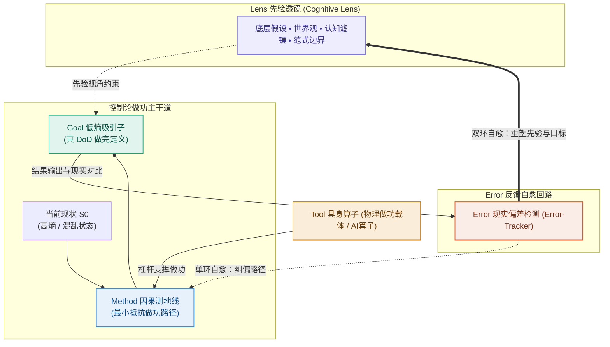

# 前言：写给每一个被工具压得喘不过气的人

> **本章提要**：你是否也曾在某个深夜，看着电脑屏幕上十几开的窗口、满屏的软件插件和未完成的空白文档，感到一阵深深的茫然与窒息？我们买下了市场上最新潮的生产力工具，配置了最完美的系统，却比以往任何时候都更加疲惫、更加迷茫。这封前言写给每一个试图在混乱世界中重新夺回大脑控制权的思考者——欢迎来到《清晰思考的纪律》。

---

## 一、 那个被“完美系统”绑架的深夜

如果你在过去几年里，曾经经历过以下任何一个微小的瞬间，那么这本书就是为你而写的：

* 在某个星期日的深夜，你明明感到精疲力竭，却依然强撑着在电脑前花了两三个小时去调整某个笔记软件的字体、配色与数据库标签。当你看着眼前那个精美绝伦的“工作台”时，心里升起了一股踏实的成就感，可到了第二天早晨面对真正的核心任务时，你的脑子依然是一片荒凉的雪地；
* 你的手机里装满了各种号称能“颠覆工作流”的 App，微信浮窗和网盘里塞满了上千篇“稍后阅读”的干货文章，但每当需要解决一个复杂的现实问题时，你依然感到了深深的无力与匮乏；
* 你的团队每天都在开 15 分钟的敏捷站会，白板上贴满了密密麻麻的看板贴纸，每个人都汇报得忙碌而充实，但季度末交付出来的产品，却是一个没有人买单的垃圾；
* 你的企业花了成百上千万元采购了最顶级的“企业数字化转型系统”，管理者在大屏前看到了花团锦簇的数据折线图，而在大屏背后，一线员工们正不堪重负地在周五下班前编造数据，在微信私下沟通。

**我们都病了。**

在这场铺天盖地的生产力浪潮与数字繁荣面前，现代人陷入了一种极其隐蔽、极其难察觉的集体焦虑：

**我们以为自己在掌控工具，实际上，我们正在被工具无情地剥夺着灵魂与能量。**

我们用“装修工具”的低智商忙碌，逃避着“啃硬骨头”的高难度思考；我们用“动作的充实”，安慰着“目标的失明”。

这就是我决定写下这本书的最直接动因。

---

## 二、 我踩过的坑，与这本书的诞生

我并不是站在高处向你指手画脚的“导师”。事实上，书中所写的每一个坑、每一个认知误区、每一场因为“工具先行”而导致的灾难，我自己曾经一个不落地全部踩过。

在很长一段时间里，我也曾是一个狂热的“工具爱好者”。

每当遇到复杂、棘手的新项目时，我的第一反应永远不是拿出一张白纸去厘清真实的因果逻辑，而是立刻去寻找“当下最火、最厉害的软件”。

我曾花过无数个周末去折腾各种庞大复杂的知识管理系统，曾试图用更强悍的硬件和更花哨的流程去解决团队的内耗。

直到某一次，在一个极度关键的商业交付前夕，我看着眼前那个配置得极尽完美的系统，和系统里一片空白的核心方案，现实狠狠地给了我一记响亮的耳光。

在那一刻，我突然感到了一阵强烈的荒谬与寒意：

**当方向错的时候，频繁地更换跑车和猛踩油门，只会让你更快地掉进悬崖。**

从那天起，我剥离了所有商业包装与流行语，开始从物理学、控制论（Cybernetics）与人类演化认知的第一性原理中，寻找自适应系统抗击混乱的底层真相。

最终，我梳理出了一套极其硬核、又极其简洁的降熵框架——**`LGMT` 模型（Lens, Goal, Method, Tool）**。

它告诉你：
* ** Lens（先验透镜）** 是你解释世界的前提，决定了你能看到什么；
* ** Goal（目标吸引子）** 是你强行在混乱中划定的低熵做完标准（DoD）；
* ** Method（变分路径）** 是连结目标与做功的因果测地线；
* ** Tool（具身算子）** 永远居于因果链的最末端，只是替上游做功的物理器械。

**顺序即纪律，位阶不可颠倒。**

在过去几年里，这套纪律不仅帮助我个人从知识囤积与假装努力中彻底解脱，也帮助了许多陷入内耗的团队与企业拔除了深层的病根。



---

## 三、 你将如何阅读这本书？（三车道阅读指南）

为了防止这本书本身演变成另一种“需要你死磕的认知负担”，我特意在内容编排上摒弃了所有高冷的学术高墙，引入了 **阿杰（个人/知识焦虑）、老张（团队/管理内耗）和小雯（技术/AI 时代焦虑）** 三位贴近生活的典型主角，用最接地气的大白话和场景剧场带你贯通全书。

全书分为 **4 大部分、精准的 12 个章节**。为了满足不同读者的诉求，我为你设计了“三车道阅读指南”：

```
                      三车道阅读指南
┌─────────────────────────────────────────────────────────────┐
│ ⚡ 快速实战车道 (职场人 / 个人成长)                          │
│ 直奔 第 1、2、3、4 章（击碎伪努力，建立个人 PKM 知识代谢流水线）│
├─────────────────────────────────────────────────────────────┤
│ 👔 管理诊断车道 (团队 Leader / 创业者)                      │
│ 重点看 第 1、2、5、6、7、8、9 章（解决团队敏捷表演与系统防复发）│
├─────────────────────────────────────────────────────────────┤
│ 🧠 思想深挖车道 (硬核读者 / 开发者 / AI 爱好者)              │
│ 完整阅读 第 1–12 章（体会控制论同构、道法术器解构与 AI 时代壁垒）│
└─────────────────────────────────────────────────────────────┘
```

---

## 四、 写在最后

物理学告诉我们：**混乱与熵增，是全宇宙的默认设置；而秩序，是人类用意识强行捍卫的奇迹。**

你不需要再下载任何新的 App，不需要再买任何花哨的插件，也不需要再去记忆成百上千个死板的模板。

拿出一张最便宜的 A4 纸，倒一杯热水，静下心来。

希望这本书能像一把沉静而锋利的手电筒，带你穿过混乱的暴风雪，强行划出属于你自己的低熵绿洲。

**欢迎来到《清晰思考的纪律》。让我们开始吧！**

---

**Hongyangchun & BookCoCreator**  
写于 2026 年盛夏
