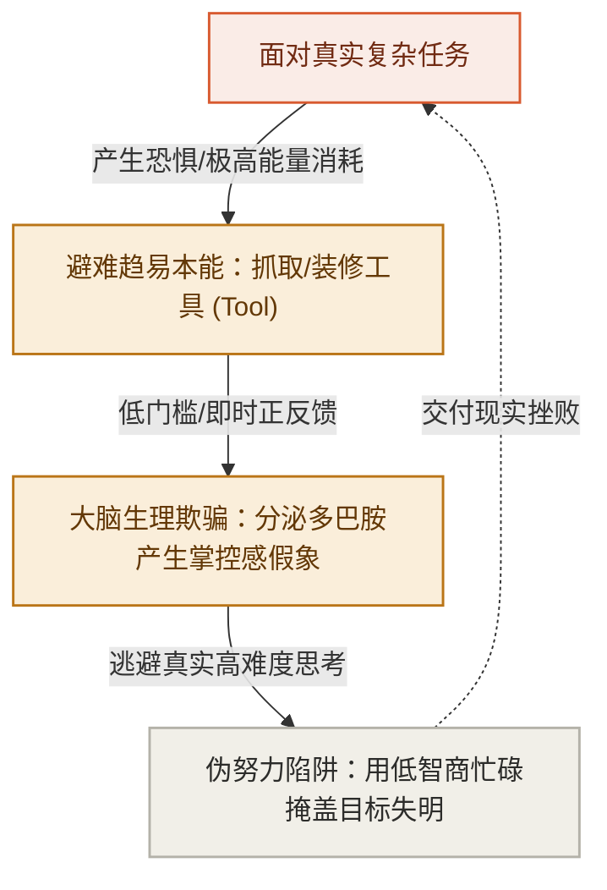

# 第 1 章：工具先行——现代人最隐蔽的认知陷阱

> **本章提要**：为什么我们买了昂贵的软件、装满了一屏插件、配置好整套“完美系统”，临近交付时屏幕上依然只有光标在一闪一闪？因为大脑极其擅长用“掌控工具”的生理快感，去逃避“啃硬骨头”的真实痛苦。本章跟着互联网产品经理阿杰的真实遭遇，拆解现代人最容易落入的“多巴胺伪努力黑客”，立下第一条纪律：不厘清视角（Lens）与目标（Goal），一切工具优化都是在错误方向上高效狂飙。

---

## 一、 阿杰的“星期日完美系统”

星期日深夜 11 点 45 分，28 岁的互联网产品经理阿杰坐在台灯下，眼睛微微发红，但精神却处于一种近乎亢奋状态。

在他面前的 27 英寸显示器上，正展示着一个极其漂亮、逻辑严密的 Obsidian 知识库面板。

为了这个面板，阿杰已经整整 36 个小时没有好好睡觉了。

时间退回到两天前的星期五下午。部门 Leader 找到阿杰，拍了拍他的肩膀说：“阿杰，下周三团队要向 VP 汇报明年‘AI+产品’的整体规划路线。你负责把全网竞品、技术演进和我们的切入点整理出一份深度报告，这关乎我们组下半年的预算。”

接下任务的那一刻，阿杰感受到了迎面扑来的巨大复杂性与混乱感。

“AI+产品”涉及十几个技术名词、几十家竞品的动态，还有公司内部错综复杂的业务线。阿杰的大脑瞬间升起了一阵密集的焦虑。

如果是一个成熟的思考者，此时或许会拿出一张最便宜的 A4 纸，用铅笔划下几个核心要问的问题：“VP 最关心什么？”、“我们现有的资源能支撑哪一条线？”、“交付的标准到底是什么？”

但阿杰没有。面对迎面扑来的混乱，他的大脑以一种本能的敏捷做出了一项决定：**他需要一套更强大的知识管理系统。**

接下来的 36 个小时里，上演了一场很多人都极为熟悉的戏码：

* **星期五晚上**：阿杰在小红书、B 站和知乎上狂搜了 4 个小时，看完了 15 条标题为《全网最强 Obsidian 搭建指南》、《用这套系统，我的产出翻了 10 倍》的视频；
* **星期六全天**：阿杰下载了 Obsidian，研究了 12 个社区插件。为了让界面看起来有“极客风”，他花了两小时调整主题配色，又花了三小时研究怎么用 Dataview 插件自动汇总卡片；
* **星期日晚上**：阿杰像个挑剔的建筑师一样，精心建立了 `#竞品`、`#大模型`、`#业务线` 的标签数据库，甚至还给不同的模块配上了精美的 Emoji 图标。

看着眼前这个框架清晰、功能强大、界面绝美的工作台，阿杰心里升起了一股巨大的成就感与满足感。他长舒一口气，在心里对自己说：“万事俱备！有了这套完美系统，明天的报告撰写绝对势如破竹。”

然而，当星期一早晨 9 点的阳光照进办公室，阿杰在干净的系统里新建了一个名为《AI+产品规划报告草案》的空白文档时，**可怕的事情发生了。**

屏幕上的光标一闪、一闪、一闪。

十分钟过去了，半小时过去了。阿杰看着空白的文档，大脑一片空白。

这种阻尼感，每个试图用新工具解决复杂问题的人都体会过：你花了整整两天时间去装修厨房、挑选最精密的厨具、安排调料瓶的摆放，却连这桌宴席要招待什么客人、主菜的做完标准以及烹饪的具体步骤都毫无概念。

到了星期二晚上，距离汇报只剩 12 个小时，阿杰只能在极度的恐慌与焦虑中，拼命复制粘贴了十几篇网上的二手文章，仓皇凑出了一份前言不搭后语的 PPT。

汇报结果可想而知：VP 看了不到三页就皱起眉头：“大家讲的都是大废话，我们到底要解决用户的什么问题？”

会议结束后，阿杰失魂落魄地回到座位。他看着电脑里那个曾经让他兴奋不已的 Obsidian“完美系统”，突然感到一阵深深的荒谬与厌恶。从那天起，这个系统被他默默晾在一边，成为了又一个“收藏即吃灰”的数字垃圾。

**你是不是也在阿杰身上，看到了自己的影子？**

无论是个人在选择笔记软件时的反复折腾，还是团队管理者斥资数百万引入 CRM 系统后大家依然用微信打字的尴尬，背后的病灶完全一致。

我们都陷入了现代人最隐蔽、也最难察觉的认知陷阱：**工具先行（Tool-First）。**

---

## 二、 多巴胺黑客：大脑为什么天生爱抓工具？

要打破这个陷阱，我们首先要像医生一样，看清大脑的生理机制。

人类的大脑是一个在漫长演化中高度注重“能量节省”的器官。思考——尤其是从一片混乱中去厘清真实的因果关系、设定明确的做完标准（Goal）、面对未知的不确定性——是一种**极其耗能、极其痛苦的重体力劳动**。

相比之下，选择、配置和装修一个工具（Tool），对大脑来说是一场低风险、高回报的“多巴胺黑客”：



当阿杰在配置 Obsidian 插件、调整字体配色时，他的大脑接收到了密集的正反馈：每敲下一行代码，界面就变美一点；每建立一个标签，资料看起来就被“归类”好了。

大脑在这个过程中被深深地欺骗了——它误以为自己正在“极其高效地推进工作”，并大量分泌多巴胺，奖励这种“掌控感”。

**但这种掌控感，完全是一种生理幻觉。**

你掌控的只是工具的界面形态，你根本没有触碰真实任务的核心逻辑。你用“装修工具”的低智商忙碌，完美地逃避了“构思方案”的高难度思考。

在现代商业和个人成长中，这种“多巴胺伪努力”每天都在以各种花哨的形式上映：

* **个人层面的伪努力**：花了三天配置时间管理 App，结果一件正事没干；买了一堆昂贵的健身装备，结果一次健身房都没去；
* **团队层面的伪努力**：团队业务方向完全混乱，管理者却带着大家花一周时间去选型“到底是用 JIRA 还是用飞书多维表格”；
* **企业层面的伪努力**：商业模式根本没跑通，公司却花了上千万元去采购最顶级的“企业数字化转型系统”。

所有人都在疯狂地优化工具（Tool），却唯独没有人关心：**我们到底要透过什么视角看问题（Lens）？我们到底要达成什么结果（Goal）？**

---

## 三、 挣脱陷阱的破局关键：顺序即纪律

要从“工具先行”的泥潭中挣脱出来，我们必须在脑海里建立一个最基础的因果认识：

**工具永远不是解决问题的起点，而是因果链推演到最后自然产出的载体。**

在应对复杂任务时，正确的生成次序应当是：

$$\mathbf{Lens (先验视角) \to Goal (做完目标) \to Method (因果路径) \to Tool (物理工具)}$$

这就是本书后续将深度拆解的 **LGMT 思考模型（Lens 视角、Goal 目标、Method 路径、Tool 工具）**。

在这一模型中，**Tool（工具）处于整条因果链的最末端**。它是为你上游思考做功的“物理算子”，它绝对不具备自主灵魂。

```
                   正确的思考生成位阶
┌─────────────────────────────────────────────────────────────┐
│ 1. Lens (视角/先验场)   : 我凭什么这么看？(底色与假设)      │
│      │                                                      │
│      ▼                                                      │
│ 2. Goal (目标吸引子)   : 我到底要什么？(做完定义 DoD)       │
│      │                                                      │
│      ▼                                                      │
│ 3. Method (路径做功)   : 我具体怎么做？(因果步骤)           │
│      │                                                      │
│      ▼                                                      │
│ 4. Tool (具身算子)     : 我用什么载体？(算子与工具)         │
└─────────────────────────────────────────────────────────────┘
```

假设当阿杰接到“AI+产品规划报告”的那一刻，他如果遵循了这种从 Lens 到 Tool 的顺向次序，事情会变成怎样？

1. **第一步：立 Lens（先验视角）**
   阿杰应该先问自己：“VP 让我做这个规划，他底层的先验视角是什么？他关注的是‘我们技术有多炫’，还是‘这能帮公司多赚多少钱/省多少成本’？”
   一旦确定了“商业 ROI 优先”的 Lens，阿杰就会瞬间过滤掉全网 90% 无用的技术炫技文章。

2. **第二步：锁 Goal（目标与做完定义）**
   阿杰接着问：“周三汇报的 Goal 是什么？什么是做完的定义（DoD）？”
   答案不是“写出一份 100 页的精美文档”，而是“**提炼出 3 个具备可操作性的 AI 切入点，并给出明确的算力与人力预算**”。

3. **第三步：推 Method（路径与步骤）**
   为了达成这 3 个切入点，阿杰需要做哪几步动作？
   第一步：访谈 2 位一线销售，了解客户最常投诉的 3 个痛点；第二步：对比 5 家直接竞品的解决方案；第三步：算出一笔成本账。

4. **第四步：选 Tool（工具与载体）**
   到了这一步，阿杰才需要看工具。此时他会发现，完成这三步动作，**最快、摩擦力最小的工具，居然就是一张纸、一支笔和一个最基础的 Excel 表格！**

看！当位阶顺畅时，阿杰根本不需要花 36 个小时去搭建什么 Obsidian 完美系统。他在 2 个小时内就能锁定关键路径，用最轻量的工具，交付出最具震撼力的结果。

---

## 四、 本章防错纪律与检视卡

离开阿杰的故事，请冷酷地审视你今天的手头工作。

你现在正在折腾的那个软件、那个插件、那个看板，究竟是在为你的 Goal 服务，还是在你大脑逃避思考时，给它提供廉价多巴胺的避难所？

记住：**最顶级的思考者，往往使用最笨拙的工具；而最平庸的执行者，才会在工具的装修上倾尽全力。**

---

### 📷【第一部·立模篇】认知对错对比卡（Contrast Card）

> **建议保存或拍照此卡，在开启任何新任务或想下载新软件前进行对错判定：**

```
 ┌──────────────────────────────────────────────────────────────┐
 │          《清晰思考的纪律》· 伪努力 vs 清晰思考对比卡          │
 ├──────────────────────────────────────────────────────────────┤
 │ ❌ 伪努力模式 (工具先行)                                     │
 │    [1] 遇到难题 ➔ 疯狂寻找新软件、新插件或美化看板           │
 │    [2] 无视做完定义 (DoD) ➔ 把“忙碌的动作”当成“达成的结果”     │
 │    [3] 用装修工具的低智商忙碌，逃避高难度的底层思考           │
 ├──────────────────────────────────────────────────────────────┤
 │ ✅ 清晰思考模式 (位阶顺畅)                                    │
 │    [1] 遇到难题 ➔ 先立 Lens 场，确定底层先验与商业底色       │
 │    [2] 锁死 Goal DoD ➔ 强行规定最小可交付物理结果            │
 │    [3] 倒推 Method 路径 ➔ 选用做功摩擦力最小的极简 Tool       │
 └──────────────────────────────────────────────────────────────┘
```

---

> **本章金句**：  
> * “屏幕上闪烁的光标，从来不会因为你换了一个更美观的软件而自己写出字来。”  
> * “用装修工具的低智商忙碌，去逃避构思方案的高难度思考，是现代人最隐蔽的伪努力。”  
> * “在没想清‘要什么’之前，所有的工具优化，都只是在错误的方向上高效狂飙。”
