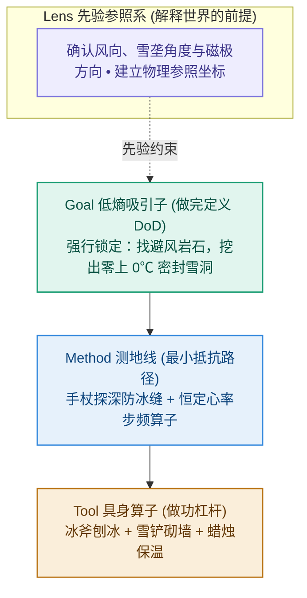
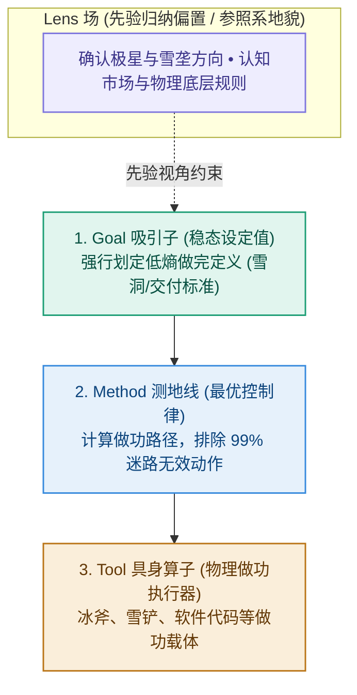

# 第 2 章：秩序的物理学——暴风雪中的求生骨架

> **本章提要**：为什么如果你不花精力去收拾，房间必然会越来越乱，手机内存必然会越来越满，团队的沟通必然会越来越低效？这不仅仅是某种心理焦虑或管理疏忽，而是全宇宙最残酷、也最无可逃避的物理定律——热力学第二定律（熵增原理）。在混乱的自然界中，秩序从来不是免费的。本章带你深入暴风雪赶路的思想实验，用通俗生动的物理与控制论直觉，严密推导 LGMT “1 场 + 3 节点”的物理降熵拓扑，为你建立一套在混乱风暴中强行划出低熵绿洲的求生骨架。

---

## 一、 极地风暴：无骨架做功如何走向物理冻死？

> 🚗 **【快车道速览】**：本节通过极地暴风雪思想实验的深入剖析，从生理学与物理能量消耗角度，直观推导为什么缺乏先验参照系与终局吸引子的“勤奋狂奔”，在物理法则面前只会加速系统的彻底崩溃。

### 1. 思想实验：北极圈内的生死抉择

请随我进入这样一个身临其境的思想实验：

设想你正身处北极圈内的一片茫茫荒原之上。夜幕骤然降临，气温急剧攀升至零下 30 摄氏度。一场遮天蔽日的极地暴风雪撕裂了天空，狂风夹杂着密集的冰晶撞击着你的面罩，发出震耳欲聋的噼啪声。四周的视线被压缩至不足半米，天地间陷入了一片令人窒息的死寂与漆黑。

此时，你的体温正在被强风以恐怖的速度抽走，体内仅储备着极其有限的卡路里。如果不能在体温降至 35 摄氏度的致命临界点之前找到避风场所，失温症将会在数十分钟内剥夺你的意识与生命。

在这样极端的混乱环境中，一个缺乏先验秩序与系统骨架的普通求生者，究竟是怎样一步步走向物理冻死的？

我们可以将他的行为拆解为三个看似极其努力、实则走向毁灭的物理做功阶段：

```
                         无骨架求生者的能量耗散死循环
┌─────────────────────────────────────────────────────────────┐
│ 阶段一：盲目狂奔 ──► 缺乏 Lens 参照系 ──► 步幅偏执正反馈 ──► 原地打转  │
└─────────────────────────────────────────────────────────────┘
                               │
                               ▼ 能量耗散 50%
┌─────────────────────────────────────────────────────────────┐
│ 阶段二：工具依赖 ──► 缺乏 Goal 吸引子 ──► 点燃打火机(Tool) ──► 局部假象  │
└─────────────────────────────────────────────────────────────┘
                               │
                               ▼ 燃料耗尽，能量耗散 100%
┌─────────────────────────────────────────────────────────────┐
│ 阶段三：失温瘫痪 ──► 熵增吞噬系统    ──► 脑部异常发热   ──► 物理冻死  │
└─────────────────────────────────────────────────────────────┘
```

#### 阶段一：无参照系的盲目做功（Tool & Method 狂飙）
在极度的恐慌与生存本能驱动下，求生者的第一反应通常是“立刻行动起来”。他迈动双腿（Tool），以极高的步频在风雪中狂奔（Method）。他大口喘息，体内的糖原被剧烈消耗，机械能大量转化为无用的热能散逸到狂风中。

然而，在能见度为零、且没有极星或地貌参照系（无 Lens 托底）的物理空间中，人类的生理机制存在一个致命缺陷：双腿的步幅存在极其微小的非对称性（通常左脚与右脚相差数毫米）。在没有视觉矫正的调节下，这种微小的偏差会在步频的累积中不断放大，导致求生者以数公里为半径在荒原上画出了一个巨大的闭合圆圈。

**20 分钟后，他精疲力竭地回到了起点。** 在物理学意义上，他的有用位移为零，但他体内的核心能量已经耗散了一半。

#### 阶段二：对高级工具的溺水式抓取（Tool 侵蚀 Goal）
当发现狂奔无效后，绝望的求生者掏出了口袋里性能最强悍、价格最昂贵的防风打火机（Tool）。打火机发出了璀璨的蓝光，点燃了一根随身携带的枯枝。火光照亮了四周不到 1 米的狭小空间，带给了他一丝暂时的温暖与掌控感假象。

但这只是一种“多巴胺伪努力”。防风打火机虽然是一个极其精密的具身算子（Tool），但它本身不具备阻挡零下 30 度暴风雪的物理结构。求生者没有去构建避风掩体（无 Goal 锁定），而是把全部希望寄托在打火机上。几分钟后，枯枝化为灰烬，打火机燃料耗尽，四周重新被更深沉的黑暗与冰冷吞噬。

#### 阶段三：系统的熵增彻底瘫痪（物理冻死）
当最后一丝卡路里耗尽，求生者的核心体温降至 35 度以下。由于大脑供血不足与代谢紊乱，他的下丘脑调节中枢瘫痪，产生出了肢体发热的末期幻觉。最终，他脱下了外套，蜷缩在雪堆中停止了呼吸。

在这个悲剧过程中，求生者不可谓不勤奋：他的双腿迈动到了极限，他使用了随身带的最强工具。**但他依然冻死了。因为他的做功完全被系统的混乱（熵增）所抵消。**

---

### 2. 极地专家：LGMT 降熵骨架的物理解法

现在，让我们对比看一看一个真正训练有素的极地求生专家，在面对同一场致命暴风雪时，是如何运用 LGMT “1 场 + 3 节点”骨架强行捍卫出生命绿洲的：



1. **第一步（立 Lens：建立物理参照系）**  
   面对暴风雪，专家做的第一件事是**立即停下脚步**，绝不听凭本能乱跑。他戴上防风镜，通过观察风吹雪垄的物理倾角、感受风向与面部接触的角度，在无序的风暴中提取出了唯一的物理参照坐标系（**Lens 场托底**）。他明确了自己在这个环境中的真实位置与边界。

2. **第二步（锁 Goal：划定低熵吸引子）**  
   专家绝不会把目标定为“今晚走出百里大草原”（那是无法在当下物理验证的幻想）。他极其冷酷地将目标收敛为当前唯一能够维持生命体征的低熵稳态：“在体温降至 35 度之前，找到一块下风口岩石掩体，挖出一个密封度 90% 以上、温度维持在 0 度的雪洞”（**Goal 锁定做完定义 DoD**）。

3. **第三步（推 Method：变分测地线做功）**  
   确定雪洞目标后，他推演出了严密的行动路径（Method）：保持每分钟 90 步的恒定心率（防止汗液蒸发带走热量），每走 50 步用手杖向前方探深一次（排除掉入冰缝的致命风险），沿雪垄切线方向直奔岩石掩体。  
   水流在荒原上的流向取决于河床的形状。在物理世界中，做功从来不需要死磕意志力，而是顺着 Lens（范式场）与 Goal（低熵吸引子）塑造的势能河床自然流动。做功的本质是选择做功消耗最小、做功摩擦极低的高影响黄金路径，让求生行为顺理成章地发生。

4. **第四步（选 Tool：具身算子高效输出）**  
   到达岩石下风口后，他拿出冰斧（Tool）砍开地表硬冰，拿出雪铲（Tool）快速堆砌雪墙，最后点燃一根仅有 50 克重的蜡烛。

半小时后，狂风依然在洞外怒吼，但求生者已经蜷缩在密封的雪洞内部。蜡烛与人体散发的热能被雪墙有效锁住，洞内温度回升至 0 摄氏度以上。

**生命，在这场死寂的风暴中，凭靠一套硬核的 LGMT 骨架，强行在混乱中捍卫出了一块温暖的低熵绿洲。**

---

### 3. 现实映射：现代职场中的“雪夜冻死”

这个极地求生的思想实验，绝非远在天边的虚构故事。在现代商业管理、技术研发与个人成长中，无数人每天都在重复着那个“无头狂奔最后冻死”的悲剧：

* **产品团队的“雪地画圈”**：一个创业团队在面对市场寒冬与业务下滑时（暴风雪临门），CEO 因为缺乏对用户真实痛点的透彻理解（无 Lens），慌乱中命令团队“敏捷开发，快速上线”（Tool & Method 狂飙）。团队加班加点上线了 20 个花哨功能，消耗了公司最后的现金流。季度末盘点发现，用户留存率不仅没有提升，反而因为系统过于臃肿而加速流失——**这正是产品经理在商业雪暴里的“步幅偏执正反馈，原地打转到冻死”。**
* **个人学习的“打火机依赖”**：一个面临职业危机的白领，因为没有厘清自己的底层技能模型（无 Lens），也没有设定具体的项目交付成果（无 Goal），而是疯狂购买了上万元的在线课程、装满了全套 AI 写作与笔记插件（打火机 Tool）。他每天在微信浮窗和 Obsidian 里切换打卡，感到无比充实，但半年后面对真实的岗位面试时，依然拿不出任何能落地的作品——**这正是用打火机的微弱火光，逃避构建雪洞的终极悲剧。**

---

## 二、 宇宙的终极宿命：为什么混乱是常态，秩序是奇迹？

> 🔬 **【深水区推演】**：本节从热力学与信息科学的通俗原理出发，揭示为什么任何未经先验约束的系统如果不持续耗能维护，必然滑向混乱与失控。

### 1. 熵增原理：自然界不可逆的散乱倾向

为什么我们刚整理好的办公桌，两天后又被乱七八糟的杂物堆满？为什么刚重构完的干净代码库，几个月后又充斥着无名变量与死代码？为什么团队刚开会澄清的流程，下周大家又回到了各自为政的摩擦中？

很多人倾向于将这些归咎于“员工自律不够”、“自己有拖延症”或是“管理层抓得不紧”。但物理学告诉我们：**这一切并不是道德或态度的衰退，而是全宇宙最基础、最不可逆的物理法则——熵增原理在发挥作用。**

简而言之：**在自然状态下，事物总是倾向于从整齐有序自发走向混乱无序。如果不持续投入能量去维护，任何系统都会自然退化与瘫痪。**

这个原理揭示了一个极其深刻且令人震惊的真相：

在自然界中，**“整齐有序的状态”所对应的可能性极少（通常只有一种或极少数几种）；而“混乱无序的状态”所对应的可能性则是天文数字。**

```
                       状态可能性爆炸与熵增本质
┌─────────────────────────────────────────────────────────────┐
│ 宏观“有序”状态 (如：整洁桌面 / 高效代码 / 统一目标)            │
│ 组合可能性 ≈ 仅有 1 种 (极低概率的特殊稳态)                  │
└─────────────────────────────────────────────────────────────┘
                               │
                               │ 自然演化 (不额外施加约束做功)
                               ▼
┌─────────────────────────────────────────────────────────────┐
│ 宏观“混乱”状态 (如：杂物堆积 / 垃圾代码 / 部门内耗)            │
│ 组合可能性 ≈ 数以亿计的组合 (极高概率的统计必然)              │
└─────────────────────────────────────────────────────────────┘
```

* **桌面的熵增**：设想桌面上有 100 件物品。它们被“各自归位摆放整齐”的摆放组合只有 1 种；而它们“随机乱丢在桌面上”的摆放组合则是无法想象的天文数字。如果你不额外消耗人体能量去整理，随机碰撞与随意丢放必然让桌面滑向这无穷无尽的乱七八糟组合中。
* **代码的熵增**：在一个软件项目中，每一行代码的逻辑、接口的命名与模块的依赖，保持“极简、解耦、高可用”的优雅架构只有 1 种；而“随意声明全局变量、硬编码参数、复制粘贴重复代码”的坏代码组合数趋近于无限。如果不施加严格的代码审查与架构重构，代码库必然演变成难以维护的废墟。

---

### 2. 信息与认知紊乱：为什么团队与大脑更容易失控？

将物理学原理延伸至信息与思维领域，我们同样会发现信息熵的存在——它衡量的是一个系统内部**不确定性与信息紊乱度的大小**。

这一原理完美解释了为什么团队协作与个人大脑的大部分内耗，都是混乱在信息维度的具象化爆发：

```
                      信息维度上的混乱爆发模型
┌─────────────────────────────────────────────────────────────┐
│ 无先验 Lens 约束的个人大脑                                   │
│ 信息可能性散乱 ──► 脑海紊乱度达到峰值 ──► 陷入焦虑与注意力碎片化 │
└─────────────────────────────────────────────────────────────┘
                               │
┌─────────────────────────────────────────────────────────────┐
│ 无 DoD Goal 约束的团队协作                                   │
│ 各部门对“做完”的解释数暴增 ──► 视角分散 ──► 互相扯皮与动作表演  │
└─────────────────────────────────────────────────────────────┘
```

1. **个人大脑的信息紊乱暴增**：当你的大脑缺乏明确的先验框架（Lens）去过滤外界信息时，微信公众号、短视频、各类新闻推送以同等概率冲击你的注意力和大脑神经网络。此时，信息的干扰达到最大，你的脑海充斥着杂音。你感到思绪万千、焦虑万分，却无法集中精力完成任何一项深度的逻辑思考。
2. **团队协作的可能性爆炸**：在一个 10 人的战役项目中，如果负责人没有用冷酷的做完定义（Goal）统一“什么是完成”，那么 10 个人对这个项目的理解就会产生数以亿计的组合差异。研发在关心代码架构，市场在关心文案字号，销售在关心返点提成。大家看似在同一个会议室开会，实则各说各的话，沟通效率极低。

---

### 3. 薛定谔的终极判词：生命靠吃“负熵”活着

物理学家埃尔温·薛定谔（Erwin Schrödinger）在经典著作《生命是什么》中，提出了一个震撼人类思想界的洞察：

> **“生命要摆脱死亡和衰亡，唯一的办法就是不断地从周围环境中汲取负熵（也就是吸收秩序、排出混乱）……生命就是靠吃负熵活着。”**

```
                       薛定谔“负熵做功”生命模型
┌─────────────────────────────────────────────────────────────┐
│ 外部自然宇宙 ──► 持续施加物理熵增 ──► 系统衰亡、混乱与瘫痪     │
└─────────────────────────────────────────────────────────────┘
                               │
                               │ 唯一对抗路径
                               ▼
┌─────────────────────────────────────────────────────────────┐
│ 注入“负熵做功流” (LGMT 骨架) ──► 引入先验、锁死目标、精密做功    │
│ (强行在孤立系统内划出低熵做功绿洲，捍卫秩序与生命)              │
└─────────────────────────────────────────────────────────────┘
```

这个洞察彻底打破了人们对于“秩序会自然产生”的幻想：

**混乱，是全宇宙默认的物理底色；而秩序，是人类必须咬牙进行做功、持续从环境中吸收秩序（负熵）才能捍卫的奇迹。**

* 生命系统通过呼吸、进食与新陈代谢，消耗外界能量，排出废料，维持体内的健康稳态；
* 认知系统通过引入先验视角（Lens）、锁定低熵目标（Goal）、推演变分路径（Method）与调用物理算子（Tool），消耗脑力能量，将混乱的信息流重构为清晰的解题方案。

**LGMT 模型，本质上就是人类大脑在充满混乱的物理世界里，强行构建吸收秩序、捍卫系统秩序的最优降熵结构。**

---

## 三、 LGMT “1 场 + 3 节点”的物理降熵拓扑

> 🔬 **【深水区推演】**：本节解构 LGMT 模型非平铺直叙的“1 个先验场 + 3 个前向做功节点”拓扑，推导各构件在真实世界中的作用规律。

在物理学与控制论的透视下，LGMT 绝不是四个平铺直叙、随机组合的步骤，而是一个由 **“1 个贯穿先验场”与“3 个前向做功节点”** 组成的自适应控制拓扑结构：



让我们用严密的物理与工程逻辑，对这“1 场 + 3 节点”进行逐层剥离与通俗解耦。

---

### 1. Lens 场（先验归纳偏置）：解释世界的前提参照系

```
                         Lens (先验范式场)
┌─────────────────────────────────────────────────────────────┐
│ 直观功能映射 : 脑海中的地图参照系 / 滤镜偏置                    │
│ 核心物理功能 : 决定你能从无序杂音中“识别出什么”与“忽略什么”    │
│ 位阶物理定律 : 视角决定方法的上限；先验错，后续做功全为负值   │
└─────────────────────────────────────────────────────────────┘
```

#### 通俗推导
在认知科学与人工智能中，没有任何智能系统能在没有任何先验知识的状态下处理复杂数据。如果没有先验偏置，算法面对未知输入时的判断就跟随机瞎猜没有任何区别。

**Lens 就是你脑海里的先验地图与坐标参照系。**

在暴风雪思想实验中，如果求生者没有“极星方向”和“雪垄物理特征”这个 Lens，风雪在他眼里就是纯粹的无序噪音；而一旦 Lens 建立，原本混乱的噪声瞬间被解构成为了带有方向的清晰线条。

#### 现实公理
* 在个人学习中，如果你戴着“仓储 Lens”（误以为知识是收藏的资产），你看到的每篇文章都是“赶紧点击收藏”；而一旦切换为“代谢 Lens”（意识到知识是消化的食物），你看到的每篇文章都变成了“用自己的话重写并输出”；
* 在团队管理中，如果老板戴着“控制 Lens”（误以为管理是全知全能的监督），他看到的都是“员工打卡有没有偷懒”；而一旦切换为“交付 Lens”（意识到管理是拔除障碍），他看到的都是“如何帮一线搞定资源”。

**先验 Lens 决定了你所能看到的视角上限。Lens 若错，后续一切精密的 Method 与 Tool 做功，在物理意义上都是在错误方向上的高效狂飙。**

---

### 2. Goal 吸引子（稳态设定值）：强行划定低熵做完边界

```
                         Goal (目标吸引子)
┌─────────────────────────────────────────────────────────────┐
│ 直观功能映射 : 混乱世界中的稳态磁极 / 做完标准                 │
│ 核心物理功能 : 在无穷多种混乱可能中，强行收敛出极低概率的稳态 │
│ 位阶物理定律 : 必须包含明确的 DoD (做完定义)，且不随工具改变   │
└─────────────────────────────────────────────────────────────┘
```

#### 通俗推导
在系统科学中，**吸引子**是指系统随时间演化最终趋向收敛的状态目标。

在未受干预的自然状态下，系统的发展方向是极其散乱和不确定的。**Goal 的物理本质，是人类意识用专注强行划定的一组极低概率的稳态目标。**

在极地风暴中，“暴风雪中的无限未来”包含了数百万种迷路和冻死的可能性，而专家强行划定的 Goal——“在岩石下风口挖一个密封度 90% 的雪洞”，就是一个强有力的目标吸引子。

```
                       Goal 吸引子的物理收敛过程
┌─────────────────────────────────────────────────────────────┐
│ 弥散的高熵可能性 (无数种迷路、冻死、乱跑的可能性)             │
└─────────────────────────────────────────────────────────────┘
                               │
                               │ Goal 强行收敛
                               ▼
┌─────────────────────────────────────────────────────────────┐
│ 唯一的低熵稳态 (雪洞 / 零 Bug 上线 / 真实客户留存 DoD)       │
└─────────────────────────────────────────────────────────────┘
```

#### 现实公理
一个合格的物理级 Goal，必须满足三个硬核指标（DoD 做完定义）：
1. **客观可验证性**：它必须能在现实中被客观验证（如“洞内温度升至零度以上”、“新功能首批 50 位用户完成体验”），而不是虚无飘渺的心理感受（如“搞好团队关系”、“深入学习”）；
2. **工具无关性**：Goal 的定义绝对不随 Tool 的改变而改变。雪洞的合格标准不会因为你换了高级雪铲就发生改变；
3. **消除杂念**：真正的 Goal 能瞬间砍掉 99% 毫无意义的中间动作。

---

### 3. Method 测地线（最优路径）：能量消耗最小的有效路径

```
                         Method (最优路径)
┌─────────────────────────────────────────────────────────────┐
│ 直观功能映射 : 两点之间能量消耗最小的测地线 / 有效算法          │
│ 核心物理功能 : 连结初始状态与 Goal 目标，消除无用做功摩擦力   │
│ 位阶物理定律 : 必须服从 Goal 约束；拒绝不解决问题的仪式表演   │
└─────────────────────────────────────────────────────────────┘
```

#### 物理学推导
在物理学中，连接两点之间距离最短、能量消耗最小的曲线被称为**测地线**。自然界中的许多现象（如光线的折射、水流的走向）都会本能地选择那条能量耗散最小的路径。

```
                         Method 最优路径与无功摩擦
┌─────────────────────────────────────────────────────────────┐
│ ❌ 盲目狂飙路径 (无头狂奔 / 敏捷站会表演)                    │
│ 轨迹做剧烈无规则布朗运动 ──► 消耗大量能量，位移为零            │
└─────────────────────────────────────────────────────────────┘
                               vs
┌─────────────────────────────────────────────────────────────┐
│ ✅ Method 最优测地线 (恒定步频探深 / 4步对齐算法)             │
│ 沿作用量最小的路径直奔 Goal ──► 抵消 99% 的物理做功摩擦       │
└─────────────────────────────────────────────────────────────┘
```

**Method 的物理本质，就是连接当前混乱状态与 Goal 目标之间那条能量耗散最小的最佳路径。**

#### 现实公理
在求生者奔向岩石的路径中，专家制定的 Method（每分钟 90 步、每 50 步探深一次）极度冷酷地排除了其他所有消耗能量的可能（如狂奔、乱跳、折返）。
* 在团队管理中，敏捷站会与周报本应是消除阻碍的 Method，但如果丢失了 Goal，这些 Method 就退化为了轨迹剧烈抖动、毫无有用位移的“忙碌表演”；
* 在技术重构中，极简的算法与解耦架构是 Method，它用最小的计算消耗达成系统的业务响应。

---

### 4. Tool 具身算子（做功杠杆）：物理现实中的物理做功载体

```
                         Tool (具身算子)
┌─────────────────────────────────────────────────────────────┐
│ 直观功能映射 : 机械杠杆 / 物理执行器与放大器                  │
│ 核心物理功能 : 将 Method 指令转化为物理现实中的能量与物质搬运│
│ 位阶物理定律 : 永远居于因果链的最末端；禁止工具反向侵蚀主脑   │
└─────────────────────────────────────────────────────────────┘
```

#### 工程学推导
在力学与工程中，**工具（Tool）的物理本质是具身杠杆与能量放大器。**

**物理输出做功 = Tool 杠杆放大系数 × Method 正确指令**

冰斧和雪铲（Tool）本身没有哪怕一微克的智慧。它们不会自己思考极星方向（无 Lens），也不会自己决定堆砌多高的雪墙（无 Goal）。它们只是在物理上将求生者手臂施加的微弱肌肉力量，通过尖锐的接触点进行放大，切碎硬冰、堆砌雪墙。

```
                       Tool 具身算子的双向放大效应
┌─────────────────────────────────────────────────────────────┐
│ 正向放大 : 有效 Method 指令 ──► Tool 杠杆 ──► 高效绿洲       │
└─────────────────────────────────────────────────────────────┘
                               ▲
                               │ 决定性位阶关系
                               ▼
┌─────────────────────────────────────────────────────────────┐
│ 反向放大 : 混乱/错误 Method ──► Tool 杠杆 ──► 暴增的废墟     │
└─────────────────────────────────────────────────────────────┘
```

#### 现实公理
* **Tool 的双向放大性**：如果上游的 Method 极其清晰（如“减少 2 个输入框提升支付率”），即使是简单的纸笔或简陋代码（Tool）也能产生剧烈的业务效益；如果上游的 Lens 和 Goal 乱成一团，引入顶级 CRM 或 AI 大模型智能体（Tool），只会将混乱以 10 倍的速度放大为昂贵的数字废墟。
* **位阶倒错的惩罚**：当求生者在暴风雪里沉迷于雕刻打火机的外壳（Tool 装修），或者阿杰在星期日深夜花 36 个小时配置 Obsidian 社区插件时，Tool 就演变成了反向侵蚀大脑算力的毒品。

---

## 四、 本章防错纪律与检视卡

> 🚗 **【快车道速览】**：本节总结物理降熵三大防错纪律，交付随身物理降熵自查卡，助你在混乱风暴中随时划出低熵绿洲。

读完这一章，请将对抗混乱的物理直觉彻底刻入你的大脑。

当你再次感到工作混乱、团队内耗、或者面对复杂的项目无从下手时，**不要陷入道德谴责，也不要叹气**。

在心里对自己说：

> **“这是自然界的熵增原理在对我做功。如果我不施加逆向的 LGMT 控制力，系统必然顺理成章地滑向崩溃。”**

收起你的情绪，拿出你的 LGMT 降熵骨架，在混乱的风暴中，为自己和团队强行挖出那个温暖的雪洞。

---

### 📷【30秒物理降熵自查卡】

> **建议保存或打印此卡贴于工作台前，在感到混乱、项目失控或陷入瘫痪时自查：**

```
 ┌──────────────────────────────────────────────────────────────┐
 │             《思考的位阶》· 物理降熵自查卡                   │
 ├──────────────────────────────────────────────────────────────┤
 │ 当你感觉事情乱成一团麻、自己正在“无头狂奔”时，问自己：       │
 │                                                              │
 │ [ ] 1. 物理参照系 (Lens) ：我是在听凭本能乱跑（迷茫无序）， │
 │        还是已通过 Lens 确认了风向与极星参照系？               │
 │                                                              │
 │ [ ] 2. 目标吸引子 (Goal) ：在无限混乱的可能性中，我是否划定了│
 │        明确的低熵做完定义 (零上 0℃ 密封雪洞 DoD)？           │
 │                                                              │
 │ [ ] 3. 最优路径 (Method)  ：我的 Method 是在有效路径上做功，  │
 │        还是在做步幅偏执的“雪地画圈无用消耗”？                 │
 │                                                              │
 │ [ ] 4. 具身算子 (Tool)    ：我现在是在用 Tool 切碎硬冰，      │
 │        还是在暴风雪里沉迷于点燃打火机的多巴胺假象？          │
 └──────────────────────────────────────────────────────────────┘
```

---

> **本章金句**：  
> * “混乱是全宇宙的默认物理设置，而秩序，是人类用意识施加控制强行捍卫的奇迹。”  
> * “在暴风雪里，双腿最勤奋的无头狂奔，往往只会带你走向最快的物理冻死。”  
> * “生命靠吸收秩序活着，清晰思考靠 LGMT 位阶生存；顺序即纪律，位阶不可颠倒。”
