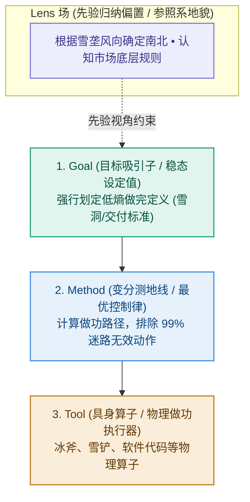

# 第 2 章：秩序的物理学——暴风雪中的求生骨架

> **本章提要**：为什么如果你不花精力去收拾，房间必然会越来越乱，手机内存必然会越来越满，团队的沟通必然会越来越低效？这不仅仅是某种心理暗示，而是全宇宙最残酷、也最无可逃避的物理定律——熵增。在混乱的自然界中，秩序从来不是免费的。本章带你走进暴风雪赶路的思想实验，用物理直觉推演 LGMT “1 场 + 3 节点”的自适应拓扑，为你建立一套在熵增风暴中强行划出低熵绿洲的求生骨架。

---

## 一、 极地风暴：如果没有骨架，人是怎么在雪夜里冻死的？

想像这样一个身临其境的思想实验：

设想你正身处北极圈内的一片荒原上。夜幕降临，温度骤降至零下 30 度，一场遮天蔽日的暴风雪突然呼啸袭击了整片大地。

能见度不足半米，狂风卷着冰晶打在你的面罩上发出噼啪的巨响，四周是一片死寂的白茫茫与黑漆漆。

此时，你的体内储备着有限的卡路里，体温正在被狂风以恐怖的速度抽走。

**在这样的极端环境里，一个缺乏先验秩序的人，是怎么一步步走向死亡的？**

他通常会经历以下三步盲目做功：

1. **第一步（乱跑狂奔）**：在极度的恐慌中，他听凭本能，拔腿就跑。他拼命地迈动双腿，狂奔了 20 分钟，消耗了大量的卡路里。然而，因为没有任何参照物，他在不知不觉中只是以双脚微小的步幅差，在荒原上画了一个巨大的圆圈，最后回到了原地——**这是在 Tool（双腿做功）与 Method（狂奔）上消耗了极大能量，却没有任何有效位移。**
2. **第二步（工具依赖）**：他感到了绝望，伸手掏出了口袋里性能最强悍的防风打火机（Tool）。他打火、点燃了一根枯枝。那一刻火光照亮了四周 1 米的雪地，带给他一丝微弱的温暖。但他很快发现，打火机根本无法阻挡零下 30 度的暴风雪。几分钟后，燃料耗尽，四周重新陷入更深沉的黑暗与冰冷。
3. **第三步（失温瘫痪）**：他的体温降到了 35 度以下，大脑开始幻觉发热，最终蜷缩在雪堆里失去意识。

这个悲剧场景中，求生者不可谓不努力：他迈动双腿跑到了精疲力竭，他使用了最精良的打火机。**但他依然冻死了。**

现在，让我们看看一个真正训练有素的极地求生专家，在面对同一场暴风雪时会怎么做：

1. **第一步（立 Lens：确定物理地图）**：他停下脚步，绝不乱跑。他戴着特制的风镜，在狂风中寻找极星的位置，或者根据风吹雪堆形成的雪垄走向，确认了磁极与风向的底层先验（**这叫 Lens 场托底**）。
2. **第二步（锁 Goal：设定生命吸引子）**：他没有把目标设定为“今晚走出大草原”（那是虚无的幻想），而是极其冷静地锁定当下的唯一低熵目标：“在体温降到 35 度前，找到一块避风的岩石掩体，挖一个雪洞”（**这叫 Goal 锁定做完定义**）。
3. **第三步（推 Method：变分测地线）**：为了到达岩石掩体，他制定了严格的做功路径——不狂奔，保持恒定心率，每走 100 步用手杖探一次深度，防止掉入冰缝。
4. **第四步（选 Tool：工具算子做功）**：他拿出冰斧（Tool）砍开硬雪，拿出雪铲（Tool）快速堆砌雪墙。

半小时后，狂风依然在洞外怒吼，但求生者已经蜷缩在点燃了微小蜡烛的雪洞里。雪洞内的温度回升到了 0 度以上，他的体温保住了，生命在死寂的暴风雪中强行划出了一块温暖的低熵绿洲。

**这个雪夜求生的骨架，就是 LGMT 模型最原始、最硬核的物理真相。**

---

## 二、 宇宙的终极宿命：为什么混乱是常态，秩序是奇迹？

很多管理者和个人经常感到沮丧：“为什么我刚把桌面理干净，两天后又乱了？为什么团队刚对齐的流程，过两周大家又开始走样了？”

答案隐藏在 19 世纪物理学家克劳修斯提出的**热力学第二定律（熵增原理）**中：

> **在孤立系统内，分子的热运动总是朝着无序度（熵）增加的方向演化。任何系统如果不借助外部做功，必然从有秩序走向瘫痪与混乱。**

```
                       自然界无处不在的“熵增法则”
┌─────────────────────────────────────────────────────────────┐
│ 物理世界自然演化 ──► 秩序崩解、能量耗散、无序度 (熵) 暴增    │
│ (房间变乱、打卡走样、系统卡顿、团队内耗、人生迷茫)           │
└─────────────────────────────────────────────────────────────┘
                               ▲
                               │ 必须输入“低熵负熵流”
┌─────────────────────────────────────────────────────────────┐
│ LGMT 降熵骨架    ──► 引入先验、锁定目标、规划路径、精密做功  │
└─────────────────────────────────────────────────────────────┘
```

这个物理定律揭示了一个残酷的真相：

**混乱，是宇宙的默认设置；而秩序，是人类必须咬牙进行做功才能维持的奇迹。**

* 一个房间如果不花精力收拾，自然状态下散落的概率（数百万种）远大于整齐叠好的概率（一种）；
* 一个团队如果不进行目标校验，每个人按照各自本能发散的概率，远大于统一方向做功的概率；
* 一个人的大脑如果不进行先验约束，陷入胡思乱想与注意力碎片的概率，远大于专注产出的概率。

如果你任由系统听凭本能去演化，系统必然会快速滑向“高熵废墟”。

**而 LGMT 模型，本质上就是人类大脑在物理世界里抗击熵增、强行维持系统秩序的最优降熵拓扑结构。**

---

## 三、 LGMT “1 场 + 3 节点”的物理降熵拓扑

在物理学与控制论的透视下，LGMT 绝不是四个平铺直叙的步骤，而是一个由 **“ 1 个贯穿先验场”与“ 3 个前向做功节点”** 组成的自适应控制拓扑：



### 1. Lens（先验场）：为你提供大地的参照系
在北极风暴里，如果你看不见极星、读不懂雪垄（没有 Lens），你眼中的世界就是一片无方向的乱麻。
Lens 是你脑海中的“先验地图”。它不直接做功，但它决定了你在面对纷繁复杂的信息流时，如何进行过滤与归因。

### 2. Goal（目标吸引子）：强行划定低熵边界
在无数种可能的未来中（比如冻死在路上、掉进冰缝、漫无目的乱逛），Goal 是你用意识强行选定的那一个**极低概率的稳态（雪洞）**。
Goal 越明确，系统的熵值就被压缩得越低。

### 3. Method（变分测地线）：避开最耗能量的坑洞
在物理学中，变分法用于寻找两点之间能量消耗最小的“测地线”。
Method 就是那条测地线。它告诉你“第一步踩哪里、第二步怎么挥斧”，防止你像那个无头苍蝇一样在雪地里画圈子。

### 4. Tool（具身算子）：在物理现实中做功
冰斧和雪铲（Tool）本身没有任何智慧，它们只是替你把人脑的思考转化为实体做功的机械载体。

---

## 四、 本章防错纪律与检视卡

当你再次感到混乱、迷茫、或者项目乱成一团麻时，不要坐在那里叹气。

提醒自己：**这是熵增原理在对我做功。如果我不施加逆向的控制力，系统必然崩溃。**

收起你的情绪，拿出你的 LGMT 降熵骨架，在混乱的风暴中，为自己挖出那个温暖的雪洞。

---

### 📷【30秒物理降熵自查卡】

> **建议保存或拍照此卡，在感到混乱、项目失控或陷入熵增瘫痪时自查：**

```
 ┌──────────────────────────────────────────────────────────────┐
 │             《清晰思考的纪律》· 物理降熵自查卡                 │
 ├──────────────────────────────────────────────────────────────┤
 │ 当你感觉事情乱成一团麻、自己正在“无头狂奔”时，问自己：       │
 │                                                              │
 │ [ ] 1. 物理参照系：我现在是在听凭本能乱跑（高熵迷茫），      │
 │        还是已经通过 Lens 确认了当前的先验方向？             │
 │                                                              │
 │ [ ] 2. 吸引子锁定：在无数种混乱可能中，我是否强行锁定了一个  │
 │        明确的低熵 Goal (雪洞/做完定义)？                     │
 │                                                              │
 │ [ ] 3. 能量测地线：我的 Method 是在高效做功，还是像在雪地里  │
 │        打转一样，在做大量无用功？                             │
 └──────────────────────────────────────────────────────────────┘
```

---

> **本章金句**：  
> * “混乱是全宇宙的默认设置，而秩序，是人类用意识强行捍卫的奇迹。”  
> * “在暴风雪里，双腿最勤奋的无头狂奔，往往只会带你走向最快的冻死。”  
> * “LGMT 并不是某种花哨的管理爱好，而是你在充满熵增的现实世界里抗击瘫痪的唯一求生骨架。”
