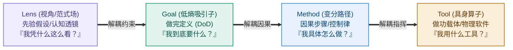

# 第 3 章：四构件解构——Lens、Goal、Method、Tool 的极简说明书

> **本章提要**：如果在面对复杂任务时，你依然分不清什么是“看世界的眼镜”、什么是“最终要结果”、什么是“走过的路径”、什么是“手中的器械”，你就会在不知不觉中重蹈覆辙。本章剥离所有花哨案例，为你一站式深度拆解 LGMT 模型的四个核心构件——Lens、Goal、Method、Tool 的精准定义、判别标准与真假防伪标志，交付一套终身受用的认知解耦说明书。

---

## 一、 为什么要对这四个词进行“冷酷解耦”？

在日常生活和工作中，人们经常把一些极其不同的概念混为一谈：

* “我们的目标是引入敏捷开发！”——错！敏捷开发是 **Method（路径）**，不是 Goal（目标）。
* “我今天学了 3 个小时 Python！”——错！Python 是 **Tool（工具）**，学习 3 小时是动作，都不是 Goal。
* “我觉得这个需求做不出来。”——错！这是你戴着的 **Lens（先验透镜）** 在限制你，而不是物理现实限制了你。

人类大脑在混乱状态下，最容易把“视角、目标、路径、工具”黏连在一起，形成一团无法解开的乱麻。

**解耦（Decoupling），是所有顶级工程与清晰思考的第一步。**

就像一辆跑车，发动机（Tool）、导航路线（Method）、终点站（Goal）和驾驶者的驾驶视野（Lens）各司其职。一旦你把导航路线当成终点站、把发动机当成视野，这辆车必然车毁人亡。

现在，让我们拿起手术刀，对 LGMT 的四个构件进行逐一解构。

---

## 二、 构件一：Lens（先验范式 / 认知透镜）——你凭什么这么看？

```
                         Lens (先验范式场)
┌─────────────────────────────────────────────────────────────┐
│ 物理隐喻 : 戴在眼睛上的有色眼镜 / 脑海中的底层先验地图       │
│ 核心功能 : 决定你从混沌信息中“能看到什么”与“忽略什么”      │
│ 防伪标志 : 它不是某一个具体的动作，而是解释一切的前置立场    │
└─────────────────────────────────────────────────────────────┘
```

### 1. 什么是 Lens？
Lens 是你大脑中长期积累形成的**先验假设、价值观、归纳偏置与认知透镜**。

在物理学与人工智能中，没有任何系统能在“零先验”的状态下处理信息。当你面对一个陌生场景时，你必须先“戴上一副眼镜”，才能从无序的噪声中看出结构。

### 2. 经典比喻：红墨镜与雪地
如果你戴着一副**红色的墨镜**去看一片白色的雪地，你眼里看到的雪地永远是血红色的。

* 如果你不知道自己戴着红墨镜，你就会高喊：“天啊，全世界都在流血！”（**先验傲慢**）；
* 只有当你意识到“我戴了一副红墨镜”时，你才能摘下眼镜，看清雪地真正的白色（**先验觉察**）。

### 3. 三种常见的 Lens 示例
* **阿杰的“仓储 Lens” vs “代谢 Lens”**：以为知识是收集的财产（仓储），看到的都是“收藏”；意识到知识是消化的能量（代谢），看到的都是“输出”。
* **老张的“炫技 Lens” vs “商业 Lens”**：以为用户喜欢高科技（炫技），生产出的都是无人问津的繁琐硬件；意识到用户喜欢简单耐用（商业），生产出的都是爆款。
* **管理者的“掌控 Lens” vs 一线的“交付 Lens”**：管理者希望数据全知（掌控），看到的都是表格；一线希望快速做功（交付），看到的都是摩擦力。

---

## 三、 构件二：Goal（低熵吸引子 / 稳态设定值）——你到底要什么？

```
                         Goal (目标吸引子)
┌─────────────────────────────────────────────────────────────┐
│ 物理隐喻 : 暴风雪中避风的雪洞 / 吸引系统收敛的低熵吸引子     │
│ 核心功能 : 强行在无数种混乱可能中，锁定唯一的物理做完标准   │
│ 防伪标志 : 必须包含明确的 DoD (做完定义)，且不随工具而改变  │
└─────────────────────────────────────────────────────────────┘
```

### 1. 什么是 Goal？
Goal 是系统在物理相空间中强行锁定的**稳态设定值（Set Point）**。它是用来校验系统一切做功是否有效的唯一标准。

### 2. 识别“真 Goal”与“假 Goal”的 3 大生死标准

在现实中，90% 的人设定的 Goal 都是假 Goal（代理指标置换）。用以下 3 条标准进行真伪判定：



---

## 四、 构件三：Method（变分路径 / 控制律）——你具体怎么做？

```
                         Method (变分路径)
┌─────────────────────────────────────────────────────────────┐
│ 物理隐喻 : 避开冰缝的探路轨迹 / 能量消耗最小的变分测地线     │
│ 核心功能 : 建立从“当前状态”通往“ Goal ”的因果做功链条       │
│ 防伪标志 : 必须具备因果逻辑，且能根据 Error 反馈动态微调     │
└─────────────────────────────────────────────────────────────┘
```

### 1. 什么是 Method？
Method 是连结上游 Goal 与下游 Tool 的**因果策略、算法步骤与做功路线**。

在物理学中，从 A 点到 B 点有无数条路径，Method 是那条排除 99% 无效动作、能量消耗最小的“测地线”。

### 2. Method 容易犯的两大死穴
* **因果断裂**：动作与目标之间没有因果关系。例如：“每天在微信公众号发 3 条海报（Method）”并不能因果导向“客户购买产品（Goal）”。
* **方法仪式化（Cargo-Cult）**：失去了 Goal 支撑的 Method，就会退化为无意义的木头耳机——大家每天机械地开 15 分钟敏捷站会、填报表，唯独不关心结果。

---

## 五、 构件四：Tool（具身算子 / 物理执行器）——你用什么载体？

```
                         Tool (具身算子)
┌─────────────────────────────────────────────────────────────┐
│ 物理隐喻 : 求生者手中的冰斧雪铲 / 在实体世界做功的物理算子   │
│ 核心功能 : 降低人类大脑与物理世界的交互摩擦，输出实体控制力  │
│ 防伪标志 : 居于因果链的最末端，永远被动接受上游指挥         │
└─────────────────────────────────────────────────────────────┘
```

### 1. 什么是 Tool？
Tool 是实体世界中看得见、摸得着的**物理做功载体、软件算子与机械器具**。

从一把石斧、一根铅笔，到 Obsidian 软件、Python 脚本、AI 大模型，通通都是 Tool。

### 2. Tool 的物理第一性：具身做功成本（Cognitive Friction）
工具本身没有任何道德与灵魂。评价一个 Tool 好坏的唯一标准是：

$$\text{工具净效能} = \text{生产力增益} - \text{具身做功摩擦力}$$

* 如果一个工具让你少敲 50 个字、少点 3 次鼠标，它就是**正效能 Tool**；
* 如果一个工具为了满足管理者的装修欲，让你每天多花 1 小时填 12 个下拉框，它就是**负效能废墟**。

---

## 六、 LGMT 的五大黄金纪律总纲

在完整解构了 Lens、Goal、Method、Tool 四大构件之后，我们必须将它们升华为指导日常决策与系统防错的 **5 大黄金纪律**。这是贯穿全书的核心认知骨架：

```
                    LGMT 5 大黄金纪律总纲
┌─────────────────────────────────────────────────────────────┐
│ 1. 纪律一：位阶不可颠倒 (生成顺序)                          │
│    Lens (视角) ──► Goal (目标) ──► Method (路径) ──► Tool (工具)│
├─────────────────────────────────────────────────────────────┤
│ 2. 纪律二：目标不可置换 (做完定义)                          │
│    用真实物理降熵与客户价值 (DoD)，校验一切做功与代理指标      │
├─────────────────────────────────────────────────────────────┤
│ 3. 纪律三：路径不可脱节 (因果做功)                          │
│    废除无因果关系的伪努力与形式主义，Method 必须是最小抵抗测地线│
├─────────────────────────────────────────────────────────────┤
│ 4. 纪律四：诊断必须逆向 (自下而上)                          │
│    故障时按做功成本自下而上升维排查：Tool ─► Method ─► Lens    │
├─────────────────────────────────────────────────────────────┤
│ 5. 纪律五：模型不可教条 (因地制宜)                          │
│    简单域直接 SOP，混沌域先行动止血，手中有剑，心中无剑        │
└─────────────────────────────────────────────────────────────┘
```

---

## 七、 本章防错纪律与检视卡

这四个构件，构成了你大脑中最精密的四把手术刀。

分清了它们，你在面对任何复杂任务时，就能瞬间一眼洞穿：**到底是什么地方卡住了系统。**

---

### 📷【30秒 LGMT 四构件解耦极简说明书】

> **建议保存或拍照此卡，在厘清思路或诊断问题时自查：**

```
 ┌──────────────────────────────────────────────────────────────┐
 │             《清晰思考的纪律》· 四构件极简说明书               │
 ├──────────────────────────────────────────────────────────────┤
 │ [ ] Lens (视角)   : 我戴着什么眼镜？(先验假设、立场与底色)    │
 │                     问：“我凭什么这么看？”                   │
 │                                                              │
 │ [ ] Goal (目标)   : 终点雪洞在哪里？(做完定义 DoD、低熵稳态) │
 │                     问：“我到底要什么？”                     │
 │                                                              │
 │ [ ] Method (路径) : 路线怎么走？(因果步骤、变分测地线)        │
 │                     问：“我具体怎么做？”                     │
 │                                                              │
 │ [ ] Tool (工具)   : 拿什么冰斧做功？(算子载体、物理软件)      │
 │                     问：“我用什么工具？”                     │
 └──────────────────────────────────────────────────────────────┘
```

---

> **本章金句**：  
> * “将 Method 当成 Goal，叫方法仪式化；将 Tool 当成 Goal，叫伪努力黑客。”  
> * “没有零先验的视角，只有不知道自己戴着红墨镜的盲人。”  
> * “解耦是所有顶级工程的第一步。把路线当终点，跑车必然车毁人亡。”
