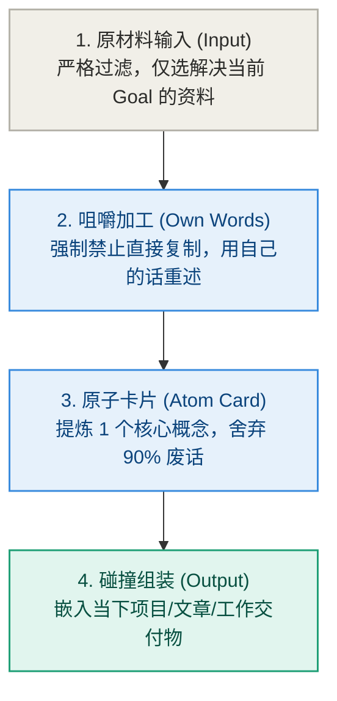

# 第 4 章：个人突破——彻底终结“知识囤积与假装学习”

> **本章提要**：为什么你收藏了上千篇干货文章、买了上百门在线课程、微信浮窗和网盘里塞满了资料，真正需要解决问题时，脑子里却依然是一片荒漠？个人学习中最深的坑，在于用“收集与囤积”的快乐，替代了“消化与输出”的做功。本章跟着阿杰的“资料库松鼠症”，用 LGMT 模型重新定义个人知识管理（PKM），理清 PARA、卡片盒、双链笔记的真实坐标，建立输出倒逼输入的知识代谢流水线。

---

## 一、 篇章衔接：从理论骨架切入四大真实战场

在完成了【第一部·立模篇】对 Lens、Goal、Method、Tool 的冷酷解耦与黄金纪律搭建后，我们终于可以握紧这四把手术刀，走出理论的试验场，切入现实的四大真实战场。

第一站，让我们先去解剖现代人最普遍、也最隐蔽的认知陷阱——个人学习中的“数字松鼠症”。

故事，依然要从阿杰说起。在经历了第 1 章的汇报惨败后，阿杰沉寂了一周。但他很快又给自己找到了新的出路：

“上次之所以败得那么惨，”阿杰在心里对自己分析，“是因为我的知识库积累还不够深。我的脑子里没有足够的案例和素材，所以才写不出东西。”

于是，阿杰开启了一场长达半年的**“知识狂欢”**：

* 每天早上刷手机，看到一篇标题为《AI 时代的 10 个商业模式》的文章，他的手指迅速滑动，点击“微信收藏”，并转发到自己的 Obsidian 接收收件箱；
* 午休时，刷到一段讲解“变分自编码器”的 B 站视频，他兴奋地按下“收藏”，并在心里对自己说：“这内容太硬核了，今晚一定要抽空看完”；
* 深夜躺在床上，他买下了某个知识付费平台推给他的《30天掌握顶级思考模型》课程，看着已购列表中那 30 节未解锁的视频，他心满意足地合上了眼睛。

在接下来的大半年里，阿杰就像一只在秋天狂热囤积松果的松鼠。

他的微信收藏夹里攒了 1200 多篇文章；他的网盘里塞满了 300GB 的高清讲座视频；他的 Obsidian 库里建立了几十个文件夹、分类打上了 800 多个标签。

每当看到自己的知识库数字不断攀升，阿杰心里就会升起一股踏实而丰盈的满足感。他觉得自己正在以惊人的速度“成长”。

**然而，现实的冷水很快再次泼来。**

半年后的一个下午，团队遇到了一个关于“用户流失率异常”的紧急难题。Leader 在白板前敲着黑板：“大家脑暴一下，我们有什么现成的分析框架或解法？”

会议室里一片安静。阿杰坐在后排，心跳陡然加速。

他在脑海里疯狂地检索：“我记得我半年前收藏过一篇讲用户流失的绝佳文章！里面有 5 个维度！我当时还打了 `#用户增长` 的标签！”

然而，当他打开 Obsidian 拼命输入关键词搜索时，尴尬的事情发生了：

那篇文章确实在他的库里，甚至被整理到了精致的文件夹里。但他除了记得“标题看起来很有道理”之外，**对于文章里的具体逻辑、推导过程、以及如何应用到眼前公司的业务中，脑子里依然是一片空白。**

他花了整整半年时间囤积的 1200 篇文章和 300GB 资料，在现实问题的撞击下，像一堆轻飘飘的泡沫一样瞬间蒸发。他依然什么都回答不上来。

**这种现象，就是典型的“数字松鼠症（Information Hoarding）”。**

我们像松鼠囤积坚果准备过冬一样，把“收藏和分类资料”当成了安全感的来源。但我们忘了最重要的物理事实：坚果如果不吃进肚子里消化，囤积再多，松鼠依然会被饿死。

这种“用动作的充实掩盖目标的失明”，不仅发生在知识管理中，在现代人的健康健身中同样每天都在重复：很多人为了“恢复健康”，买了几千块的跑鞋、高阶健身房年卡与打卡软件（Tool 疯狂采购）。随后强迫自己天天照着软件打卡（Method 机械执行）。但三个月过去体脂率毫无变化，人累得够呛。

为什么？因为他们的 Goal 被置换为了“天天打卡”这种自我感动的代理指标，而他们底层的 Lens 依然是“健身是某种按时打卡就能自动变瘦的交易”。

**只要底层的 Lens 和 Goal 错掉了，买再贵的跑鞋、做再复杂的健身计划，都只是一场昂贵的表演。**

---

## 二、 LGMT 病理诊断：用“仓储思维”替代“代谢模型”

> 🚗 **【快车道速览】**：本节对比两种认知透镜——误把信息当财产的“仓储 Lens”只会导致吃灰；意识到知识是能量的“代谢 Lens”才能实现真实产出。

用 LGMT 模型的手电筒照向阿杰的学习过程，你会发现他在个人成长上犯了极其致命的“认知倒错”。

```
                    阿杰在学习上的 LGMT 倒错
┌─────────────────────────────────────────────────────────────┐
│ ❌ 错误 Lens (仓储视角) : 知识是某种可以被收藏拥有的“财产”│
│                          知识库文件越多，自己就越厉害       │
└─────────────────────────────────────────────────────────────┘
                               │
                               ▼ 导致
┌─────────────────────────────────────────────────────────────┐
│ ❌ 代理 Goal (指标置换) : “看完 50 本书”、“收藏 1000 篇干货”│
│                          (用“收集量”替代“吸收量”)            │
└─────────────────────────────────────────────────────────────┘
                               │
                               ▼ 导致
┌─────────────────────────────────────────────────────────────┐
│ ❌ 伪 Method & Tool    : 疯狂折腾笔记分类、PARA、双链标签    │
│                          (在门楼上磨洋工，耗尽了深度算力)   │
└─────────────────────────────────────────────────────────────┘
```

### 1. Lens（视角）坏掉了：误把信息当资产
阿杰底层的 Lens 是“仓储视角（Warehouse View）”。他认为知识就像存折里的余额，收藏得越多，资产就越雄厚。
但物理现实是：**未经你大脑加工、重组与表达的信息，不是你的资产，而是你硬盘里占地方的无用负债。**

### 2. Goal（目标）被偷换了：用“代理指标”自我感动
在旧 Lens 的支配下，阿杰的目标变成了“今年读完 50 本书”、“每天收藏 5 篇好文”。
这些目标极其容易达成，也能给大脑带来廉价的成就感。但它们都是**假目标**。真实的 Goal 永远只有一种：**你是否能用自己的话解释这个概念？你是否用它解决了一个真实问题？**

### 3. Method 与 Tool 被过度工程化：在门楼上磨洋工
为了支持这种“仓储思维”，阿杰引入了极度复杂的卡片盒笔记法、PARA 目录分类、Obsidian 双链关系图谱。
他每天花费数小时在给文章打标签、画双链连线上。这种繁重的“前端整理”，让他彻底消耗光了能量，再也没有体力去进行真正的“后向思考”。

---

## 三、 破局纪律：建立“输出倒逼输入”的知识代谢流水线

> 🔬 **【深水区推演】**：本节推演控制论代谢模型，提供“摄入-咀嚼-做功-输出”四步算法，用输出来强行倒逼输入。

要彻底终结知识囤积与假装学习，我们必须用全新的 LGMT 纪律，重构你的个人学习系统。

### 纪律 1：立新 Lens——知识不是资产，而是“代谢物”

在你的脑海里建立一个新的先验视角：

> **知识不是石头，而是像食物一样的“代谢物”。**

食物吃进肚子，如果不经过肠胃的消化吸收，并最终转化为身体的能量与排泄，堆积在体内的食物就会变成剧毒的垃圾。

信息也是一模一样。**没有被你用自己的话重写（消化）、没有被你用来输出解决问题（代谢）的信息，本质上就是你脑海里的精神垃圾。**

衡量你学习成效的唯一标准，绝对不是你“输入了多少”，而是你“输出了多少”。

### 纪律 2：重塑 Goal——绝不“稍后阅读”，只做“即时交付”

从今天起，彻底废除你手机和电脑里的“稍后阅读（Read Later）”列表！

在物理学上，“稍后阅读”约等于“再也不读”。它只是大脑在逃避当下思考时的一种缓兵之计。

建立全新的 Goal 纪律：
* 看到一篇好文，要么**立刻花 5 分钟读完**，并用自己的话在白板或卡片上写下一句心得；
* 如果当下没有时间，**直接关闭页面，决不收藏**！
* 相信我：如果这篇文章真的足够重要，未来的现实问题一定会再次把它推到你的面前；如果它不重要，流失了就是对你大脑算子最大的保护。



**【4步代谢口诀】**：`按需输入` ➔ `用自己的话重述` ➔ `提炼单概念卡片` ➔ `直接用于项目输出`。

终结数字松鼠症，绝不能靠发狠誓或死磕意志力。在微观落地层，我们需要借用行为设计中的黄金技巧：**将能力摩擦降至最低，并锚定日常提示**。

不要试图规划一个陡峭的“每天撰写 2000 字”的宏大目标，那需要消耗巨大的意志力。相反，筛选出低摩擦的黄金行为——“每天在现有的工作日志末尾，只用自己的话重述 1 条今天学到的核心概念”。随后，将这个极简行为绑定到你已有的生活锚点上（例如“每次下午下班关电脑前”）。让知识的代谢像刷牙一样无痛发生，自然而然地融入你的工作流。

### 纪律 3：主流笔记法在 LGMT 坐标系中的真实归位

市面上流行着各种各样的笔记方法论，我们不必盲目崇拜，也不必全盘否定。用 LGMT 坐标系把它们放在正确的位置：

* **康奈尔笔记法（Cornell Notes）**：本质上是一个极佳的 **Method（咀嚼加工）**。它强制你在右侧记录、在左侧提炼线索、在底部写 Summary（用自己的话重述）。它关注的是“消化”，而不是“仓储”。
* **卡片盒笔记法（Zettelkasten）**：本质上是一个 **Method（原子化组装）**。它的精髓在于让你把长文章拆成单概念的“原子卡片”，方便未来像积木一样拼装出新文章。如果你只写卡片而不拼装输出，它依然会沦为高级废纸堆。
* **PARA 方法（Projects, Areas, Resources, Archives）**：本质上是一个 **Goal 导向的 Tool 架构**。它最大的亮点是把 **Projects（当前有明确交付物的项目）** 放在第一位。凡是不服务于当前 Projects 的资源，通通压入背景。

---

## 四、 本章防错纪律与检视卡

看清了阿杰的松鼠症，请立刻打开你的手机和电脑。

清理掉那些让你产生假装努力快感的“稍后阅读”列表。记住：**你的大脑是用来思考的器官，而不是用来装二手资料的硬盘。**

---

### 📷【30秒个人学习与知识代谢自查卡】

> **建议保存或拍照此卡，在阅读干货文章或想点击“收藏”时进行自查：**

```
 ┌──────────────────────────────────────────────────────────────┐
 │             《清晰思考的纪律》· 知识代谢自查卡                 │
 ├──────────────────────────────────────────────────────────────┤
 │ 当你想点击“收藏”或保存一篇资料时，问自己：                   │
 │                                                              │
 │ [ ] 1. 逃避检测：我是不是在用“收藏”的动作，逃避当下用大脑  │
 │        去认真读完它的痛苦？                                  │
 │                                                              │
 │ [ ] 2. 转述检测：如果不允许复制粘贴，我能否用自己的话，在    │
 │        30 秒内说出这篇文章最核心的一个洞察？                │
 │                                                              │
 │ [ ] 3. 交付检测：这篇资料能够直接服务于我未来 7 天内的哪一个 │
 │        具体交付 Goal？（若无 -> 立即关闭页面，绝不收藏！）   │
 ├──────────────────────────────────────────────────────────────┤
 │ ⚡【即刻行动】：现在打开手机，清空或关闭你的“稍后阅读”悬浮框。 │
 └──────────────────────────────────────────────────────────────┘
```

---

> **本章金句**：  
> * “未经过你大脑加工与表达的信息，不是你的资产，而是你硬盘里的无用负债。”  
> * “稍后阅读，在物理学上约等于再也不读；收藏夹是你给大脑搭建的最舒适的避难所。”  
> * “知识不是石头，而是食物。不要做囤积坚果的松鼠，要做把信息转化为能量的消化者。”
