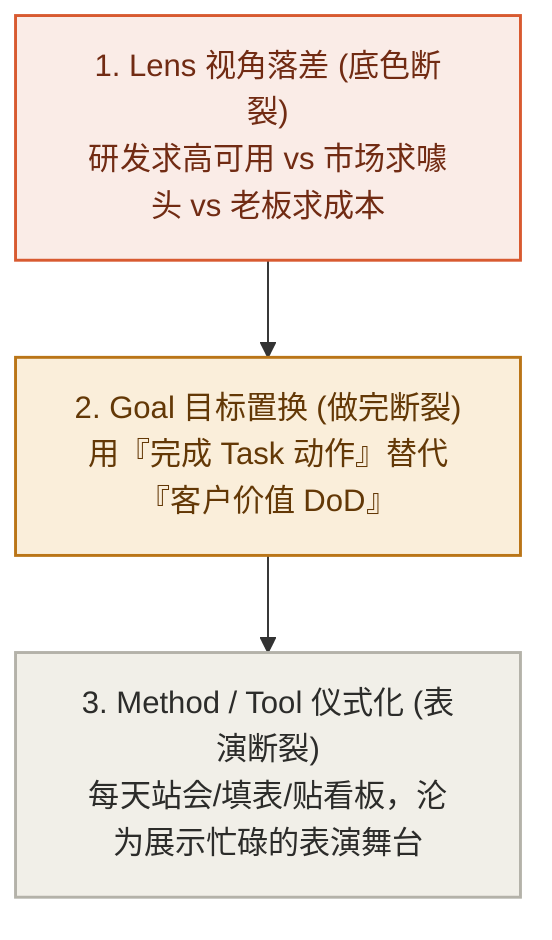

# 第 5 章：团队对齐——告别“大家都在忙，却不知为了啥”

> **本章提要**：为什么很多团队每周开无数个对齐会、每天搞 15 分钟站会、引入了最时髦的 OKR 与敏捷流程，大家累得精疲力竭，交付出来的产品却依然不解决问题？团队协作最大的死穴，在于用“动作的忙碌（Method/Tool）”替代了“目标的对齐（Goal）”。本章跟着传统制造业创始人老张的创业团队，用 LGMT 模型剖析团队内耗的根源，教你如何用 Goal 锁定“做完的定义”，用 Lens 统一团队底色，彻底终结“敏捷表演”。

---

## 一、 老张和他的“敏捷表演艺术团”

42 岁的传统制造业创始人老张，今年遇到了一件让他无比头疼的事情。

为了响应“数字化升级与敏捷转型”的口号，老张高薪聘请了一位来自大厂的敏捷教练，为公司引进了最时髦的敏捷开发流程、OKR 目标管理体系以及全套看板工具。

刚开始的两个月，公司的气氛看起来焕然一新：

每天早晨 9 点 30 分，各个部门的员工围成一圈，召开例行的“15 分钟敏捷站会”。

大家站在白板看板前，轮流语气坚定、表态积极地发言：
* 研发组组长：“我昨天完成了 3 个 Task 的代码提交，修复了 2 个 Bug，今天准备继续推进模块 B 的开发，目前没有 Blocker。”
* 市场部经理：“我昨天发了 2 篇微信公众号文案，今天计划把下周的社群海报排版完成，目前没有 Blocker。”

每个人汇报得有条不紊、排期满满。白板上的“进行中（In Progress）”贴纸被密密麻麻地贴满，每周的周报写得花团锦簇。

单看这个画面，这无疑是一支训练有素、执行力极其恐怖的狼性团队。

老张在会议室后排看着，心里感到了由衷的欣慰。

**然而，到了季度末的业务交付日，现实却给老张泼了一桶彻骨的冰水。**

当老张打开财务报表和后台数据时，刺眼的数据让他几乎晕厥：
* 新上线的数字化系统留存率几乎为零，一线销售根本不用；
* 客户最核心提出的 3 个致命痛点，在过去 6 个敏捷迭代里被一拖再拖；
* 市场部发了几十张精美海报，带来的有效潜在客户转化竟然是零！

在紧急召开的复盘会上，会议室里的空气陷入了死寂。

老张拍着桌子咆哮：“大家每天站会都在说没有 Blocker，每个人都在按时完成 Task，为什么最后交出来的东西是个垃圾？！”

下属们低着头，脸上写满了委屈：
* 研发组抱怨：“我们严格按照产品经理给的 Task 写完了代码啊，代码零 Bug 上线，这不能怪我们吧？”
* 市场部抱怨：“我们按敏捷排期发满了 20 篇文案啊，文章阅读量指标也达标了，用户不买单是产品太难用啊！”

每个人都极其忙碌，每个人都百分之百完成了自己的“ Task ”，但**没有人在为最终的“业务结果”负责！**

**这种现象，在团队管理中被称为“货物崇拜（Cargo-Cult）与敏捷表演”。**

二战时期，南太平洋岛屿上的土著人看到美军在平地上建造跑道、戴着木头耳机挥动旗帜，随后就有装满物资的飞机降落。美军撤走后，土著人也用木头造了假“飞机”和“耳机”，在荒地上挥舞旗帜，虔诚地祈祷物资降落。

老张的团队，正是陷入了这种荒谬的“货物崇拜”：

**他们拷贝了敏捷站会、周报填表、看板贴纸等所有时髦的动作（Method/Tool），却唯独丢失了这些动作背后的目标（Goal）与灵魂！**

---

## 二、 LGMT 病理诊断：团队内耗的三大断裂

用 LGMT 模型去剖析老张团队的内耗，其背后的病理结构极其清晰：



### 1. 认知底色断裂（Lens 落差）
团队里的成员看似在一个办公区工作，其实每个人戴着完全不同的 Lens（透镜）：
* 研发的 Lens 是“技术优雅”：他们关注代码结构漂不漂亮，系统会不会崩；
* 市场的 Lens 是“曝光声量”：他们关注文章阅读量高不高，海报够不够抓眼球；
* 老张的 Lens 是“企业存亡”：他关注的是现金流和客户续费率。

当这三种完全相反的先验视角没有在源头被统一时，大家在站会上的“沟通”，本质上只是三种语言在平行时空里的对聋发哑。

### 2. 做完标准断裂（Goal 置换）
在老张的团队里，最大的死穴在于**“做完的定义（Definition of Done, DoD）”被严重置换了**。
* 研发把“代码合并进主干”定义为做完；
* 市场把“海报排版完成发送”定义为做完。

但真正的 DoD 永远只有一个：**客户是否成功使用了这个功能？这个动作是否产生了真实的商业价值？**
当团队用“Task 完成度”替代“客户价值 DoD”时，大家就会心安理得地交付大量“无用的垃圾”。

### 3. 动作与工具表演化（Method / Tool 退化）
敏捷站会（Method）和看板工具（Tool），本意是为了暴露阻碍、快速迭代。但当上游的 Lens 和 Goal 断裂后，这些工具就退化为了员工向 Leader 证明“我很忙、我没有偷懒”的表演舞台。

---

## 三、 破局纪律：用 Goal 锁定 DoD，建立 4 步团队对齐流程

要终结团队的“敏捷表演”，老张们必须重构团队的 LGMT 对齐纪律。

### 纪律 1：强制统一“做完的定义（DoD）”

在任何项目开工前，团队负责人必须召开“DoD 锁定会”。在白板上只写两行字，并要求所有成员签字确认：

```
DoD (Definition of Done) 锁定公式：
┌─────────────────────────────────────────────────────────────┐
│ ❌ 伪 DoD (动作完成) : 代码写完了 / 海报发出了 / 报告填完了   │
├─────────────────────────────────────────────────────────────┤
│ ✅ 真 DoD (价值闭环) : 客户顺利完成了一次真实下单 /         │
│                        带来了 50 个有效试用留存 /            │
│                        问题在生产环境中被验证解决。         │
└─────────────────────────────────────────────────────────────┘
```

**未达到“真 DoD”之前，任何人在站会上都不能声称这个 Task“已完成”！**

这一条纪律，能瞬间击碎 90% 团队成员的自我感觉良好，把所有人拉回到真实的结果面前。

### 纪律 2：团队 LGMT 4 步对齐流程

下一次在召开项目启动会或周对齐会时，抛弃死板的表格，严格按照以下 4 步进行推演：

1. **第一步：统一 Lens（为什么要开这个战役？）**
   负责人首先发言：“各位，我们这次做小程序重构，底层的 Lens 不是为了炫技，而是因为现有流程太繁琐，导致 40% 的客户在支付环节流失了。”（统一先验底色）

2. **第二步：锁死 Goal（做完的具体指标）**
   “我们这次战役唯一的 Goal 是：**将支付环节的客户放弃率，从 40% 降低到 15% 以下。** 不管代码写得优雅还是粗暴，达到这个数字才算胜利！”

3. **第三步：拆解 Method（跨部门因果路径）**
   研发、产品和市场不再各自为政，而是共同推演路径：“为了降低放弃率，产品减少 2 个输入框，研发优化 1 秒加载延迟，市场提供一个一键领取优惠券的弹窗。”

4. **第四步：精简 Tool（拒绝看板表演）**
   废除那些花哨复杂的软件字段。白板上只留三列：`未开始`、`进行中`、`已达成真 DoD`。站会只讨论一件事：**“谁的动作卡住了总 Goal 的达成？怎么帮他搞定？”**

---

## 四、 本章防错纪律与检视卡

看清了老张团队的教训，请检查你的团队开会现场。

站会不是表演舞台，白板不是艺术展览。记住：**大家都在忙碌，不等于大家都在前进；只有朝向同一个 Goal 的做功，才叫真正的团队执行力。**

---

### 📷【第二部·用模篇】场景决策流程树（Decision Checklist）

> **建议保存或拍照此卡，在团队开会、做项目决策或分工时引导逻辑推演：**

```
 ┌──────────────────────────────────────────────────────────────┐
 │          《清晰思考的纪律》· 团队战场场景决策流程树           │
 ├──────────────────────────────────────────────────────────────┤
 │ 🌲 步骤 1：先判 Lens 场                                      │
 │    问：“跨部门对战役底色是否一致？（如：是降本增效还是炫技？）” │
 │    └─► 否 ➔ 停工，先召开 Lens 对齐会； 是 ➔ 进入步骤 2。     │
 ├──────────────────────────────────────────────────────────────┤
 │ 🌲 步骤 2：锁死 Goal DoD                                      │
 │    问：“我们承诺交付的是动作（伪 DoD），还是客户物理价值？” │
 │    └─► 动作 ➔ 重写 DoD 目标； 价值 ➔ 进入步骤 3。           │
 ├──────────────────────────────────────────────────────────────┤
 │ 🌲 步骤 3：排查 Tool 阻碍                                    │
 │    问：“每日站会是在做‘忙碌表演’，还是在拔除 Goal 阻碍？”   │
 │    └─► 忙碌表演 ➔ 精简看板，只留未开始、进行中、已达成真 DoD！│
 └──────────────────────────────────────────────────────────────┘
```

---

> **本章金句**：  
> * “大家都在忙碌，不等于大家都在前进；没有目标对齐的忙碌，只是在集体无意识地踩原地踏步脚踏车。”  
> * “拷贝了敏捷站会的所有动作，唯独丢失了做完的定义（DoD），这就是现代企业里最昂贵的货物崇拜。”  
> * “未产生真实客户价值的‘已完成’，是对团队资源最残酷的浪费。”
