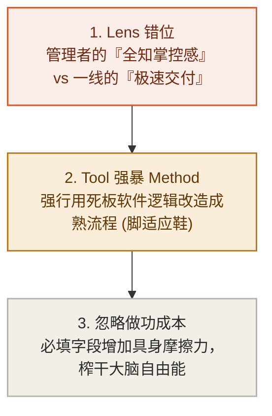

# 第 6 章：系统与技术——避免千万级系统的“填表灾难”

> **本章提要**：为什么很多企业花费巨资引入 CRM、ERP 或敏捷管理软件后，员工不仅没有变得高效，反而每天要抽出一两个小时专门“补表格”？为什么花哨的技术选型往往演变为生产力的灾难？本章跟着全栈工程师小雯的亲身经历，用 LGMT 模型剖析技术实施中的“认知倒错”，揭示“工具强暴流程”与“管理者幻觉”的深层根源，并提供一套业务视角优先的技术选型与系统降维防错框架。

---

## 一、 小雯的“千万级系统填表地狱”

> 🚗 **【快车道速览】**：通过全栈工程师小雯参与配置千万级企业 CRM 系统后、一线员工不得不用“周五下班前编造数据”逃避卡顿流程的荒谬故事，切开技术选型中的“填表灾难”。

34 岁的全栈工程师小雯，去年跳槽到了一家正在进行“数字化转型”的中型企业担任技术负责人。

刚入职时，公司高层对小雯寄予厚望，并拨出了上千万元的预算，采购了市场上最昂贵、功能最齐全的顶级企业 CRM（客户关系管理）与 ERP 系统。

在启动大会上，董事长信心满满地宣布：“有了这套系统，我们的业务将实现全流程数字化，管理效率将提升 3 倍！”

随后，管理层发布了长达 20 页的《系统操作规范》，要求全公司员工：
* 销售人员每次打完客户电话，必须在系统中录入 12 项详细沟通字段；
* 每一个销售机会的推进，必须按 7 个阶段上传对应的证明文档；
* 工程师的每一个开发 Task，必须精确录入预估工时与实际工时，并每天打卡更新。

小雯作为技术负责人，亲自参与了系统的配置与上线。然而，半年过去了，高层预想中的“效率飞跃”不仅没有出现，**公司反而陷入了一场前所未有的“填表地狱”。**

小雯在日常观察中看到了令人啼笑皆非的真实景象：

* **一线的“暗渠交易”**：销售员老王抱怨道：“我在微信里 3 分钟就能跟客户敲定合同，但要我把内容填进 CRM，要在电脑上层层点击 12 个下拉框、耗时 5 分钟！我现在宁可用纸质笔记本记账，也不想打开那个卡顿的系统。”
* **周五下午的“集体造假”**：每到周五下午 4 点，办公室里就会响起密集的键盘敲击声——大家开始凭回忆或干脆编造数据，把一周的业务“补填”进系统，仅仅是为了迎合 HR 和管理层下周一的例行抽查；
* **业务流程彻底瘫痪**：为了迎合系统预设的复杂审批流，原本半天就能签署的合同，现在要在系统里流转 6 个节点，拖延整整一周。

高层管理者在打开系统看板时看到的是一片繁荣：表格被填满了，折线图看起来极其漂亮。但在看板背后，真正产生价值的业务线正在不堪重负地呻吟。

小雯看着这个自己花了大半年时间配置的系统，心里感到无比震惊：**企业花了上千万元买来的系统（Tool），不仅没有成为推动业务前进的发动机，反而演变成了拖垮生产力的最大摩擦力源头。**

系统沦为一座高耸入云的“数字废墟”——大家都在为系统打工，唯独没有人为业务结果打工。

为什么聪明的管理者和优秀的工程师，会在技术选型和系统建设上掉入如此巨大的陷阱？

---

## 二、 LGMT 病理诊断：技术选型中的“认知倒错”

用 LGMT 模型的手电筒照向小雯公司那个瘫痪的系统，其背后的认知病理清晰得令人发指。这完全是一场关于 Lens、Goal、Method 与 Tool 位阶倒置的悲剧。



### 1. 认知倒错一：管理者的 Lens 与一线的 Lens 剧烈对撞
任何系统的设计和选型，都隐藏着设计者的 Lens（先验假设）。
* **管理者的 Lens** 是“掌控与全知”：他们希望系统能收集尽量多维度的数据，提供完美大屏，从而获得掌控感；
* **一线员工的 Lens** 是“生存与效率”：他们需要以最小的摩擦力、最快的速度把产品卖出去、把 Bug 修复掉。

当管理者凭借权力，把服务于自己“掌控 Lens”的庞大字段强制压给一线时，Tool 就彻底背离了一线的生产现场。对于一线而言，填写这些字段没有任何个人价值，反而增加了巨大的能量消耗。

员工集体敷衍填表、在暗渠沟通，正是系统摩擦力过大时，生物体为了防止自身能量被榨干而做出的理性自卫。

### 2. 认知倒错二：用 Tool（工具）强暴 Method（方法）
软件供应商在设计产品时，往往嵌入了他们所提炼的“通用最佳实践”。但**“通用最佳实践”往往等于“在任何具体场景下都不最佳的实践”。**

当企业自身的方法（Method）尚未成熟、流程尚未打磨顺畅时，管理者往往盲目寄希望于“买个系统就能把方法带过来”。于是，企业强行引入了一套庞大僵硬的系统（Tool），并用系统的规则去硬性改造一线的业务流程。

结果就是：**工具强暴了流程。**原本灵活顺畅的线下沟通，被强行切割成无数个系统中的死板字段。这种“脚适应鞋”的倒错，直接摧毁了方法本身的生命力。

### 3. 认知倒错三：忽略 Tool 的“具身做功成本”
在很多数字产品的倡导者眼中，软件好像是没有重量的。但现实中，**每一个输入框、每一个下拉菜单、每一个需要等待 2 秒的加载页面，都是需要消耗人类大脑自由能（Free Energy）的具身摩擦力。**

我们可以用物理效率算子公式对其进行量化：

$$\text{工具净效能} = \text{业务增益} - \text{填表认知做功}$$

当一个工具带来的“效率增益”，小于使用这个工具所付出的“认知做功成本”时，这个工具在物理学意义上就是一个**效率净负值算子**。

---

## 三、 破局纪律：业务视角优先的技术选型与防错框架

> 🔬 **【深水区推演】**：本节推演“工具净效能物理量化公式”，提出无系统原则（No-Tool First）与摩擦力测试法，确保技术始终服务于业务因果。

要帮小雯们摆脱“填表灾难”，我们必须用 LGMT 的严格位阶，重新建立技术与系统实施的纪律。技术从来不是目的，工具永远只能服务于做功的节点。

### 纪律 1：无系统原则（No-Tool First）——绝不自动化未成熟的流程

在考虑购买或开发任何软件系统（Tool）之前，必须强制执行“无系统原则”：

> **在没有软件辅助的情况下，用纸笔、Excel 或纯手动沟通，你的业务流程（Method）能否顺畅跑通并产生价值？**

如果你的团队用一张简易的 Excel 表格或白板都管不好客户跟进，那么引入一套价值百万元的 CRM 系统，除了让你获得一张极其昂贵的数字废墟外，绝对不会产生任何奇迹。

**系统（Tool）的功能是“放大器”，而不是“救世主”。** 它会放大你顺畅的流程（使高效率放大 10 倍），但更会放大你混乱的方法（使混乱和摩擦力放大 10 倍）。

只有当你的 Method 已经在手动状态下被证明极其有效、但因业务量暴增而触及人力极限时，才是引入 Tool 进场自动化的最佳时机。

### 纪律 2：技术选型“黄金三问法”

任何团队在引入新工具、新架构或新系统前，负责人和小雯这样的技术主管，必须在白板上回答以下三个问题：

```
技术选型黄金三问：
┌─────────────────────────────────────────────────────────────┐
│ 1. 问 Goal：这套系统解决的是“交付摩擦”还是“管理者焦虑”？     │
│ 2. 问 Method：我们现有的线下流程是否已经标准化到可以被固化？│
│ 3. 问 Tool：一线员工使用新工具的操作步骤是增加了还是减少了？ │
└─────────────────────────────────────────────────────────────┘
```

这正呼应了马斯克在工程五步法中给出的铁律：在试图将一个技术或系统自动化/软件化（Step 5）之前，必须首先对需求进行质问（Step 1 质疑需求），并彻底删减非必要环节（Step 2 激进删减）。

**工程史上最致命的错误，就是极度高效地去优化一个根本不该存在的东西。** 在买千万级 CRM 或开发复杂系统前，先问问那些繁琐的审批和填写节点能不能直接删掉。

1. **问 Goal**：这套系统上线后，最核心的受益者是谁？如果回答是“方便领导看报表”，那么请立刻斩断 80% 输入字段的设计，只保留最核心的交付数据。**【判定结论】：凡是不直接促进业务交付的冗余字段，都是对生产力的犯罪。**
2. **问 Method**：我们是否试图用软件的预设逻辑，去替代团队自主思考业务流程的责任？如果是，请先暂停系统引入，开会把业务路标彻底划清。
3. **问 Tool**：新工具是否降低了一线做功的摩擦力？如果一个新系统能让销售少敲 50 个字、让工程师少点 3 次鼠标，它就是绝佳的技术选型；如果它让一线的工作时间翻倍，那么无论它的后台看板多漂亮，都必须立刻砍掉。

---

## 四、 本章防错纪律与检视卡

技术是高精度的做功杠杆，但也最容易演变成庞大的认知负担。请记住：**最顶级的技术架构，往往拥有最克制的工具形态。**

为了防止你的团队或企业掉入系统化的“填表灾难”，请将以下防错纪律贴在 IT 部门与管理层的办公桌前。

---

### 📷【30秒技术与系统选型避坑检视卡】

> **建议保存或拍照此卡，在任何软件采购、系统立项或技术重构前进行自查：**

```
 ┌──────────────────────────────────────────────────────────────┐
 │             《清晰思考的纪律》· 系统与技术避坑卡               │
 ├──────────────────────────────────────────────────────────────┤
 │ [ ] 1. 验证成熟度：该流程在无软件介入（手动/Excel）时，    │
 │        是否已经能顺畅运转并闭环？                             │
 │        （若是 -> 允许系统化；若否 -> 先改流程，禁止上系统）    │
 │                                                              │
 │ [ ] 2. 摩擦力审查：新系统上线后，一线员工完成核心交付的     │
 │        物理操作步骤是变少了，还是变多了？                     │
 │        （若步骤暴增 -> 必须大幅砍掉非必要字段）              │
 │                                                              │
 │ [ ] 3. 目标纯粹性：系统收集的字段中，有多少是仅仅为了“迎合  │
 │        上级抽查”，而不产生任何实际业务价值的？                 │
 │        （若占比 > 30% ➔ 发生填表灾难，需立刻启动系统降维治理！）│
 └──────────────────────────────────────────────────────────────┘
```

---

> **本章金句**：  
> * “没有经过手动验证的方法，绝不能用软件去固化；自动化一个混乱的流程，你只会得到一个自动化的混乱。”  
> * “凡是不直接促进业务交付的冗余字段，都是对一线生产力的残酷犯罪。”  
> * “最顶级的技术实施，是让工具隐形于流程之后，而不是让流程瘫痪在工具脚下。”
