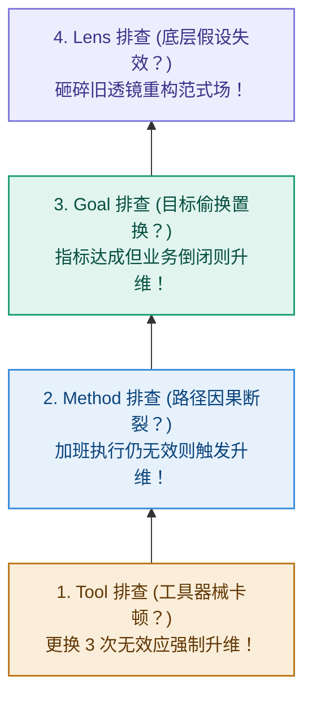

# 第 7 章：逆向追查——沿因果链拔除深层病根

> **本章提要**：当一个项目瘫痪、一项业务连续亏损、或者你个人的生活陷入无休止的陷入死循环时，绝大多数人的第一反应是“换个工具”或“再多努一把力”。这种在表象上的低水平死磕，不仅不能解决问题，反而会加速能量的耗散。本章用顾问带老张团队排查业务亏损的“诊断剧场”，教你如何沿着 Tool $\to$ Method $\to$ Goal $\to$ Lens 的因果链反向推演，精准拔除深层病根。

---

## 一、 篇章衔接：从实战战场切入逆向诊断手术

在【第二部·用模篇】中，我们先后拆解了阿杰的个人学习、老张的团队协作以及小雯的技术选型。但现实是严酷的——即使我们知道了正确的生成顺序，系统在物理世界运行中也难免遭遇卡顿、故障甚至崩溃。

当偏差（Error）已经发生、业务陷入亏损、个人陷入死循环时，我们绝不能停留在表象上盲目死磕。

【第三部·诊模篇】将为你把 LGMT 切换为一把锋利的手术刀，教你如何沿着因果链反向推演，精准拔除最深处的病根。

故事，还要从老张那场气氛压抑的紧急救火会说起。周二下午 2 点，传统制造业创始人老张的会议室里，气氛压抑得令人窒息。

公司新开发的一款智能化硬件产品，连续三个月销量大败。面对危机，老张召集了研发、市场和销售的核心骨干，开了一整天的紧急救火会。

在过去的两周里，团队已经做出一连串“拯救举措”：
* **第一周（在 Tool 上折腾）**：认为营销软件不够先进，火速花了 10 万元更换了最新的 AI 智能外呼系统、重构了电商小程序 UI；
* **第二周（在 Method 上打转）**：销量依然没有任何起色。老张认为大家工作态度不对，于是要求销售团队每天多打 50 个外呼电话，要求市场部每天多发 3 篇公众号短文。

但到了今天，销量数据依然在大跌，员工们累得精疲力竭，眼神里充满了茫然与抵触。

受邀到场的资深咨询顾问“我”，静静地听完了大家的汇报，然后走到白板前，拿起一支黑色水笔，在白板上画出了一条自下而上的因果链：

$$\text{Tool (工具)} \to \text{Method (路径)} \to \text{Goal (目标)} \to \text{Lens (先验)}$$

“老张，你们现在正在做的事情，”顾问转过身，冷酷地看着满屋子的骨干，“叫做**用低水平的勤奋，掩盖战略上的失明**。”

接下来，会议室里上演了一场针针见血的**“四级逆向诊断剧场”**：

---

### 🎭 四级逆向诊断现场实录

#### 第一级排查：诊断 Tool（工具层）
**顾问问**：“老张，你们第一周换了 AI 外呼系统和小程序 UI，销量变了吗？”  
**销售主管低头**：“完全没有。客户挂电话的速度甚至更快了。”  
**顾问断言**：“**病因不在 Tool！** 软件和小程序很顺畅，器械没有卡顿。立刻停止在 Tool 层浪费任何预算！”

#### 第二级排查：诊断 Method（方法层）
**顾问问**：“第二周你们要求销售每天多打 50 个电话、市场多发 3 篇文章。这些动作的转化率是多少？”  
**市场经理面露难色**：“发出去的文章阅读量只有几百，打出去的电话 99% 被当作骚扰电话挂断...”  
**顾问断言**：“**病因不在 Method！** 你们的动作非常勤奋，但动作与结果之间的因果链早就断了！‘多打骚扰电话’在逻辑上根本无法导向‘客户购买’。停止用盲目加班来感动自己，排查升级！”

#### 第三级排查：诊断 Goal（目标层）
**顾问问**：“你们这个产品的 Goal 是什么？你们考核团队的 DoD 是什么？”  
**研发主管抢着说**：“我们的 Goal 是打造全网功能最齐全、技术最先进的智能硬件！”  
**顾问冷笑**：“**看！病根露出来了！** 你们把 Goal 定义成了‘塞入更多技术功能’（研发的自我满足），而不是‘帮客户解决具体的痛点’！你们的目标从源头就发生了置换！”

#### 第四级排查：诊断 Lens（先验场）
**顾问问老张**：“老张，你最底层凭什么认为，现在的传统买家愿意为这些复杂的花哨功能多付 30% 的溢价？”  
**老张愣住了**，擦了擦额头上的汗：“我...我一直以为现在的用户都喜欢高科技...”  
**顾问敲着白板**：“**这就是终极病根！你的先验假设（Lens）从一开始就彻底错了！** 用户买你们的产品是为了‘傻瓜式简单耐用’，而你却戴着‘高科技炫技’的红墨镜在看市场。在错误的 Lens 托底之下，你设定的 Goal 是偏的，推导出的 Method 是废的，买的 Tool 是浪费的！”

会议室里陷入了死一样的寂静。老张和他的骨干们呆立在原地。过去两个月所有的焦虑、加班和内耗，在自下而上的因果链推演面前，被剥离得一干二净。

**这就是自下而上逆向追查的爆发力。**

不仅在企业经营中，在日常生活与家庭沟通中，这种自下而上的逆向追查同样威力巨大：

> **家庭沟通场景**：当孩子成绩下降或夫妻频繁吵架时，绝大多数人的第一反应也是在 Tool（换买辅导书、换聊天软件）或 Method（每天多讲两小时大道理、强迫对方做家务）上死磕。但如果逆向追查，你会发现病根往往在 Goal（把家庭变成了绩效考场）甚至 Lens（底层的傲慢——“我是对的，你必须服从我”）上。只要 Lens 不换，任何沟通技巧（Method）都只会被对方解读为操控。

当系统发生故障时，绝大多数人因为避难趋易的本能，只会蹲在最底层的 Tool 和 Method 上疯狂死磕；只有真正的思考者，敢于沿着因果链一路向上，拔除最深处那个坏掉的 Lens。

---

## 二、 诊断机制：自下而上的因果反向推演

在 LGMT 架构中，当系统输出结果（Error）不及预期时，我们必须将链条翻转过来，用**自下而上的逆向追查法（Tool $\to$ Method $\to$ Goal $\to$ Lens）**进行阶梯式排查。



1. **第一关：诊断 Tool 层（工具排查）**  
   * 问：目前使用的工具是否限制了效率？  
   * 规则：如果连续更换了 3 个工具，问题依然没有任何改善，**立刻停止在 Tool 层浪费资源，触发排查升级！**

2. **第二关：诊断 Method 层（路径排查）**  
   * 问：我们目前采取的行动步骤，在逻辑上是否真的能导向最终目标？  
   * 规则：如果流程已经极其精细、每个人都严格加班执行了 Method，但结果依然惨淡，**说明问题不在“怎么做”，而在“做什么”！排查再次升级！**

3. **第三关：诊断 Goal 层（目标排查）**  
   * 问：我们指标所衡量的 Goal，是否真正代表了客户或业务的最终价值？  
   * 规则：如果我们完美达成了预设的 Goal，但公司却倒闭了、个人却没有感到任何成长，证明 Goal 发生严重病变！向上切入最深层的致命地带！

4. **第四关：诊断 Lens 层（先验排查）**  
   * 问：我们对世界、市场、用户或自我的底层先验假设（Lens），是否已经被现实环境彻底否决？  
   * 破局：砸碎旧有的 Lens，承认自己的底层逻辑错了。这是唯二能让瘫痪系统重新获得生机的终极救赎。

---

## 三、 破局纪律：拔除深层病根的诊断说明书

为了防止在遇到挫折时盲目乱投医，我们必须建立一套严格的诊断纪律。

### 纪律 1：三换不效，强制升维

> **纪律条文**：在任何项目中，如果连续更换了 3 次工具（Tool）或微调了 3 次步骤（Method），系统输出依然没有质的改观，**禁止再做任何 Tool 或 Method 层的修改**。必须强制召集团队或个人静默，启动 Goal 与 Lens 层的升维诊断。

**【物理阻断】**：立刻冻结一切工具预算与加班指标，召开 2 小时的 Lens 范式复盘会。在物理学中，这叫“切断低阶振荡”。不要在无效的维度上继续消耗能量。

---

## 四、 本章防错纪律与检视卡

陷入低水平死磕是人类大脑的本能，但学会自下而上地逆向追查，是成熟思考者的终极纪律。

请将这张诊断说明书保存在你的桌前。下一次当事情陷入停滞时，用它为你的项目进行一次彻底的因果手术。

---

### 📷【30秒自下而上逆向诊断说明书】

> **建议保存或拍照此卡，在项目停滞、业务亏损或个人陷入死循环时进行病因排查：**

```
 ┌──────────────────────────────────────────────────────────────┐
 │             《清晰思考的纪律》· 逆向诊断说明书                │
 ├──────────────────────────────────────────────────────────────┤
 │ [ ] 第一级（ Tool 排查）：                                    │
 │     是不是工具卡顿或不顺手？（换工具 3 次无改善 -> 升维）     │
 │                                                              │
 │ [ ] 第二级（ Method 排查）：                                  │
 │     动作流程与预期结果之间，是否存在明确的因果关系？         │
 │     （大家都很忙却无结果 -> 说明方法陷入仪式化，升维）       │
 │                                                              │
 │ [ ] 第三级（ Goal 排查）：                                    │
 │     我们考核的目标，是否真正代表了最终的核心价值？           │
 │     （目标完成但结果惨败 -> 说明目标发生了严重置换，升维）   │
 │                                                              │
 │ [ ] 第四级（ Lens 排查）：                                    │
 │     我们对环境、市场或自我的底层先验假设，是否已经失效？      │
 │     （若假设破缺 ➔ 必须砸碎旧观念，重构范式场！）             │
 └──────────────────────────────────────────────────────────────┘
```

---

> **本章金句**：  
> * “低水平的勤奋，往往是掩盖战略失明和认知懒惰的最佳避难所。”  
> * “当方向错了，频繁地更换跑车（Tool）和猛踩油门（Method），只会让你更快地掉进悬崖。”  
> * “敢于沿着因果链向上追查，砸碎自己最骄傲的旧假设（Lens），是一个人真正的成熟。”
