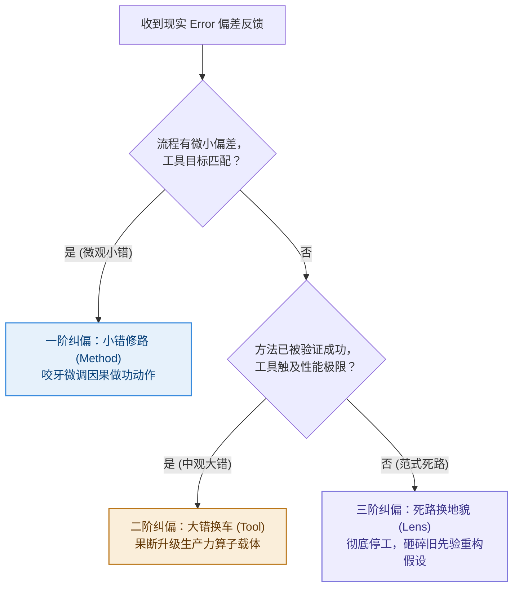

# 第 8 章：反思与闭环——小错修路，大错换车，死路换地貌

> **本章提要**：当系统出现偏差与报错（Error）时，为什么绝大多数人都会陷入“小错换车，大错修路”的致命错觉？当反馈传来，我们到底应该微调参数、升级载体，还是砸碎旧有的假设？本章跟着阿杰的“换键盘解压”与老张的“工厂死磕”，揭示 Error 驱动下的阶梯式反向传播原理，并给出划时代的纠偏法则：小错修路（Method），大错换车（Tool），死路换地貌（Lens）。

---

## 一、 现实中的“反向纠偏戏码”

让我们来看两个在现实中极具反差、却又天天重演的典型场景：

### 场景 A：阿杰的“小错大动干戈”
星期二晚上，互联网产品经理阿杰在写一份周报草稿。

他遇到了轻微的专注力波动——因为连续工作了两小时，大脑感到有点疲倦，写字的速度变慢了（这本是一个极其微小的 Method 动作摩擦）。

但阿杰做出的反应极其戏剧化：

他立刻关掉了 Word，打开小红书开始搜“最适合打字输入的键盘推荐”。接下来的两小时里，他花 800 块钱下单了一款号称“客制化静音机械键盘”；随后又下载了 3 款新的专注力倒计时软件，把桌面的壁纸换成了极简风。

**为了修补一点微小的流程疲倦，他把整个工具载体（Tool）砸掉换了一遍又一遍。**

### 场景 B：老张的“死路疯狂修路”
老张的传统制造工厂，连续两年业绩下滑 30%。这本是一场因为消费习惯改变引发的**致命生态死路（Lens 破缺）**。

但在高层会议上，老张开出的诊断药方却是：

“要求所有生产线工人每天多干一小时！要求所有销售每天的电话拜访量从 50 个增加到 80 个！每位主管的例会总结多写 500 字！”

**面对足以致命的生态死路，老张却在最微观的流程动作（Method）上咬牙“修路”，试图用更高强度的体力和汗水去对抗时代的大潮。**

把场景 A 和场景 B 放在一起，你会看到一个令人震惊的认知反转：

**绝大多数人在现实中，都在玩一场“小错换车，大错修路”的反向游戏！**

面对微不足道的小挫折（比如打字累了），人类大脑为了逃避真正的深度思考，最喜欢用“买新软件、换新设备（换车）”这种低智商的假装努力，来给自己提供多巴胺刺激；

而面对真正的深层危机和流程溃败（比如行业变天），人类大脑又因为恐惧承认自身的无知，反而选择在旧有的无效动作上死死硬撑（修路），企图用“多打几个电话、多加班两小时”来感动自己。

这种位阶错乱的纠偏方式，是导致无数团队耗尽预算崩溃、无数个人陷入低水平死磕的终极根源。

---

## 二、 控制论机制：Error 驱动的三阶反向传播

在控制论（Cybernetics）中，任何一个具备自适应能力的系统，其进化的唯一引擎就是**偏差信号（Error）**。

当系统输出的实际结果（Actual Output）与预期的目标（Goal）产生差值时，这个 Error 就会沿着 LGMT 架构反向流动，触发系统的阶梯式自愈。

像驾驶一辆汽车在公路上行驶一样，纠偏必须遵循严格的物理阶梯：

```
                    控制论的三阶反向纠偏梯队
┌─────────────────────────────────────────────────────────────┐
│ 3. 三阶纠偏 (范式级) : 死路换地貌 (Lens 场重构)              │
│    地图全错、前面是悬崖 ──► 彻底停工，砸碎旧先验，重新看世界   │
│      ▲                                                      │
│ 2. 二阶纠偏 (载体级) : 大错换车 (Tool 具身算子升级)          │
│    车速到 80 码剧烈晃动 ─► 现有的旧工具性能触及物理极限，换车 │
│      ▲                                                      │
│ 1. 一阶纠偏 (微观级) : 小错修路 (Method 路径微调)            │
│    方向盘偏了半度     ──► 轻轻微调手上的幅度，切忌大动干戈    │
└─────────────────────────────────────────────────────────────┘
```

### 1. 一阶纠偏：小错修路（Method）——切忌大动干戈
* **错误性质**：目标（Goal）正确，工具（Tool）顺手，唯独在具体执行的动作路径（Method）上产生了微小偏差或效率摩擦。
* **物理机制**：就像在高速公路上驾驶一辆性能良好的汽车，方向盘轻微偏了半度，你只需要轻轻修正手上的幅度（修路/微调 Method 路线）。
* **纠偏纪律**：**切忌小题大做！** 遇到一点执行不顺，咬牙微调流程动作即可，绝不要动不动就换软件、买新装备。

### 2. 二阶纠偏：大错换车（Tool）——生产力载体升级
* **错误性质**：目标（Goal）极其清晰，流程（Method）已被证明完全正确，但现有的工具（Tool）在物理极限上已经无法支撑当前的数据量或并发需求。
* **物理机制**：比如老王用 Excel 处理上百万行的订单数据，电脑频繁卡死崩溃。此时，Excel 的物理做功极限已经成为了阻碍生产力的最大瓶颈。
* **纠偏纪律**：**果断换车！** 当工具的算子能力触及物理天花板、导致巨大的做功摩擦时，不要在旧工具上死磕修补，果断升级更强悍的数据库或 Python 自动流水线（Tool）。

### 3. 三阶纠偏：死路换地貌（Lens）——砸碎旧先验
* **错误性质**：整个系统无论怎么微调 Method、怎么更换 Tool，输出结果依然持续恶化。这说明你赖以生存的**认知地貌与底层假设（Lens）**已经彻底与物理现实脱节。
* **物理机制**：就像你手里拿着一张 19 世纪的旧地图（Lens），在今天的现代城市里求生。此时无论你把跑车换得有多快（Tool），无论你把驾车技术修得多完美（Method），你走的都是一条死路。
* **纠偏纪律**：**砸碎旧先验！** 彻底停下一切做功，承认自己的认知地貌错了，重新走进真实世界去观察，重构最底层的 Lens 场。

---

## 三、 破局纪律：反常识的纠偏法则

要纠正人类本能中的“小错换车，大错修路”谬误，我们必须建立起严格的纠偏位阶纪律：



---

## 四、 本章防错纪律与检视卡

控制论不是冷冰冰的数学，而是指导我们在混乱世界中进行自我演化的纪律。

记住：**偏差（Error）不是敌人，而是系统给你的最高赏赐。** 关键在于，你是否用正确的位阶去回应它。

---

### 📷【30秒反馈诊断与纠偏决策树】

> **建议保存或拍照此卡，在收到报错（Error）或结果不及预期时引导纠偏决策：**

```
 ┌──────────────────────────────────────────────────────────────┐
 │             《清晰思考的纪律》· 阶梯纠偏决策树                 │
 ├──────────────────────────────────────────────────────────────┤
 │ 收到 Error 反馈后，依次问自己：                               │
 │                                                              │
 │ ❓ 提问 1：流程做功有微小摩擦，但工具和目标依然匹配吗？       │
 │    └─> 【是】：小错修路！在现有工具下微调 Method 动作。       │
 │                                                              │
 │ ❓ 提问 2：方法流程已被验证成功，但当前工具性能触及极限？     │
 │    └─> 【是】：大错换车！果断升级 Tool 载体，释放生产力。     │
 │                                                              │
 │ ❓ 提问 3：无论如何微调流程和换工具，结果依然持续恶化？       │
 │    └─> 【是】：死路换地貌！彻底停工，砸碎旧 Lens，重构先验！ │
 └──────────────────────────────────────────────────────────────┘
```

---

> **本章金句**：  
> * “面对微小的卡顿频繁更换工具，是智力上的惰性；面对深层的危机死磕旧流程，是认知上的傲慢。”  
> * “小错修路，大错换车，死路换地貌——这是自适应系统在物理世界中最优雅的进化节奏。”  
> * “永远不要试图用更高强度的体力和加班，去修复一个已经彻底破缺的先验地貌。”
