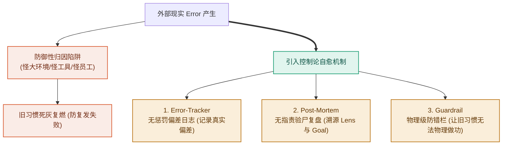

# 第 9 章：防复发与自愈——打破“防御性归因”，建立自适应反馈回路

> **本章提要**：为什么很多团队和个人明明做过了复盘、也沿着因果链找到了病根，但在几个月后，依然会在一模一样的坑里跌倒第二次？因为人类大脑存在极其顽固的“防御性归因”——成功时归功于自己的英明，失败时怪罪于外部环境或工具不好。本章跟着老张团队复盘后的“旧病复发”，揭示自适应系统防复发的控制论机制，教你如何建立无惩罚的 Error-Tracker（偏差日志）与 Post-Mortem（验尸复盘）自愈回路。

---

## 一、 老张团队的“旧病复发”

在经历了第 7 章的白板诊断剧场和第 8 章的“小错修路、大错换车”纠偏后，老张的工厂曾有过一段长达三个月的“黄金复苏期”。

当时，老张痛定思痛，砸碎了自己过去对“高科技炫技”的傲慢先验（Lens），把产品的 Goal 重新锁定在“极致简单耐用”上。研发团队砍掉了 80% 花哨的功能，销售团队停止了盲目的电话骚扰。

一个月后，新版产品的销量出现了显著的回暖，客户的满意度大幅提升。老张和他的骨干们激动不已，大家在庆功宴上推杯换盏，认为自己已经彻底掌握了 LGMT 的精髓，告别了过去的内耗。

**然而，现实的戏剧性在于：熵增与旧习惯的拉力，永远比你想象的更顽固。**

半年后的一个季度例会上，死气沉沉的气氛重新笼罩了会议室。当老张打开最新的运营报告时，赫然发现：
* 研发部门在过去两个月里，又偷偷在产品里塞入了 5 个复杂的“AI 智能语音菜单”（理由是“竞品也出了这个功能，我们不能显得太土”）；
* 市场部门又开始每天强行要求员工转发 3 篇毫无阅读量的宣传统稿；
* 一线销售们又重新把客户数据记录在了私人的纸质笔记本上，CRM 系统里再次充斥着周五下班前编造的补填数据。

大家又默默戴上了旧的炫技 Lens，重新陷入了“用动作忙碌掩盖目标失明”的货物崇拜中。

老张气得手发抖，拍着桌子质问：“三个月前我们不是才痛定思痛、把这些垃圾流程全部砍掉了吗？！为什么大家又走回了老路？！”

研发主管和市场经理低着头，小声嘀咕道：
* “上次销量回升是因为正好赶上了行业旺季，可最近市场大环境太差了呀...”
* “我们塞入 AI 菜单是为了提升产品档次，这本身没问题，主要是这次用户还没意识到这个功能的先进...”

老张看着下属们理直气壮的辩解，感到了一阵深深的无力。

**这种现象，在控制论和心理学中被称为“防御性归因（Defensive Attribution）与系统复发”。**

当系统取得成功时，人们倾向于把功劳归结为“自己的英明与勤奋”；而当系统出现 Error（偏差）或陷入困境时，大脑为了保护自尊心，会本能地把原因推给“大环境不好、用户不懂行、或者工具不给力”。

因为拒绝在主观 Lens 和内部 Method 上承认错误，系统内部的旧习惯就像野草一样，在风头过后疯狂复苏。

**诊断与纠偏固然重要，但如果不建立“防复发的自愈机制”，所有的纠偏都只是一场短暂的阵痛。**

---

## 二、 控制论机制：为什么系统天然具有“旧习惯拉力”？

在系统动力学中，任何一个组织或个人系统，都存在着强大的**基因拉力（Path Dependency，路径依赖）**。

旧习惯是系统在长期演化中挖掘出的最小能量消耗陷阱。你在过去几年中形成的工作习惯、思考惯性与组织流程，在脑神经与组织架构中已经挖出了一道深深的能量沟渠。只要外部压制稍有减弱，系统必然沿着阻力最小的旧陷阱重新滑落。



当你试图推行新的 LGMT 纪律时，你实际上是在和整个系统的“历史惯性”做对抗。一旦外部压力稍有缓解，大脑就会本能地滑回最熟悉、最省能的旧路径上——继续用“装修工具”逃避思考，继续用“忙碌的动作”替代做完的定义。

要切断这种死循环，我们不能依赖道德说教或老板的咆哮，必须在系统内部建立**自适应的自愈反馈回路（Self-Healing Feedback Loop）**。

---

## 三、 破局纪律：建立防复发的“三大自愈防火墙”

为了帮老张们彻底切断旧病复发，我们必须在团队和个人系统中，强制植入三道物理级防火墙：

### 纪律 1：建立无惩罚的 Error-Tracker（偏差日志）

绝大多数团队之所以无法阻止复发，是因为大家**害怕承认错误**。一旦暴露问题就会面临 KPI 扣钱或责备，于是大家本能地掩盖 Error。

在自适应系统中，** Error 不是罪过，隐瞒 Error 才是唯一的罪过。**

建立团队的 **Error-Tracker（偏差日志）**：
* 允许任何员工无惩罚地记录系统出现的实际偏差（例如：“今天研发的模块未达到 DoD 标准”、“今天 CRM 系统增加了 2 个无用必填项”）；
* 不追踪个人责任，只追踪“系统流程在哪儿产生了摩擦”。把 Error 从隐蔽的角落拉到日光之下。

### 纪律 2：开展无指责的 Post-Mortem（验尸复盘会）

当一个项目延期、或者一项举措复发失败时，禁止开相互指责的批斗会，而是召开严格的 **Post-Mortem（验尸复盘会）**。

复盘会只讨论三个客观问题：
1. **真实结果与预设 Goal 的偏差有多大？**（用数据说话，不给“大环境不好”留辩解空间）；
2. **我们在哪一步偷偷滑回了旧的 Lens 和假 Goal？**（追查是谁又把“动作完成”当成了“做完”）；
3. **我们在系统里增加了哪一道物理屏障，防止下次再犯？**

### 纪律 3：设立物理级的 Guardrail（防错护栏）

不要相信人类的自律，要相信**物理级的阻碍**。

* **个人防复发**：如果你总是忍不住在工作时打开社交软件（旧病复发），不要靠意志力硬撑，直接用软件将域名在工作时段硬性封锁 8 小时；
* **代码与技术防复发**：Git 代码库配置提交 Hook，未通过单元测试与静态审查代码直接拒绝 Push；
* **团队防复发**：如果研发部门总是忍不住偷偷塞入花哨功能，设立物理护栏——**任何未经过 5 位真实用户访谈签名的需求，禁止提交代码库！**

用物理护栏，让做坏事的成本极高，让做正确事情的摩擦力极低。

---

## 四、 本章防错纪律与检视卡

复发不是失败，而是系统演化中的正常波动。关键在于，当复发来临时，你是选择用“防御性归因”自我安慰，还是用自愈回路将系统再次升级。

---

### 📷【第三部·诊模篇】病根追查与防复发全景诊断表

> **建议保存或拍照此卡，在项目复盘、旧病复发或发现系统卡顿时自测诊断：**

```
 ┌──────────────────────────────────────────────────────────────┐
 │          《清晰思考的纪律》· 病根追查与防复发全景诊断表        │
 ├──────────────────────────────────────────────────────────────┤
 │ 🔴 诊断 1：归因模式自测                                      │
 │    [ ] 外部防御归因 ➔ 习惯怪罪环境/大厂/政策 (旧病复发高危！)   │
 │    [ ] 自适应归因   ➔ 承认内部 Lens 偏离，主动暴露 Error     │
 ├──────────────────────────────────────────────────────────────┤
 │ 🔴 诊断 2：反馈回路自测                                      │
 │    [ ] 惩罚型机制   ➔ 暴露错误会被惩罚 ➔ 导致信息隐瞒与假善意  │
 │    [ ] Error-Tracker➔ 建立无惩罚偏差日志 ➔ 促进系统物理自愈    │
 ├──────────────────────────────────────────────────────────────┤
 │ 🔴 诊断 3：防错护栏自测                                      │
 │    [ ] 依赖口头意志 ➔ 靠道德保证不犯错 (熵增必然再次侵蚀)     │
 │    [ ] 物理 Guardrail➔ 增加旧动作摩擦力，物理阻断坏习惯      │
 └──────────────────────────────────────────────────────────────┘
```

---

> **本章金句**：  
> * “成功时归功于英明，失败时怪罪于大环境，是人类系统最隐蔽的自欺欺人。”  
> * “不要相信意志力的自律，要相信物理护栏的阻隔；让做坏事的摩擦力极高，才是最高明的管理。”  
> * “ Error 不是罪过，隐瞒 Error 才是唯一的罪过。复发是系统自愈与进化的最佳契机。”
