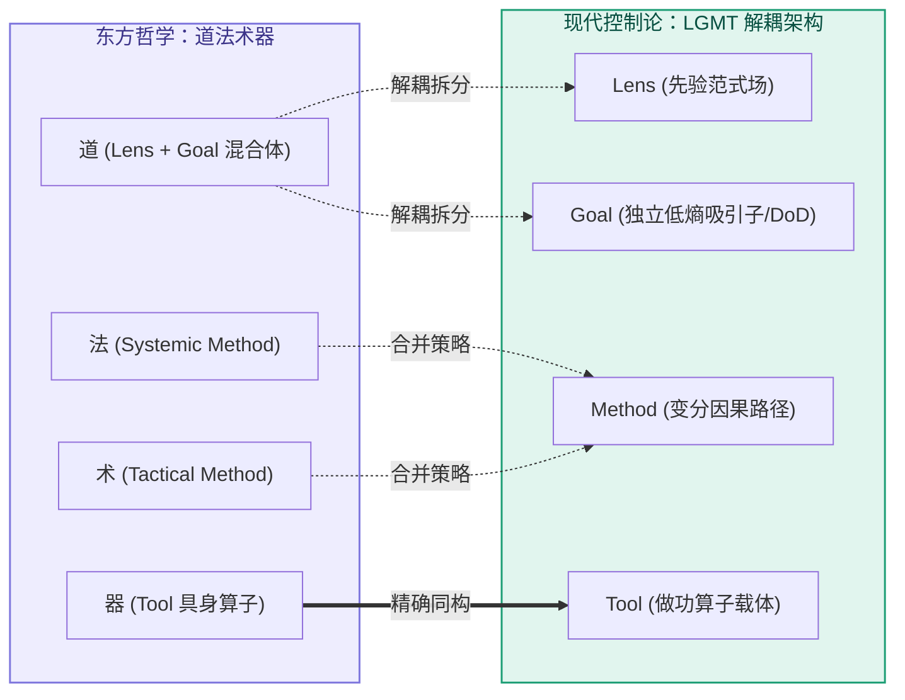

# 第 10 章：古今归真——老祖宗的“道法术器”与控制论

> **本章提要**：在前面几章中，我们沿着实战战场完成了个人、团队、技术系统的撕拆与逆向诊断。此刻，让我们站到三万米高空——为什么一个诞生于现代数字时代的思考框架，在两千多年前的东方哲学“道、法、术、器”中能找到近乎完美的映射？为什么在西方经典系统论与控制论中，它又是自适应系统生存的唯一解？本章将剥离所有商业包装与技术流行语，深入 LGMT 的底层思想谱系，揭示其作为“物理世界通用自适应拓扑结构”的必然性与第一性原理。

---

## 一、 叙事桥梁：在撕开战场之后，站到三万米高空

在经历了前九章在个人学习、团队敏捷、IT 选型、逆向诊断以及自愈回路中的密集血战后，很多读者可能会产生一个疑问：

“LGMT 到底是一个凑巧好用的商业小工具，还是某种更加深刻的底层规律？”

回答这个问题，需要我们暂时放下手头的琐碎任务，站到三万米高空中俯瞰思想的脉络。

在现代企业管理、个人成长和技术架构的探讨中，经常会出现一个极具戏剧性的现象：

当一位高管用最新的现代管理理论（如 OKR、精益敏捷、OKR+KPI 组合）开完战略会后，一位研读经典哲学的智者可能会笑着总结：“你讲了半天，不就是老祖宗说的‘离道失法，以术代器’吗？”

而当一位控制论专家或物理学家审视这套管理架构时，他又会指出：“这无非是阿什比（W. Ross Ashby）在 1956 年提出的‘良好调节者定理’在组织管理中的一次应用。”

**东方古老的哲理、西方硬核的控制论物理学，与现代思维框架，在此处产生了令人震撼的跨时空大汇流。**

为什么不同文明、不同学科在探索“如何把事情做成”这一终极问题时，最终都指向了同一个拓扑结构？

因为世界运行的物理规律是统一的。无论你使用怎样的语言、符号或表述方式，只要你想在充满混乱与熵增的现实世界里建立秩序，你都必须遵循最基础的反馈与控制拓扑。

LGMT（Lens, Goal, Method, Tool）绝不是某个现代人拍脑袋杜撰出来的“新名词”，它是对人类文明数千年来关于“秩序与掌控”的底层规律的一次提炼与重构。

---

## 二、 东方辩证：解构“道法术器”与 LGMT 的控制论补齐

在中国古代思想体系中，“道、法、术、器”是探讨行为哲学与治理智慧的最高概括。很多人在初接触 LGMT 模型时，第一反应往往是把它简单等同于“道、法、术、器”。

但如果我们进行严格的哲学与结构比对，就会发现**简单的 1:1 硬套不仅是错误的，反而掩盖了 LGMT 作为现代控制论模型的真正突破。**

```
             “道法术器”与 LGMT 的真实结构映射与补齐
┌─────────────────────────────────────────────────────────────┐
│ 【道】 ───►  Lens 范式场      : 宇宙规律、底层先验与观照视角 │
│                Goal 设定值    : 【LGMT 显式补齐的控制论枢纽】│
│ 【法】 ───┐                                                 │
│           ├──► Method 方法路径 : 法=系统级制度 / 术=战术级技巧 │
│ 【术】 ───┘                                                 │
│ 【器】 ───►  Tool 具身算子    : 工具器械、载体平台与实体器具 │
└─────────────────────────────────────────────────────────────┘
```

### 1. 还原“道法术器”的本意结构
如果还原东方哲学的本意，“道法术器”实际上是一个 **1 认知 + 2 方法 + 1 工具** 的四层结构：

* **【道】（Lens 范式场）**：观照世界的先验立场与底层规律。“形而上者谓之道”。
* **【法】（Systemic Method）**：制度、法则、规约与方法论体系。古代“法”指的是治理制度与行为规范，“方法”一词即源自“法”。
* **【术】（Tactical Method）**：具体战术、操作技巧、技能与招式。“法”是宏观方法体系，“术”是微观操作路径。
* **【器】（Tool 具身算子）**：做功的物理载体、器具与装备。“形而下者谓之器”。

### 2. 传统“道法术器”的控制论解构：“道”是 Lens 与 Goal 的未解耦混合体
对比之后就会发现：**传统的“道”实际上是 Lens（先验范式）与 Goal（终局愿景）的未解耦混合体。**

在传统哲学语境中，“道”既代表着“看世界的底层透镜（Lens）”，又隐性裹挟着“终极要前往的理想吸引子（Goal）”。这种混合在哲学悟道上极具美感，但在现实控制与工程落地中，却留下了致命的控制论盲区：

* **目标（Goal）被裹挟在抽象的“道”中**，缺乏独立、显式的数值或 DoD（做完定义）进行结果校验；
* 到了执行层面，系统级的“法（制度）”极易退化为管束人、折腾人的繁文缛节（形式主义）；
* 战术级的“术（技巧）”则容易退化为炫技与表面动作；
* 大家看似有道、有法、有术、有器，但因为 Goal 没有被单独解耦出来，导致整个反馈控制链无法进行精确的 Error（偏差）计算！

### 3. 用 LGMT 重新解构老子的退化警示
老子在《道德经》中曾写下一段震古烁今的退化警示：

> **“失道而后德，失德而后仁，失仁而后义，失义而后礼。夫礼者，忠信之薄，而乱之首也。”**

如果用 LGMT 的控能力度去重新解构这段话，其病理清晰可见：

* 当人们丢失了最底层的范式认知（**失道 / 丢失 Lens**）；
* 又缺乏明确可校验的终局目标（**缺少 Goal 的约束**）；
* 治理和行为就会迅速降维退化为对表面制度与繁文缛节的机械崇拜（**求礼 / 沦为“法、术、器”的形式主义**）；
* **而这种失去了“道（Lens）与目标（Goal）”支撑的机械形式主义（礼），恰恰是混乱与内耗的开端（乱之首也）！**

### 4. LGMT 的超越：用独立 Goal 补齐控制闭环
LGMT 模型绝不是对“道法术器”的简单翻版，它的真正贡献在于**将 Goal（设定值/吸引子）从模糊的“道”中解耦出来，作为一个独立的控制枢纽显式置顶。**

它将“法”与“术”统一收拢为 **Method（路径）**，并将结构重新收敛为更符合现代控制论的四拓扑：**Lens（先验场）托底 $\to$ Goal（设定值）驱动 $\to$ Method（路径）做功 $\to$ Tool（算子）执行**。

这既保留了东方“道”的哲学高远，又赋予了现代科学严密的反馈与诊断闭环。

---

## 三、 西方科学：控制论与系统论的同构证明

如果说“道法术器”是从哲学与行为学上验证了 LGMT，那么现代**控制论（Cybernetics）与经典系统论（System Theory）**则从数学与物理学上证明了它的必然性。

### 1. 阿什比“良好调节者定理”（Good Regulator Theorem）

控制论先驱艾希比（W. Ross Ashby）与罗森布鲁斯在 1970 年提出了著名的控制论定理：

> **“任何一个完美的自适应调节器，其内部必须包含一个被控系统的模型（Every good regulator of a system must be a model of that system）。”**

这一定理在数学上证明了：**一个系统（无论是机器人、生物体还是企业）要想在充满不确定性的外部环境中维持生存，它的内部必须具备一套关于外部世界的先验模型。**

### 2. 系统思考（Systems Thinking）的映射

系统思考大师唐内拉·梅多斯（Donella Meadows）在《系统之美》中明确定义，一个系统由三大基本要素构成：**目标（Purpose/Function）、连接回路（Interconnections）与要素（Elements）**；而在她著名的“系统杠杆点”排序中，改变系统的**范式（Paradigm）**则是超越具体回路之上的最高杠杆。

这在第一性原理上与 LGMT 产生了精准的拓扑映射：
* **范式（Paradigm / 最高杠杆点）** 对应 **Lens**：超越具体系统之上的底层假设，决定了系统如何过滤并解释外部信息；
* **目标（Purpose / 系统要素一）** 对应 **Goal**：吸引系统状态收敛的低熵稳态（DoD）；
* **连接回路（Interconnections / 系统要素二）** 对应 **Method**：传递信息与做功的因果测地线；
* **要素（Elements / 系统要素三）** 对应 **Tool**：在最末端输出控制力的具身做功算子。



物理学与控制论告诉我们：**LGMT 并不是一种可选的管理爱好，而是任何自适应系统在物理世界中进行抗熵增求生的唯一通用拓扑结构。**

---

## 四、 本章防错纪律与检视卡

理解了古今同构的第一性原理，我们就能在面对纷繁复杂的新概念、新框架时，拥有洞穿表象的“火眼金睛”。

无论是面对两千年前的古训，还是面对明天最新发布的 AI 流行语，记住：**万变不离其宗，一切能成事的系统，底色必然是 LGMT。**

---

### 📷【30秒底层逻辑对齐自查卡】

> **建议保存或拍照此卡，在评估任何新方法论、新管理框架或新工具时进行同构自查：**

```
 ┌──────────────────────────────────────────────────────────────┐
 │             《清晰思考的纪律》· 底层同构自查卡                 │
 ├──────────────────────────────────────────────────────────────┤
 │ 当你引入一个新框架时，请问自己：                               │
 │                                                              │
 │ [ ] 1. 它的“道（Lens）”是什么？                              │
 │        它基于对现实世界的什么先验假设？                      │
 │                                                              │
 │ [ ] 2. 它的“法（Goal）”是什么？                              │
 │        它定义的衡量标准与做完定义是否明确？                  │
 │                                                              │
 │ [ ] 3. 它的“术（Method）”是什么？                            │
 │        它的行动路径是否具备可操作的因果链？                  │
 │                                                              │
 │ [ ] 4. 它的“器（Tool）”是什么？                              │
 │        它的载体算子是否增加了无谓的认知摩擦？                │
 └──────────────────────────────────────────────────────────────┘
```

---

> **本章金句**：  
> * “离道失法，以术代器——人类数千年来犯过的所有错误，本质上都是同一种认知颠倒。”  
> * “一切完美的调节者，内部都包含着世界的模型；最顶级的实践者，心中都秉持着清晰的先验。”  
> * “不需要发明新名词，真正的智慧早已在文明的源头相遇。”
