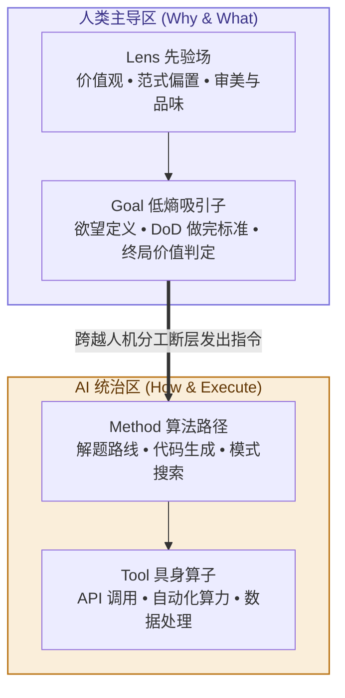

# 第 11 章：AI 时代壁垒——把 Method 交给 AI，把 Lens 留给自己

> **本章提要**：当全栈工程师小雯用最新的 AI 智能体在 30 秒内完成了过去需要三天编写的代码，当生成式 AI 以恐怖的速度吞吞噬掉排版、文案、作图与数据分析等绝大多数方法（Method）与工具（Tool）时，人类真正的核心价值与不可替代的壁垒到底在哪里？当“怎么做”变得极其廉价，决定成败的唯一因素就变成了“看什么”与“要什么”。本章用 LGMT 模型重新定义 AI 时代的人机分工协议，教你如何在 AI 浪潮中构建真正不可撼动的认知护城河。

---

## 一、 小雯的“能力过剩与意义焦虑”

在经历了第 6 章的“填表地狱”后，全栈工程师小雯做出了一个大胆的尝试：她把团队最繁重、最死板的底层代码重构与接口测试任务，全部交给了最新的 AI 大模型智能体（Agents）。

效果令人震撼，却也极其悚然：

* 过去需要 3 名初级工程师折腾一整周的代码重构，AI 智能体在 45 秒内全部完成，并自动补充了完美的单元测试；
* 过去需要市场部花三天整理的 50 页竞品分析报告，AI 可以在 20 秒内抓取全网公开数据，生成图文并茂的分析草案；
* 过去需要小雯熬夜编写的数据库查询 SQL 语句，现在只需要在输入框里敲下一句自然语言，AI 就会瞬间输出最优化版本的代码。

在最初的兴奋过后，一种巨大的、空洞的焦虑感如潮水般淹没了小雯和她的团队。

研发组的两位年轻工程师私下里找小雯谈话，眼神里充满了茫然：“雯姐，我们过去花了 4 年大学、3 年加班苦练的编程技巧（Method）和工具调优（Tool），AI 几秒钟就做完了，而且比我们写得更好。我们未来的核心价值到底在哪？我们是不是马上就要被淘汰了？”

**这不仅仅是小雯团队的焦虑，而是整个时代正在重演的悲剧。**

面对 AI 极其恐怖的生产力浪潮，绝大多数人都陷入了极其盲目的应对模式：

* **一部分人试图在“方法和工具”上与 AI 展开死磕竞赛**：他们拼命记忆几百个死板的“提示词（Prompts）模板”，企图在生成速度和格式排版上战胜 AI——这就像是在工业革命早期企图和蒸汽机比拼拉货的力气，极其悲壮却注定惨败；
* **另一部分人则沦为了“机械搬运工”**：他们完全失去了主见，把 AI 生成的成百上千页毫无灵魂的代码和文案直接复制粘贴到生产环境中。结果不仅没有提升效率，反而给系统制造了庞大的垃圾信息与隐藏 Bug。

**这种现象被称为“ AI 时代的认知退化”。**

当人类把执行动作（Method）和做功算子（Tool）交给 AI 时，如果我们自己也丢失了目标（Goal）与视角（Lens），那么庞大的 AI 生产力不仅不会成为辅助我们的超级杠杆，反而会生成海量的“高质量垃圾”，让我们彻底溺亡在信息的汪洋大海之中。

---

## 二、 LGMT 位阶迁移：AI 时代的人机分工拓扑

用 LGMT 模型去审视人工智能的技术演进，你会发现 AI 对人类能力的替代，呈现出极其清晰的**自下而上吞噬轨迹**：



### 1. Tool 与 Method：AI 的绝对统治区
* **Tool 层（做功算子）**：算力、数据库、自动化 API、图像渲染、矢量计算——在这些实体做功与算子执行上，AI 拥有超越人类数百万倍的物理优势。
* **Method 层（路径与算法）**：如何把一段代码写得更优雅、如何把一篇文案翻译得更流畅、如何把一份财务报表进行同比环比分析——这些本质上都是“在已知的规则下寻找最优路径（Search in Solution Space）”。AI 大模型凭借其海量的预训练数据，在这一层展现出了降维打击般的解题能力。

### 2. Goal 与 Lens：人类真正的绝对壁垒
* **Goal 层（目标与价值定义）**：AI 可以回答“怎么做（How）”，但它永远无法替你决定“要什么（What）”。
  * 一个问题的“做完定义（DoD）”是什么？
  * 这个产品到底要解决用户的哪一个核心痛点？
  * 商业上的止损点应该设在何处？
  这些涉及欲望、选择、风险承担与价值判定的目标节点，永远只能由人类来锁定。
* **Lens 层（先验范式与世界观）**：AI 的底层逻辑是基于历史数据的概率统计（Next-Token Prediction），它本质上是对人类既有知识库的大型拟合。
  * 什么是真正的审美与品味？
  * 面对从未出现过的伦理冲突，我们秉持什么立场？
  * 敢于打破行业既有范式、提出反直觉先验假设的勇气从何而来？
  这些定义“你看待世界方式”的 Lens 场，是人类作为具备主体性生命体的终极壁垒。

**AI 时代的简明结论：把 How（Method / Tool）交给 AI，把 Why & What（Lens / Goal）留给自己。**

---

## 三、 破局纪律：打造 AI 时代的“超级个人”与人机分工协议

要在 AI 时代获得不可替代的竞争优势，小雯和我们每个人都必须建立全新的认知纪律，完成从“执行者”向“指挥官”的身份转变。

### 纪律 1：拒绝“提示词木偶”，恪守 Goal 的终局控制权

不要把注意力放在记忆成百上千个死板的“提示词模板”上。真正的 AI 高手，极其擅长向 AI 交付清晰的 **Goal（做完的标准）与背景 Lens**。

在使用任何 AI 智能体前，强制执行**“三约束提示法”**：
1. **给定 Lens（背景与视角）**：“假设你是具备 15 年经验的资深架构师，秉持极简与高可用原则...”
2. **锁定 Goal（做完定义）**：“我们需要一份针对电商高并发场景的重构方案，衡量成功的标准是响应延迟降低 50%...”
3. **开放 Method（方法交给 AI）**：“请给出 3 种可行的实现路径，并对比各自的优缺点...”

通过锁定上游的 Lens 与 Goal，让 AI 在广阔的方法空间中为你寻找最优解，而不是让 AI 牵着你的鼻子走。

### 纪律 2：从“生产员”转变为“超级审稿人（Chief Curator）”

当 AI 可以在几秒钟内生成 10 版方案时，限制你的不再是“生产速度”，而是你的“识别力与品味（Lens）”。

* 低效的人，忙着自己去写 10 版草稿；
* 高效的人，让 AI 生成 10 版草稿，然后凭自己敏锐的 Lens，瞬间识别出哪一版具备真正的洞察，并指出其最致命的漏洞。

**你的 Lens 越深刻、你的品味越高昂，你驾驭 AI 输出的杠杆力就越恐怖。**

---

## 四、 实战算子：摘下旧 Lens 墨镜的“破局 3 步法”

既然 Lens 是最高杠杆点，可底层先验往往如呼吸般不自知。当系统陷入死局、我们发现自己戴着坏掉的“红墨镜”时，到底如何主动摘下它？这里交付一套可操作的 **Lens 破局 3 步法算子**：

```
                    Lens 破局 3 步法算子
┌──────────────────────────────────────────────────────────────┐
│ Step 1. 强行引入反事实假设（Pre-Mortem 验尸）                 │
│         问：“如果我当前的底层假设完全是错的，世界会怎样？”   │
├──────────────────────────────────────────────────────────────┤
│ Step 2. 寻找零利益关联的外部观察者（Disinterested Observer） │
│         引入不受旧局利益与先验包袱影响的“童言无忌”视角       │
├──────────────────────────────────────────────────────────────┤
│ Step 3. 故意暴露于异质噪声场（Heterogeneous Noise）          │
│         强行离开同质化信息茧房，向竞争对手或异业交叉学习    │
└──────────────────────────────────────────────────────────────┘
```

1. **Step 1：强行引入反事实假设（Pre-Mortem）**  
   在开工前假设“项目已经彻底溃败”，并倒逼自己写出 3 个“因为我的先验认知完全错了”的原因。
2. **Step 2：寻找无利益关系的外部观察者**  
   当局者迷，因为利益与旧先验高度黏连。找一个不了解你们内部规矩的外部人（甚至刚入职的新人），听听他最直白的疑问。
3. **Step 3：故意暴露于异质噪声场**  
   主动跨界看同业之外的做法。砸碎旧 Lens 最快的方式，往往是被跨界玩家的全新范式“降维打击”。

---

## 五、 本章防错纪律与检视卡

AI 不是来替代人类的，它是来淘汰那些“像机器一样思考与执行的人”的。

请保存这张人机分工协议卡。在下一次使用 AI 工具前，确认你正站在因果链的最顶端。

---

### 📷【30秒 AI 时代 Human-AI 分工自查卡】

> **建议保存或拍照此卡，在使用 AI 辅助工作或规划个人职业壁垒时自查：**

```
 ┌──────────────────────────────────────────────────────────────┐
 │             《清晰思考的纪律》· AI 人机分工协议卡             │
 ├──────────────────────────────────────────────────────────────┤
 │ [ ] 1. 视角提供（Lens）：我是否为 AI 提供了清晰的先验假设、 │
 │        角色定位与审美标准，而不是让 AI 泛泛而谈？            │
 │                                                              │
 │ [ ] 2. 目标锁定（Goal）：该任务的“做完定义（DoD）”和成功标准 │
 │        是否由我牢牢掌控？                                    │
 │                                                              │
 │ [ ] 3. 方法放权（Method）：我是否把具体撰写、编码、计算等     │
 │        繁重路径，最大程度地交给了 AI 去探索和执行？          │
 │                                                              │
 │ [ ] 4. 品味把关（Curator）：对于 AI 输出的结果，我是进行有   │
 │        主见的筛选与批判，还是沦为了机械的复制粘贴者？        │
 └──────────────────────────────────────────────────────────────┘
```

---

> **本章金句**：  
> * “当‘怎么做’变得一文不值，‘要什么’和‘凭什么这么看’就成为了全宇宙最昂贵的资产。”  
> * “AI 不会淘汰人类，但掌握了 Lens 与 Goal 的人类，将以成百上千倍的杠杆淘汰只会做 Method 的执行者。”  
> * “把做功的苦力交给机器，把审美的灵魂留给自己。”
