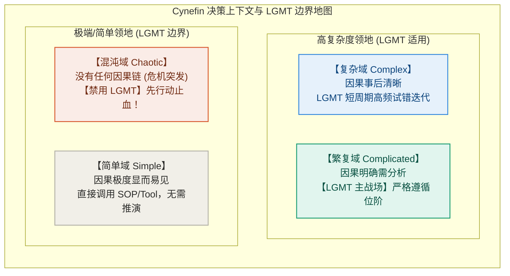

# 第 12 章：终局心法——顺序即纪律，放下即成熟

> **本章提要**：当阿杰、老张和小雯完整理解了 LGMT 模型的“1 场 + 3 节点”、学会了沿因果链逆向追查、掌握了 AI 时代的人机分工之后，最重要的一步反而来到了：“什么时候应该严格遵循这套纪律，什么时候又应该彻底放下它？”本章通过 Cynefin 复杂的决策边界，给出全书的终局心法——顺序即纪律，放下即成熟。

---

## 一、 现象：从“方法匮乏”到“模型教条主义”

> 🚗 **【快车道速览】**：通过阿杰学会模型后连午饭吃什么都要强推 LGMT 的反常现象，切入模型教条主义的陷阱——真正的高手不仅懂得何时拿起武器，更懂得何时放下武器。

让我们来看一个在很多熟练掌握了各种思维框架的人身上经常发生的反常现象：

产品经理阿杰在彻底学会了 LGMT 模型后，一度变得极其死板教条：

* 无论在食堂和同事讨论今天中午吃什么，还是在面对突如其来的灵感闪现时，他都强行要求大家：“等一下！我们先明确 Lens！再定义 Goal！然后推演 Method！最后选 Tool！”
* 面对需要快速试错、充满不确定性的艺术创作或混沌危机时，他因为迟迟无法定义出完美的 Goal，而僵立在原地不敢迈出第一步；
* 他把一套原本用来“理清思路、减少做功摩擦”的解耦工具，演变成了困住自己大脑的崭新牢笼。

**这种现象被称为“模型教条主义（Model Dogmatism）”。**

在本书的前 9 章中，我们反复强调“顺序即纪律”，教你如何用 Lens 托底、Goal 导向、Method 路径与 Tool 执行来击碎假装努力与认知紊乱。这是因为在**有序、复杂或线性做功的领域**，缺乏次序的混乱会导致剧烈的熵增和资源浪费。

然而，现实世界并不全是一条条理清晰的生产线。

如果你把用于应对“已知与复杂系统”的严密框架，生搬硬套到“完全无序、混沌或纯粹情绪表达”的领域，你就会从一个迷茫的执行者，变成一个死板的“框架教条者”。

**真正的成熟，不仅在于知道何时拿起武器，更在于知道何时放下武器。**

---

## 二、 Cynefin 决策边界：划定 LGMT 的有效领地

> 🔬 **【深水区推演】**：本节推演 Cynefin 决策上下文域模型（繁复域、复杂域、简单域、混沌域），严密划定 LGMT 的适用场景与物理禁用边界。

为了防止陷入模型教条主义，我们必须引入威尔士学者戴夫·斯诺登（Dave Snowden）提出的 **Cynefin 决策上下文域模型**。

现实世界中的所有情境，都可以被划分为四大不同的“领地（Domains）”。LGMT 模型在这四大领地中有着完全不同的适用规则：



### 1. 繁复域与复杂域（Complicated & Complex）：LGMT 的主战场
* **繁复域（如企业系统建设、技术重构、复杂项目交付）**：因果链条明确但交织复杂。此时必须**严格遵循 LGMT 顺序**，用 Lens 统一底色，用 Goal 锁死 DoD，用 Method 规划路径，用 Tool 降维做功。
* **复杂域（如新产品探索、个人职业转型、市场突围）**：因果关系只有在事后才清晰。此时 LGMT 依然有效，但必须**大幅缩短 LGMT 的迭代周期**。不要试图规划一个为期两年的完美 Method，而是用“小 Goal + 快 Tool + 高频 Error 反馈”，在试错中让 Lens 自主演化。

### 2. 简单域与混沌域（Simple & Chaotic）：划定框架边界
* **简单域（如日常盖章、打卡、按规定报销）**：因果极度显而易见。此时**无需动用复杂的 LGMT 推演**，直接调用成熟的 Tool 或既有 SOP 即可。强行在简单事情上推演 LGMT，属于典型的过度工程（Over-Engineering）。
* **混沌域（如突发火灾、服务器全线崩溃、极端危机爆发）**：没有任何因果关系可言，系统正处于毁灭边缘。此时**必须暂停 LGMT 的理论推演！** 任何在火灾现场停下来讨论“先验 Lens 与长期 Goal”的行为都是致命的。此时的纪律是：**先行动（Act）止血，建立基本安全边界，等系统降温退回到复杂或繁复域后，再重启 LGMT 诊断！**

---

## 三、 终局心法：顺序即纪律，放下即成熟

读完本书，请将以下两条终局心法铭刻在心：

### 心法 1：手中有剑，顺序即纪律（秩序守护）

在绝大多数日常工作、团队协作与系统建设中，人类最大的敌人不是缺乏资源，而是**认知的无序与位阶的倒错**。

当你要开启一个新项目、学习一门新技能、或者带领一支团队突围时：
* 记住：**先定 Lens 场，再建 Goal 链，后推 Method 路，最后选 Tool 器。**
* 严守秩序，不被花哨的工具勾走灵魂，不被虚无的忙碌感动自己。这就是“手中有剑”的威力。

### 心法 2：心中无剑，放下即成熟（无我自由）

框架是用来服务人、解放大脑的，而不是用来囚禁心灵的。

当阿杰、老张和小雯在暴风雨中立定了骨架、当他们的 LGMT 四构件已经内化为肌肉记忆与直觉时，就不再需要时刻在嘴上挂着这些名词。

面对生活中的诗意、面对灵感的突发奇想、面对混沌中的果断出手——**勇敢地放下模型！**

直接去观察、直接去行动、直接去与真实的物理世界撞击。

**手中有模型，让你在混乱中建立秩序；心中无模型，让你在秩序中获得自由。**

---

## 四、 全书终局避坑卡与随书检视卡

感谢你陪同本书走过这段关于“清晰思考”的探索之旅。

在本书的结尾，我们为你准备了这张随书附赠的《终局避坑卡》。无论未来你走得多远、面对多么纷繁复杂的挑战，希望它能像一把沉静的手电筒，随时为你照亮脚下的路。

---

### 📷【第四部·归真篇】心法反思卡 (Meta-Reflection Card)

> **建议保存或打印此卡贴在工作台前，在完成大项目或进行深刻元认知反思时静心自省：**

```
 ┌──────────────────────────────────────────────────────────────┐
 │          《思考的位阶》· 终局元认知反思卡                     │
 ├──────────────────────────────────────────────────────────────┤
 │ 🌌 反思 1：关于顺序与纪律                                    │
 │    我是守住了 Lens ➔ Goal ➔ Method ➔ Tool 的严格次序，        │
 │    还是再次被某个新工具勾走了灵魂、陷入了伪努力忙碌？        │
 ├──────────────────────────────────────────────────────────────┤
 │ 🌌 反思 2：关于自适应进化                                    │
 │    小错修路 (Method)，大错换车 (Tool)，死路换地貌 (Lens)。    │
 │    当面对不可逆的失败，我是否有勇气砸碎旧先验、承认自己错了？│
 ├──────────────────────────────────────────────────────────────┤
 │ 🌌 反思 3：关于放下与成熟                                    │
 │    手中有模型，在混乱中建秩序；心中无模型，在秩序中得自由。  │
 │    框架是否已内化为直觉？我是否敢于放下教条、勇敢撞击物理世界？│
 └──────────────────────────────────────────────────────────────┘
```

---

> **全书终局金句**：  
> * “顺序即纪律：用清晰的次序击碎混乱，把人脑最宝贵的算子留给真正的创造。”  
> * “放下即成熟：框架是通往自由的桥梁，过河之后，便可昂首前行。”  
> * “愿你在充满熵增的世界里，怀揣清晰的骨架，勇敢而自由地生活。”
