# 前言：写给每一个被工具压得喘不过气的人

> **本章提要**：你是否也曾在某个深夜，看着电脑屏幕上十几开的窗口、满屏的软件插件和未完成的空白文档，感到一阵深深的茫然与窒息？我们买下了市场上最新潮的生产力工具，配置了最完美的系统，却比以往任何时候都更加疲惫、更加迷茫。这封前言写给每一个试图在混乱世界中重新夺回大脑控制权的思考者——欢迎来到《清晰思考的纪律》。

---

## 一、 那个被“完美系统”绑架的深夜

如果你在过去几年里，曾经经历过以下任何一个微小的瞬间，那么这本书就是为你而写的：

* 在某个星期日的深夜，你明明感到精疲力竭，却依然强撑着在电脑前花了两三个小时去调整某个笔记软件的字体、配色与数据库标签。当你看着眼前那个精美绝伦的“工作台”时，心里升起了一股踏实的成就感，可到了第二天早晨面对真正的核心任务时，你的脑子依然是一片荒凉的雪地；
* 你的手机里装满了各种号称能“颠覆工作流”的 App，微信浮窗和网盘里塞满了上千篇“稍后阅读”的干货文章，但每当需要解决一个复杂的现实问题时，你依然感到了深深的无力与匮乏；
* 你的团队每天都在开 15 分钟的敏捷站会，白板上贴满了密密麻麻的看板贴纸，每个人都汇报得忙碌而充实，但季度末交付出来的产品，却是一个没有人买单的垃圾；
* 你的企业花了成百上千万元采购了最顶级的“企业数字化转型系统”，管理者在大屏前看到了花团锦簇的数据折线图，而在大屏背后，一线员工们正不堪重负地在周五下班前编造数据，在微信私下沟通。

**我们都病了。**

在这场铺天盖地的生产力浪潮与数字繁荣面前，现代人陷入了一种极其隐蔽、极其难察觉的集体焦虑：

**我们以为自己在掌控工具，实际上，我们正在被工具无情地剥夺着灵魂与能量。**

我们用“装修工具”的低智商忙碌，逃避着“啃硬骨头”的高难度思考；我们用“动作的充实”，安慰着“目标的失明”。

这就是我决定写下这本书的最直接动因。

---

## 二、 我踩过的坑，与这本书的诞生

我并不是站在高处向你指手画脚的“导师”。事实上，书中所写的每一个坑、每一个认知误区、每一场因为“工具先行”而导致的灾难，我自己曾经一个不落地全部踩过。

在很长一段时间里，我也曾是一个狂热的“工具爱好者”。

每当遇到复杂、棘手的新项目时，我的第一反应永远不是拿出一张白纸去厘清真实的因果逻辑，而是立刻去寻找“当下最火、最厉害的软件”。

我曾花过无数个周末去折腾各种庞大复杂的知识管理系统，曾试图用更强悍的硬件和更花哨的流程去解决团队的内耗。

直到某一次，在一个极度关键的商业交付前夕，我看着眼前那个配置得极尽完美的系统，和系统里一片空白的核心方案，现实狠狠地给了我一记响亮的耳光。

在那一刻，我突然感到了一阵强烈的荒谬与寒意：

**当方向错的时候，频繁地更换跑车和猛踩油门，只会让你更快地掉进悬崖。**

从那天起，我剥离了所有商业包装与流行语，开始从物理学、控制论（Cybernetics）与人类演化认知的第一性原理中，寻找自适应系统抗击混乱的底层真相。

最终，我梳理出了一套极其硬核、又极其简洁的降熵框架——**`LGMT` 模型（Lens, Goal, Method, Tool）**。

它告诉你：
* ** Lens（先验透镜）** 是你解释世界的前提，决定了你能看到什么；
* ** Goal（目标吸引子）** 是你强行在混乱中划定的低熵做完标准（DoD）；
* ** Method（变分路径）** 是连结目标与做功的因果测地线；
* ** Tool（具身算子）** 永远居于因果链的最末端，只是替上游做功的物理器械。

**顺序即纪律，位阶不可颠倒。**

在过去几年里，这套纪律不仅帮助我个人从知识囤积与假装努力中彻底解脱，也帮助了许多陷入内耗的团队与企业拔除了深层的病根。

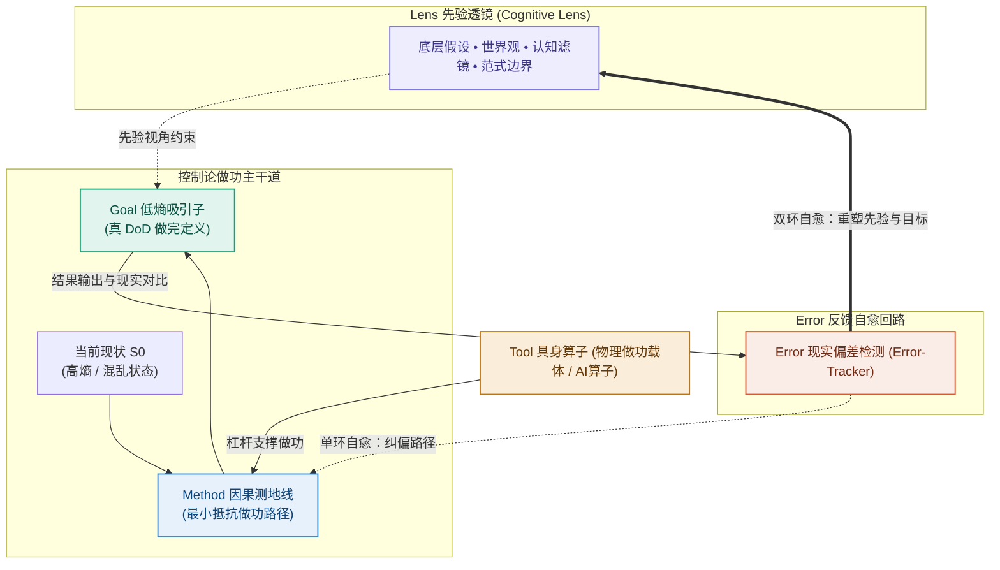

---

## 三、 你将如何阅读这本书？（三车道阅读指南）

为了防止这本书本身演变成另一种“需要你死磕的认知负担”，我特意在内容编排上摒弃了所有高冷的学术高墙，引入了 **阿杰（个人/知识焦虑）、老张（团队/管理内耗）和小雯（技术/AI 时代焦虑）** 三位贴近生活的典型主角，用最接地气的大白话和场景剧场带你贯通全书。

全书分为 **4 大部分、精准的 12 个章节**。为了满足不同读者的诉求，我为你设计了“三车道阅读指南”：

```
                      三车道阅读指南
┌─────────────────────────────────────────────────────────────┐
│ ⚡ 快速实战车道 (职场人 / 个人成长)                          │
│ 直奔 第 1、2、3、4 章（击碎伪努力，建立个人 PKM 知识代谢流水线）│
├─────────────────────────────────────────────────────────────┤
│ 👔 管理诊断车道 (团队 Leader / 创业者)                      │
│ 重点看 第 1、2、5、6、7、8、9 章（解决团队敏捷表演与系统防复发）│
├─────────────────────────────────────────────────────────────┤
│ 🧠 思想深挖车道 (硬核读者 / 开发者 / AI 爱好者)              │
│ 完整阅读 第 1–12 章（体会控制论同构、道法术器解构与 AI 时代壁垒）│
└─────────────────────────────────────────────────────────────┘
```

---

## 四、 写在最后

物理学告诉我们：**混乱与熵增，是全宇宙的默认设置；而秩序，是人类用意识强行捍卫的奇迹。**

你不需要再下载任何新的 App，不需要再买任何花哨的插件，也不需要再去记忆成百上千个死板的模板。

拿出一张最便宜的 A4 纸，倒一杯热水，静下心来。

希望这本书能像一把沉静而锋利的手电筒，带你穿过混乱的暴风雪，强行划出属于你自己的低熵绿洲。

**欢迎来到《清晰思考的纪律》。让我们开始吧！**

---

**Hongyangchun & BookCoCreator**  
写于 2026 年盛夏


---

# 第 1 章：工具先行——现代人最隐蔽的认知陷阱

> **本章提要**：为什么我们买了昂贵的软件、装满了一屏插件、配置好整套“完美系统”，临近交付时屏幕上依然只有光标在一闪一闪？因为大脑极其擅长用“掌控工具”的生理快感，去逃避“啃硬骨头”的真实痛苦。本章跟着互联网产品经理阿杰的真实遭遇，拆解现代人最容易落入的“多巴胺伪努力黑客”，立下第一条纪律：不厘清视角（Lens）与目标（Goal），一切工具优化都是在错误方向上高效狂飙。

---

## 一、 阿杰的“星期日完美系统”

星期日深夜 11 点 45 分，28 岁的互联网产品经理阿杰坐在台灯下，眼睛微微发红，但精神却处于一种近乎亢奋状态。

在他面前的 27 英寸显示器上，正展示着一个极其漂亮、逻辑严密的 Obsidian 知识库面板。

为了这个面板，阿杰已经整整 36 个小时没有好好睡觉了。

时间退回到两天前的星期五下午。部门 Leader 找到阿杰，拍了拍他的肩膀说：“阿杰，下周三团队要向 VP 汇报明年‘AI+产品’的整体规划路线。你负责把全网竞品、技术演进和我们的切入点整理出一份深度报告，这关乎我们组下半年的预算。”

接下任务的那一刻，阿杰感受到了迎面扑来的巨大复杂性与混乱感。

“AI+产品”涉及十几个技术名词、几十家竞品的动态，还有公司内部错综复杂的业务线。阿杰的大脑瞬间升起了一阵密集的焦虑。

如果是一个成熟的思考者，此时或许会拿出一张最便宜的 A4 纸，用铅笔划下几个核心要问的问题：“VP 最关心什么？”、“我们现有的资源能支撑哪一条线？”、“交付的标准到底是什么？”

但阿杰没有。面对迎面扑来的混乱，他的大脑以一种本能的敏捷做出了一项决定：**他需要一套更强大的知识管理系统。**

接下来的 36 个小时里，上演了一场很多人都极为熟悉的戏码：

* **星期五晚上**：阿杰在小红书、B 站和知乎上狂搜了 4 个小时，看完了 15 条标题为《全网最强 Obsidian 搭建指南》、《用这套系统，我的产出翻了 10 倍》的视频；
* **星期六全天**：阿杰下载了 Obsidian，研究了 12 个社区插件。为了让界面看起来有“极客风”，他花了两小时调整主题配色，又花了三小时研究怎么用 Dataview 插件自动汇总卡片；
* **星期日晚上**：阿杰像个挑剔的建筑师一样，精心建立了 `#竞品`、`#大模型`、`#业务线` 的标签数据库，甚至还给不同的模块配上了精美的 Emoji 图标。

看着眼前这个框架清晰、功能强大、界面绝美的工作台，阿杰心里升起了一股巨大的成就感与满足感。他长舒一口气，在心里对自己说：“万事俱备！有了这套完美系统，明天的报告撰写绝对势如破竹。”

然而，当星期一早晨 9 点的阳光照进办公室，阿杰在干净的系统里新建了一个名为《AI+产品规划报告草案》的空白文档时，**可怕的事情发生了。**

屏幕上的光标一闪、一闪、一闪。

十分钟过去了，半小时过去了。阿杰看着空白的文档，脑子里依然是一片荒凉的雪地。

他花了整整两天时间去装修厨房、挑选最精密的厨具、安排调料瓶的摆放，却连一道菜要给客人吃什么、主料怎么切都没有想过。

到了星期二晚上，距离汇报只剩 12 个小时，阿杰只能在极度的恐慌与焦虑中，拼命复制粘贴了十几篇网上的二手文章，仓皇凑出了一份前言不搭后语的 PPT。

汇报结果可想而知：VP 看了不到三页就皱起眉头：“大家讲的都是大废话，我们到底要解决用户的什么问题？”

会议结束后，阿杰失魂落魄地回到座位。他看着电脑里那个曾经让他兴奋不已的 Obsidian“完美系统”，突然感到一阵深深的荒谬与厌恶。从那天起，这个系统被他默默晾在一边，成为了又一个“收藏即吃灰”的数字垃圾。

**你是不是也在阿杰身上，看到了自己的影子？**

无论是个人在选择笔记软件时的反复折腾，还是团队管理者斥资数百万引入 CRM 系统后大家依然用微信打字的尴尬，背后的病灶完全一致。

我们都陷入了现代人最隐蔽、也最难察觉的认知陷阱：**工具先行（Tool-First）。**

---

## 二、 多巴胺黑客：大脑为什么天生爱抓工具？

要打破这个陷阱，我们首先要像医生一样，看清大脑的生理机制。

人类的大脑是一个在漫长演化中高度注重“能量节省”的器官。思考——尤其是从一片混乱中去厘清真实的因果关系、设定明确的做完标准（Goal）、面对未知的不确定性——是一种**极其耗能、极其痛苦的重体力劳动**。

相比之下，选择、配置和装修一个工具（Tool），对大脑来说是一场低风险、高回报的“多巴胺黑客”：

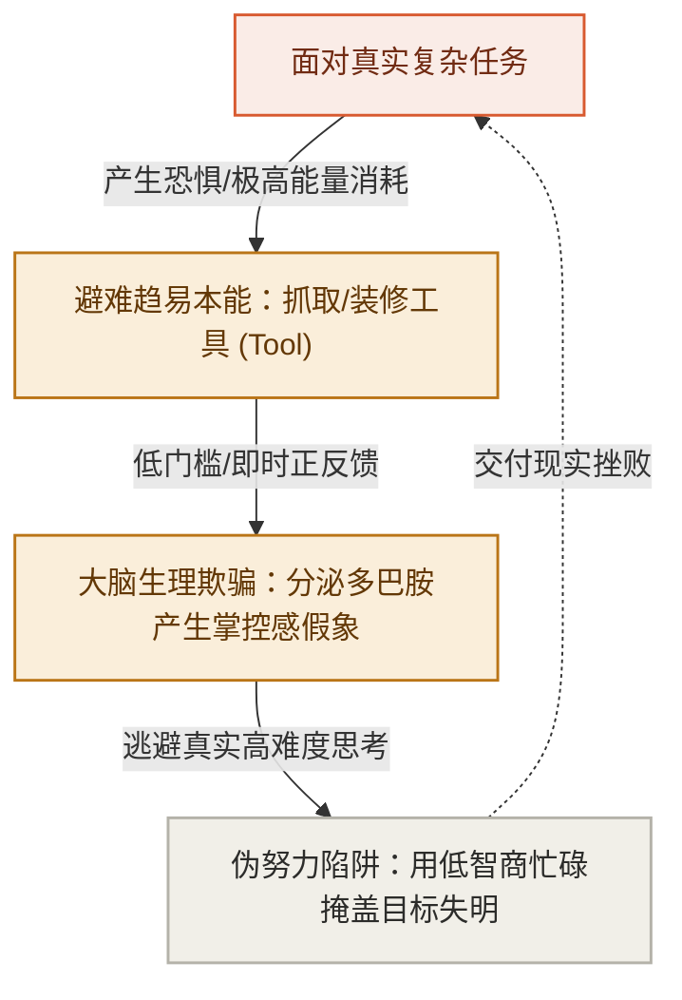

当阿杰在配置 Obsidian 插件、调整字体配色时，他的大脑接收到了密集的正反馈：每敲下一行代码，界面就变美一点；每建立一个标签，资料看起来就被“归类”好了。

大脑在这个过程中被深深地欺骗了——它误以为自己正在“极其高效地推进工作”，并大量分泌多巴胺，奖励这种“掌控感”。

**但这种掌控感，完全是一种生理幻觉。**

你掌控的只是工具的界面形态，你根本没有触碰真实任务的核心逻辑。你用“装修工具”的低智商忙碌，完美地逃避了“构思方案”的高难度思考。

在现代商业和个人成长中，这种“多巴胺伪努力”每天都在以各种花哨的形式上映：

* **个人层面的伪努力**：花了三天配置时间管理 App，结果一件正事没干；买了一堆昂贵的健身装备，结果一次健身房都没去；
* **团队层面的伪努力**：团队业务方向完全混乱，管理者却带着大家花一周时间去选型“到底是用 JIRA 还是用飞书多维表格”；
* **企业层面的伪努力**：商业模式根本没跑通，公司却花了上千万元去采购最顶级的“企业数字化转型系统”。

所有人都在疯狂地优化工具（Tool），却唯独没有人关心：**我们到底要透过什么视角看问题（Lens）？我们到底要达成什么结果（Goal）？**

---

## 三、 LGMT 的黄金纪律体系

要从“工具先行”的泥潭中挣脱出来，我们必须在脑海里立下 LGMT 模型最核心的 5 大黄金纪律：

$$\mathbf{Lens (视角) \to Goal (目标) \to Method (方法) \to Tool (工具)}$$

```
                    LGMT 5 大黄金纪律总纲
┌─────────────────────────────────────────────────────────────┐
│ 1. 纪律一：位阶不可颠倒 (生成顺序)                          │
│    Lens (视角) ──► Goal (目标) ──► Method (路径) ──► Tool (工具)│
├─────────────────────────────────────────────────────────────┤
│ 2. 纪律二：目标不可置换 (做完定义)                          │
│    用真实物理降熵与客户价值 (DoD)，校验一切做功与指标          │
├─────────────────────────────────────────────────────────────┤
│ 3. 纪律三：路径不可脱节 (因果做功)                          │
│    废除无因果关系的伪努力与形式主义，Method 必须是最小抵抗线   │
├─────────────────────────────────────────────────────────────┤
│ 4. 纪律四：诊断必须逆向 (自下而上)                          │
│    遇到故障自下而上排查：Tool(工具) ─► Method(路径) ─► Lens(假设)│
├─────────────────────────────────────────────────────────────┤
│ 5. 纪律五：模型不可教条 (因地制宜)                          │
│    简单域直接 SOP，混沌域先行动止血，手中有剑，心中无剑        │
└─────────────────────────────────────────────────────────────┘
```

在这个四构件结构中，**Tool（工具）处于整条因果链的最末端**。它是为你上游的思考做功的“物理算子”，它绝对不具备自主灵魂。

### 纪律一实战：位阶不可颠倒

假设当阿杰接到“AI+产品规划报告”的那一刻，他如果遵循了第一条纪律（位阶不可颠倒），事情会变成怎样？

1. **第一步：立 Lens（先验视角）**
   阿杰应该先问自己：“VP 让我做这个规划，他底层的先验视角是什么？他关注的是‘我们技术有多炫’，还是‘这能帮公司多赚多少钱/省多少成本’？”
   一旦确定了“商业 ROI 优先”的 Lens，阿杰就会瞬间过滤掉全网 90% 无用的技术炫技文章。

2. **第二步：锁 Goal（目标与做完定义）**
   阿杰接着问：“周三汇报的 Goal 是什么？什么是做完的定义（DoD）？”
   答案不是“写出一份 100 页的精美文档”，而是“**提炼出 3 个具备可操作性的 AI 切入点，并给出明确的算力与人力预算**”。

3. **第三步：推 Method（路径与步骤）**
   为了达成这 3 个切入点，阿杰需要做哪几步动作？
   第一步：访谈 2 位一线销售，了解客户最常投诉的 3 个痛点；第二步：对比 5 家直接竞品的解决方案；第三步：算出一笔成本账。

4. **第四步：选 Tool（工具与载体）**
   到了这一步，阿杰才需要看工具。此时他会发现，完成这三步动作，**最快、摩擦力最小的工具，居然就是一张纸、一支笔和一个最基础的 Excel 表格！**

看！当位阶顺畅时，阿杰根本不需要花 36 个小时去搭建什么 Obsidian 完美系统。他在 2 个小时内就能锁定关键路径，用最轻量的工具，交付出最具震撼力的结果。

---

## 四、 本章防错纪律与检视卡

离开阿杰的故事，请冷酷地审视你今天的手头工作。

你现在正在折腾的那个软件、那个插件、那个看板，究竟是在为你的 Goal 服务，还是在你大脑逃避思考时，给它提供廉价多巴胺的避难所？

记住：**最顶级的思考者，往往使用最笨拙的工具；而最平庸的执行者，才会在工具的装修上倾尽全力。**

---

### 📷【30秒伪努力与工具先行避坑卡】

> **建议保存或拍照此卡，在开启任何新任务或想下载新软件前进行自查：**

```
 ┌──────────────────────────────────────────────────────────────┐
 │             《清晰思考的纪律》· 伪努力避坑自查卡               │
 ├──────────────────────────────────────────────────────────────┤
 │ 当你想下载新软件、配置新系统、或折腾新插件时，请问自己：      │
 │                                                              │
 │ [ ] 1. 逃避检测：我当前是不是在逃避某个极其棘手、耗能的     │
 │        核心思考任务？                                        │
 │                                                              │
 │ [ ] 2. 目标检测：如果不允许使用任何新工具，只用纸和笔，     │
 │        我能否用一句话写下今天必须交付的 Goal (DoD)？         │
 │                                                              │
 │ [ ] 3. 摩擦检测：我选用的工具，是让我的物理做功步骤变少了， │
 │        还是为了满足我的“装修欲”而变多了？                   │
 └──────────────────────────────────────────────────────────────┘
```

---

> **本章金句**：  
> * “屏幕上闪烁的光标，从来不会因为你换了一个更美观的软件而自己写出字来。”  
> * “用装修工具的低智商忙碌，去逃避构思方案的高难度思考，是现代人最隐蔽的伪努力。”  
> * “在没想清‘要什么’之前，所有的工具优化，都只是在错误的方向上高效狂飙。”


---

# 第 2 章：秩序的物理学——暴风雪中的求生骨架

> **本章提要**：为什么如果你不花精力去收拾，房间必然会越来越乱，手机内存必然会越来越满，团队的沟通必然会越来越低效？这不仅仅是某种心理暗示，而是全宇宙最残酷、也最无可逃避的物理定律——熵增。在混乱的自然界中，秩序从来不是免费的。本章带你走进暴风雪赶路的思想实验，用物理直觉推演 LGMT “1 场 + 3 节点”的自适应拓扑，为你建立一套在熵增风暴中强行划出低熵绿洲的求生骨架。

---

## 一、 极地风暴：如果没有骨架，人是怎么在雪夜里冻死的？

想像这样一个身临其境的思想实验：

设想你正身处北极圈内的一片荒原上。夜幕降临，温度骤降至零下 30 度，一场遮天蔽日的暴风雪突然呼啸袭击了整片大地。

能见度不足半米，狂风卷着冰晶打在你的面罩上发出噼啪的巨响，四周是一片死寂的白茫茫与黑漆漆。

此时，你的体内储备着有限的卡路里，体温正在被狂风以恐怖的速度抽走。

**在这样的极端环境里，一个缺乏先验秩序的人，是怎么一步步走向死亡的？**

他通常会经历以下三步盲目做功：

1. **第一步（乱跑狂奔）**：在极度的恐慌中，他听凭本能，拔腿就跑。他拼命地迈动双腿，狂奔了 20 分钟，消耗了大量的卡路里。然而，因为没有任何参照物，他在不知不觉中只是以双脚微小的步幅差，在荒原上画了一个巨大的圆圈，最后回到了原地——**这是在 Tool（双腿做功）与 Method（狂奔）上消耗了极大能量，却没有任何有效位移。**
2. **第二步（工具依赖）**：他感到了绝望，伸手掏出了口袋里性能最强悍的防风打火机（Tool）。他打火、点燃了一根枯枝。那一刻火光照亮了四周 1 米的雪地，带给他一丝微弱的温暖。但他很快发现，打火机根本无法阻挡零下 30 度的暴风雪。几分钟后，燃料耗尽，四周重新陷入更深沉的黑暗与冰冷。
3. **第三步（失温瘫痪）**：他的体温降到了 35 度以下，大脑开始幻觉发热，最终蜷缩在雪堆里失去意识。

这个悲剧场景中，求生者不可谓不努力：他迈动双腿跑到了精疲力竭，他使用了最精良的打火机。**但他依然冻死了。**

现在，让我们看看一个真正训练有素的极地求生专家，在面对同一场暴风雪时会怎么做：

1. **第一步（立 Lens：确定物理地图）**：他停下脚步，绝不乱跑。他戴着特制的风镜，在狂风中寻找极星的位置，或者根据风吹雪堆形成的雪垄走向，确认了磁极与风向的底层先验（**这叫 Lens 场托底**）。
2. **第二步（锁 Goal：设定生命吸引子）**：他没有把目标设定为“今晚走出大草原”（那是虚无的幻想），而是极其冷静地锁定当下的唯一低熵目标：“在体温降到 35 度前，找到一块避风的岩石掩体，挖一个雪洞”（**这叫 Goal 锁定做完定义**）。
3. **第三步（推 Method：变分测地线）**：为了到达岩石掩体，他制定了严格的做功路径——不狂奔，保持恒定心率，每走 100 步用手杖探一次深度，防止掉入冰缝。
4. **第四步（选 Tool：工具算子做功）**：他拿出冰斧（Tool）砍开硬雪，拿出雪铲（Tool）快速堆砌雪墙。

半小时后，狂风依然在洞外怒吼，但求生者已经蜷缩在点燃了微小蜡烛的雪洞里。雪洞内的温度回升到了 0 度以上，他的体温保住了，生命在死寂的暴风雪中强行划出了一块温暖的低熵绿洲。

**这个雪夜求生的骨架，就是 LGMT 模型最原始、最硬核的物理真相。**

---

## 二、 宇宙的终极宿命：为什么混乱是常态，秩序是奇迹？

很多管理者和个人经常感到沮丧：“为什么我刚把桌面理干净，两天后又乱了？为什么团队刚对齐的流程，过两周大家又开始走样了？”

答案隐藏在 19 世纪物理学家克劳修斯提出的**热力学第二定律（熵增原理）**中：

> **在孤立系统内，分子的热运动总是朝着无序度（熵）增加的方向演化。任何系统如果不借助外部做功，必然从有秩序走向瘫痪与混乱。**

```
                       自然界无处不在的“熵增法则”
┌─────────────────────────────────────────────────────────────┐
│ 物理世界自然演化 ──► 秩序崩解、能量耗散、无序度 (熵) 暴增    │
│ (房间变乱、打卡走样、系统卡顿、团队内耗、人生迷茫)           │
└─────────────────────────────────────────────────────────────┘
                               ▲
                               │ 必须输入“低熵负熵流”
┌─────────────────────────────────────────────────────────────┐
│ LGMT 降熵骨架    ──► 引入先验、锁定目标、规划路径、精密做功  │
└─────────────────────────────────────────────────────────────┘
```

这个物理定律揭示了一个残酷的真相：

**混乱，是宇宙的默认设置；而秩序，是人类必须咬牙进行做功才能维持的奇迹。**

* 一个房间如果不花精力收拾，自然状态下散落的概率（数百万种）远大于整齐叠好的概率（一种）；
* 一个团队如果不进行目标校验，每个人按照各自本能发散的概率，远大于统一方向做功的概率；
* 一个人的大脑如果不进行先验约束，陷入胡思乱想与注意力碎片的概率，远大于专注产出的概率。

如果你任由系统听凭本能去演化，系统必然会快速滑向“高熵废墟”。

**而 LGMT 模型，本质上就是人类大脑在物理世界里抗击熵增、强行维持系统秩序的最优降熵拓扑结构。**

---

## 三、 LGMT “1 场 + 3 节点”的物理降熵拓扑

在物理学与控制论的透视下，LGMT 绝不是四个平铺直叙的步骤，而是一个由 **“ 1 个贯穿先验场”与“ 3 个前向做功节点”** 组成的自适应控制拓扑：

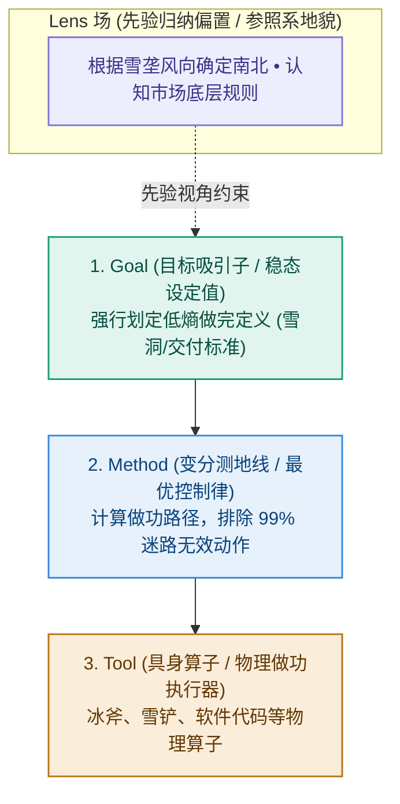

### 1. Lens（先验场）：为你提供大地的参照系
在北极风暴里，如果你看不见极星、读不懂雪垄（没有 Lens），你眼中的世界就是一片无方向的乱麻。
Lens 是你脑海中的“先验地图”。它不直接做功，但它决定了你在面对纷繁复杂的信息流时，如何进行过滤与归因。

### 2. Goal（目标吸引子）：强行划定低熵边界
在无数种可能的未来中（比如冻死在路上、掉进冰缝、漫无目的乱逛），Goal 是你用意识强行选定的那一个**极低概率的稳态（雪洞）**。
Goal 越明确，系统的熵值就被压缩得越低。

### 3. Method（变分测地线）：避开最耗能量的坑洞
在物理学中，变分法用于寻找两点之间能量消耗最小的“测地线”。
Method 就是那条测地线。它告诉你“第一步踩哪里、第二步怎么挥斧”，防止你像那个无头苍蝇一样在雪地里画圈子。

### 4. Tool（具身算子）：在物理现实中做功
冰斧和雪铲（Tool）本身没有任何智慧，它们只是替你把人脑的思考转化为实体做功的机械载体。

---

## 四、 本章防错纪律与检视卡

当你再次感到混乱、迷茫、或者项目乱成一团麻时，不要坐在那里叹气。

提醒自己：**这是熵增原理在对我做功。如果我不施加逆向的控制力，系统必然崩溃。**

收起你的情绪，拿出你的 LGMT 降熵骨架，在混乱的风暴中，为自己挖出那个温暖的雪洞。

---

### 📷【30秒物理降熵自查卡】

> **建议保存或拍照此卡，在感到混乱、项目失控或陷入熵增瘫痪时自查：**

```
 ┌──────────────────────────────────────────────────────────────┐
 │             《清晰思考的纪律》· 物理降熵自查卡                 │
 ├──────────────────────────────────────────────────────────────┤
 │ 当你感觉事情乱成一团麻、自己正在“无头狂奔”时，问自己：       │
 │                                                              │
 │ [ ] 1. 物理参照系：我现在是在听凭本能乱跑（高熵迷茫），      │
 │        还是已经通过 Lens 确认了当前的先验方向？             │
 │                                                              │
 │ [ ] 2. 吸引子锁定：在无数种混乱可能中，我是否强行锁定了一个  │
 │        明确的低熵 Goal (雪洞/做完定义)？                     │
 │                                                              │
 │ [ ] 3. 能量测地线：我的 Method 是在高效做功，还是像在雪地里  │
 │        打转一样，在做大量无用功？                             │
 └──────────────────────────────────────────────────────────────┘
```

---

> **本章金句**：  
> * “混乱是全宇宙的默认设置，而秩序，是人类用意识强行捍卫的奇迹。”  
> * “在暴风雪里，双腿最勤奋的无头狂奔，往往只会带你走向最快的冻死。”  
> * “LGMT 并不是某种花哨的管理爱好，而是你在充满熵增的现实世界里抗击瘫痪的唯一求生骨架。”


---

# 第 3 章：四构件解构——Lens、Goal、Method、Tool 的极简说明书

> **本章提要**：如果在面对复杂任务时，你依然分不清什么是“看世界的眼镜”、什么是“最终要结果”、什么是“走过的路径”、什么是“手中的器械”，你就会在不知不觉中重蹈覆辙。本章剥离所有花哨案例，为你一站式深度拆解 LGMT 模型的四个核心构件——Lens、Goal、Method、Tool 的精准定义、判别标准与真假防伪标志，交付一套终身受用的认知解耦说明书。

---

## 一、 为什么要对这四个词进行“冷酷解耦”？

在日常生活和工作中，人们经常把一些极其不同的概念混为一谈：

* “我们的目标是引入敏捷开发！”——错！敏捷开发是 **Method（路径）**，不是 Goal（目标）。
* “我今天学了 3 个小时 Python！”——错！Python 是 **Tool（工具）**，学习 3 小时是动作，都不是 Goal。
* “我觉得这个需求做不出来。”——错！这是你戴着的 **Lens（先验透镜）** 在限制你，而不是物理现实限制了你。

人类大脑在混乱状态下，最容易把“视角、目标、路径、工具”黏连在一起，形成一团无法解开的乱麻。

**解耦（Decoupling），是所有顶级工程与清晰思考的第一步。**

就像一辆跑车，发动机（Tool）、导航路线（Method）、终点站（Goal）和驾驶者的驾驶视野（Lens）各司其职。一旦你把导航路线当成终点站、把发动机当成视野，这辆车必然车毁人亡。

现在，让我们拿起手术刀，对 LGMT 的四个构件进行逐一解构。

---

## 二、 构件一：Lens（先验范式 / 认知透镜）——你凭什么这么看？

```
                         Lens (先验范式场)
┌─────────────────────────────────────────────────────────────┐
│ 物理隐喻 : 戴在眼睛上的有色眼镜 / 脑海中的底层先验地图       │
│ 核心功能 : 决定你从混沌信息中“能看到什么”与“忽略什么”      │
│ 防伪标志 : 它不是某一个具体的动作，而是解释一切的前置立场    │
└─────────────────────────────────────────────────────────────┘
```

### 1. 什么是 Lens？
Lens 是你大脑中长期积累形成的**先验假设、价值观、归纳偏置与认知透镜**。

在物理学与人工智能中，没有任何系统能在“零先验”的状态下处理信息。当你面对一个陌生场景时，你必须先“戴上一副眼镜”，才能从无序的噪声中看出结构。

### 2. 经典比喻：红墨镜与雪地
如果你戴着一副**红色的墨镜**去看一片白色的雪地，你眼里看到的雪地永远是血红色的。

* 如果你不知道自己戴着红墨镜，你就会高喊：“天啊，全世界都在流血！”（**先验傲慢**）；
* 只有当你意识到“我戴了一副红墨镜”时，你才能摘下眼镜，看清雪地真正的白色（**先验觉察**）。

### 3. 三种常见的 Lens 示例
* **阿杰的“仓储 Lens” vs “代谢 Lens”**：以为知识是收集的财产（仓储），看到的都是“收藏”；意识到知识是消化的能量（代谢），看到的都是“输出”。
* **老张的“炫技 Lens” vs “商业 Lens”**：以为用户喜欢高科技（炫技），生产出的都是无人问津的繁琐硬件；意识到用户喜欢简单耐用（商业），生产出的都是爆款。
* **管理者的“掌控 Lens” vs 一线的“交付 Lens”**：管理者希望数据全知（掌控），看到的都是表格；一线希望快速做功（交付），看到的都是摩擦力。

---

## 三、 构件二：Goal（低熵吸引子 / 稳态设定值）——你到底要什么？

```
                         Goal (目标吸引子)
┌─────────────────────────────────────────────────────────────┐
│ 物理隐喻 : 暴风雪中避风的雪洞 / 吸引系统收敛的低熵吸引子     │
│ 核心功能 : 强行在无数种混乱可能中，锁定唯一的物理做完标准   │
│ 防伪标志 : 必须包含明确的 DoD (做完定义)，且不随工具而改变  │
└─────────────────────────────────────────────────────────────┘
```

### 1. 什么是 Goal？
Goal 是系统在物理相空间中强行锁定的**稳态设定值（Set Point）**。它是用来校验系统一切做功是否有效的唯一标准。

### 2. 识别“真 Goal”与“假 Goal”的 3 大生死标准

在现实中，90% 的人设定的 Goal 都是假 Goal（代理指标置换）。用以下 3 条标准进行真伪判定：


---

## 四、 构件三：Method（变分路径 / 控制律）——你具体怎么做？

```
                         Method (变分路径)
┌─────────────────────────────────────────────────────────────┐
│ 物理隐喻 : 避开冰缝的探路轨迹 / 能量消耗最小的变分测地线     │
│ 核心功能 : 建立从“当前状态”通往“ Goal ”的因果做功链条       │
│ 防伪标志 : 必须具备因果逻辑，且能根据 Error 反馈动态微调     │
└─────────────────────────────────────────────────────────────┘
```

### 1. 什么是 Method？
Method 是连结上游 Goal 与下游 Tool 的**因果策略、算法步骤与做功路线**。

在物理学中，从 A 点到 B 点有无数条路径，Method 是那条排除 99% 无效动作、能量消耗最小的“测地线”。

### 2. Method 容易犯的两大死穴
* **因果断裂**：动作与目标之间没有因果关系。例如：“每天在微信公众号发 3 条海报（Method）”并不能因果导向“客户购买产品（Goal）”。
* **方法仪式化（Cargo-Cult）**：失去了 Goal 支撑的 Method，就会退化为无意义的木头耳机——大家每天机械地开 15 分钟敏捷站会、填报表，唯独不关心结果。

---

## 五、 构件四：Tool（具身算子 / 物理执行器）——你用什么载体？

```
                         Tool (具身算子)
┌─────────────────────────────────────────────────────────────┐
│ 物理隐喻 : 求生者手中的冰斧雪铲 / 在实体世界做功的物理算子   │
│ 核心功能 : 降低人类大脑与物理世界的交互摩擦，输出实体控制力  │
│ 防伪标志 : 居于因果链的最末端，永远被动接受上游指挥         │
└─────────────────────────────────────────────────────────────┘
```

### 1. 什么是 Tool？
Tool 是实体世界中看得见、摸得着的**物理做功载体、软件算子与机械器具**。

从一把石斧、一根铅笔，到 Obsidian 软件、Python 脚本、AI 大模型，通通都是 Tool。

### 2. Tool 的物理第一性：具身做功成本（Cognitive Friction）
工具本身没有任何道德与灵魂。评价一个 Tool 好坏的唯一标准是：

$$\text{工具净效能} = \text{生产力增益} - \text{具身做功摩擦力}$$

* 如果一个工具让你少敲 50 个字、少点 3 次鼠标，它就是**正效能 Tool**；
* 如果一个工具为了满足管理者的装修欲，让你每天多花 1 小时填 12 个下拉框，它就是**负效能废墟**。

---

## 六、 本章防错纪律与检视卡

这四个构件，构成了你大脑中最精密的四把手术刀。

分清了它们，你在面对任何复杂任务时，就能瞬间一眼洞穿：**到底是什么地方卡住了系统。**

---

### 📷【30秒 LGMT 四构件解耦极简说明书】

> **建议保存或拍照此卡，在厘清思路或诊断问题时自查：**

```
 ┌──────────────────────────────────────────────────────────────┐
 │             《清晰思考的纪律》· 四构件极简说明书               │
 ├──────────────────────────────────────────────────────────────┤
 │ [ ] Lens (视角)   : 我戴着什么眼镜？(先验假设、立场与底色)    │
 │                     问：“我凭什么这么看？”                   │
 │                                                              │
 │ [ ] Goal (目标)   : 终点雪洞在哪里？(做完定义 DoD、低熵稳态) │
 │                     问：“我到底要什么？”                     │
 │                                                              │
 │ [ ] Method (路径) : 路线怎么走？(因果步骤、变分测地线)        │
 │                     问：“我具体怎么做？”                     │
 │                                                              │
 │ [ ] Tool (工具)   : 拿什么冰斧做功？(算子载体、物理软件)      │
 │                     问：“我用什么工具？”                     │
 └──────────────────────────────────────────────────────────────┘
```

---

> **本章金句**：  
> * “将 Method 当成 Goal，叫方法仪式化；将 Tool 当成 Goal，叫伪努力黑客。”  
> * “没有零先验的视角，只有不知道自己戴着红墨镜的盲人。”  
> * “解耦是所有顶级工程的第一步。把路线当终点，跑车必然车毁人亡。”


---

# 第 4 章：个人突破——彻底终结“知识囤积与假装学习”

> **本章提要**：为什么你收藏了上千篇干货文章、买了上百门在线课程、微信浮窗和网盘里塞满了资料，真正需要解决问题时，脑子里却依然是一片荒漠？个人学习中最深的坑，在于用“收集与囤积”的快乐，替代了“消化与输出”的做功。本章跟着阿杰的“资料库松鼠症”，用 LGMT 模型重新定义个人知识管理（PKM），理清 PARA、卡片盒、双链笔记的真实坐标，建立输出倒逼输入的知识代谢流水线。

---

## 一、 阿杰的“数字松鼠症”

在经历了第 1 章的汇报惨败后，阿杰沉寂了一周。但他很快又给自己找到了新的出路。

“上次之所以败得那么惨，”阿杰在心里对自己分析，“是因为我的知识库积累还不够深。我的脑子里没有足够的案例和素材，所以才写不出东西。”

于是，阿杰开启了一场长达半年的**“知识狂欢”**：

每天早上刷手机，看到一篇标题为《AI 时代的 10 个商业模式》的文章，他的手指迅速滑动，点击“微信收藏”，并转发到自己的 Obsidian 接收收件箱；
午休时，刷到一段讲解“变分自编码器”的 B 站视频，他兴奋地按下“收藏”，并在心里对自己说：“这内容太硬核了，今晚一定要抽空看完”；
深夜躺在床上，他买下了某个知识付费平台推给他的《30天掌握顶级思考模型》课程，看着已购列表中那 30 节未解锁的视频，他心满意足地合上了眼睛。

在接下来的大半年里，阿杰就像一只在秋天狂热囤积松果的松鼠。

他的微信收藏夹里攒了 1200 多篇文章；他的网盘里塞满了 300GB 的高清讲座视频；他的 Obsidian 库里建立了几十个文件夹、分类打上了 800 多个标签。

每当看到自己的知识库数字不断攀升，阿杰心里就会升起一股踏实而丰盈的满足感。他觉得自己正在以惊人的速度“成长”。

**然而，现实的冷水很快再次泼来。**

半年后的一个下午，团队遇到了一个关于“用户流失率异常”的紧急难题。Leader 在白板前敲着黑板：“大家脑暴一下，我们有什么现成的分析框架或解法？”

会议室里一片安静。阿杰坐在后排，心跳陡然加速。

他在脑海里疯狂地检索：“我记得我半年前收藏过一篇讲用户流失的绝佳文章！里面有 5 个维度！我当时还打了 `#用户增长` 的标签！”

然而，当他打开 Obsidian 拼命输入关键词搜索时，尴尬的事情发生了：

那篇文章确实在他的库里，甚至被整理到了精致的文件夹里。但他除了记得“标题看起来很有道理”之外，**对于文章里的具体逻辑、推导过程、以及如何应用到眼前公司的业务中，脑子里依然是一片空白。**

他花了整整半年时间囤积的 1200 篇文章和 300GB 资料，在现实问题的撞击下，像一堆轻飘飘的泡沫一样瞬间蒸发。他依然什么都回答不上来。

**这种现象，就是典型的“数字松鼠症（Information Hoarding）”。**

我们像松鼠囤积坚果准备过冬一样，把“收藏和分类资料”当成了安全感的来源。但我们忘了最重要的物理事实：坚果如果不吃进肚子里消化，囤积再多，松鼠依然会被饿死。

---

## 二、 LGMT 病理诊断：用“仓储思维”替代“代谢模型”

用 LGMT 模型的手电筒照向阿杰的学习过程，你会发现他在个人成长上犯了极其致命的“认知倒错”。

```
                    阿杰在学习上的 LGMT 倒错
┌─────────────────────────────────────────────────────────────┐
│ ❌ 错误 Lens (仓储视角) : 知识是某种可以被收藏拥有的“财产”│
│                          知识库文件越多，自己就越厉害       │
└─────────────────────────────────────────────────────────────┘
                               │
                               ▼ 导致
┌─────────────────────────────────────────────────────────────┐
│ ❌ 代理 Goal (指标置换) : “看完 50 本书”、“收藏 1000 篇干货”│
│                          (用“收集量”替代“吸收量”)            │
└─────────────────────────────────────────────────────────────┘
                               │
                               ▼ 导致
┌─────────────────────────────────────────────────────────────┐
│ ❌ 伪 Method & Tool    : 疯狂折腾笔记分类、PARA、双链标签    │
│                          (在信息入口处做极度繁重的无用功)   │
└─────────────────────────────────────────────────────────────┘
```

### 1. Lens（视角）坏掉了：误把信息当资产
阿杰底层的 Lens 是“仓储视角（Warehouse View）”。他认为知识就像存折里的余额，收藏得越多，资产就越雄厚。
但物理现实是：**未经你大脑加工、重组与表达的信息，不是你的资产，而是你硬盘里占地方的无用负债。**

### 2. Goal（目标）被偷换了：用“代理指标”自我感动
在旧 Lens 的支配下，阿杰的目标变成了“今年读完 50 本书”、“每天收藏 5 篇好文”。
这些目标极其容易达成，也能给大脑带来廉价的成就感。但它们都是**假目标**。真实的 Goal 永远只有一种：**你是否能用自己的话解释这个概念？你是否用它解决了一个真实问题？**

### 3. Method 与 Tool 被过度工程化：在门楼上磨洋工
为了支持这种“仓储思维”，阿杰引入了极度复杂的卡片盒笔记法、PARA 目录分类、Obsidian 双链关系图谱。
他每天花费数小时在给文章打标签、画双链连线上。这种繁重的“前端整理”，让他彻底消耗光了能量，再也没有体力去进行真正的“后向思考”。

---

## 三、 破局纪律：建立“输出倒逼输入”的知识代谢流水线

要彻底终结知识囤积与假装学习，我们必须用全新的 LGMT 纪律，重构你的个人学习系统。

### 纪律 1：立新 Lens——知识不是资产，而是“代谢物”

在你的脑海里建立一个新的先验视角：

> **知识不是石头，而是像食物一样的“代谢物”。**

食物吃进肚子，如果不经过肠胃的消化吸收，并最终转化为身体的能量与排泄，堆积在体内的食物就会变成剧毒的垃圾。

信息也是一模一样。**没有被你用自己的话重写（消化）、没有被你用来输出解决问题（代谢）的信息，本质上就是你脑海里的精神垃圾。**

衡量你学习成效的唯一标准，绝对不是你“输入了多少”，而是你“输出了多少”。

### 纪律 2：重塑 Goal——绝不“稍后阅读”，只做“即时交付”

从今天起，彻底废除你手机和电脑里的“稍后阅读（Read Later）”列表！

在物理学上，“稍后阅读”约等于“再也不读”。它只是大脑在逃避当下思考时的一种缓兵之计。

建立全新的 Goal 纪律：
* 看到一篇好文，要么**立刻花 5 分钟读完**，并用自己的话在白板或卡片上写下一句心得；
* 如果当下没有时间，**直接关闭页面，决不收藏**！
* 相信我：如果这篇文章真的足够重要，未来的现实问题一定会再次把它推到你的面前；如果它不重要，流失了就是对你大脑算子最大的保护。

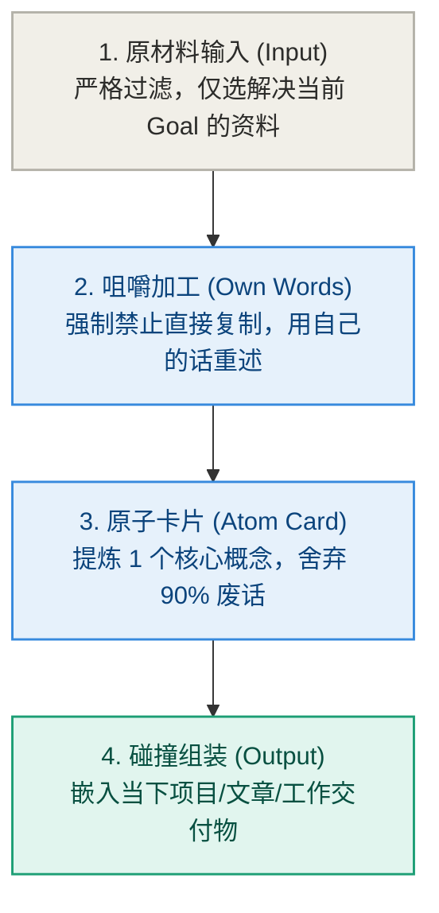

### 纪律 3：主流笔记法在 LGMT 坐标系中的真实归位

市面上流行着各种各样的笔记方法论，我们不必盲目崇拜，也不必全盘否定。用 LGMT 坐标系把它们放在正确的位置：

* **康奈尔笔记法（Cornell Notes）**：本质上是一个极佳的 **Method（咀嚼加工）**。它强制你在右侧记录、在左侧提炼线索、在底部写 Summary（用自己的话重述）。它关注的是“消化”，而不是“仓储”。
* **卡片盒笔记法（Zettelkasten）**：本质上是一个 **Method（原子化组装）**。它的精髓在于让你把长文章拆成单概念的“原子卡片”，方便未来像积木一样拼装出新文章。如果你只写卡片而不拼装输出，它依然会沦为高级废纸堆。
* **PARA 方法（Projects, Areas, Resources, Archives）**：本质上是一个 **Goal 导向的 Tool 架构**。它最大的亮点是把 **Projects（当前有明确交付物的项目）** 放在第一位。凡是不服务于当前 Projects 的资源，通通压入背景。

---

## 四、 本章防错纪律与检视卡

看清了阿杰的松鼠症，请立刻打开你的手机和电脑。

清理掉那些让你产生假装努力快感的“稍后阅读”列表。记住：**你的大脑是用来思考的器官，而不是用来装二手资料的硬盘。**

---

### 📷【30秒个人学习与知识代谢自查卡】

> **建议保存或拍照此卡，在阅读干货文章或想点击“收藏”时进行自查：**

```
 ┌──────────────────────────────────────────────────────────────┐
 │             《清晰思考的纪律》· 知识代谢自查卡                 │
 ├──────────────────────────────────────────────────────────────┤
 │ 当你想点击“收藏”或保存一篇资料时，问自己：                   │
 │                                                              │
 │ [ ] 1. 逃避检测：我是不是在用“收藏”的动作，逃避当下用大脑  │
 │        去认真读完它的痛苦？                                  │
 │                                                              │
 │ [ ] 2. 转述检测：如果不允许复制粘贴，我能否用自己的话，在    │
 │        30 秒内说出这篇文章最核心的一个洞察？                │
 │                                                              │
 │ [ ] 3. 交付检测：这篇资料能够直接服务于我未来 7 天内的哪一个 │
 │        具体交付 Goal？（若无 -> 立即关闭页面，绝不收藏！）   │
 └──────────────────────────────────────────────────────────────┘
```

---

> **本章金句**：  
> * “未经过你大脑加工与表达的信息，不是你的资产，而是你硬盘里的无用负债。”  
> * “稍后阅读，在物理学上约等于再也不读；收藏夹是你给大脑搭建的最舒适的避难所。”  
> * “知识不是石头，而是食物。不要做囤积坚果的松鼠，要做把信息转化为能量的消化者。”


---

# 第 5 章：团队对齐——告别“大家都在忙，却不知为了啥”

> **本章提要**：为什么很多团队每周开无数个对齐会、每天搞 15 分钟站会、引入了最时髦的 OKR 与敏捷流程，大家累得精疲力竭，交付出来的产品却依然不解决问题？团队协作最大的死穴，在于用“动作的忙碌（Method/Tool）”替代了“目标的对齐（Goal）”。本章跟着传统制造业创始人老张的创业团队，用 LGMT 模型剖析团队内耗的根源，教你如何用 Goal 锁定“做完的定义”，用 Lens 统一团队底色，彻底终结“敏捷表演”。

---

## 一、 老张和他的“敏捷表演艺术团”

42 岁的传统制造业创始人老张，今年遇到了一件让他无比头疼的事情。

为了响应“数字化升级与敏捷转型”的口号，老张高薪聘请了一位来自大厂的敏捷教练，为公司引进了最时髦的敏捷开发流程、OKR 目标管理体系以及全套看板工具。

刚开始的两个月，公司的气氛看起来焕然一新：

每天早晨 9 点 30 分，各个部门的员工围成一圈，召开例行的“15 分钟敏捷站会”。

大家站在白板看板前，轮流语气坚定、表态积极地发言：
* 研发组组长：“我昨天完成了 3 个 Task 的代码提交，修复了 2 个 Bug，今天准备继续推进模块 B 的开发，目前没有 Blocker。”
* 市场部经理：“我昨天发了 2 篇微信公众号文案，今天计划把下周的社群海报排版完成，目前没有 Blocker。”

每个人汇报得有条不紊、排期满满。白板上的“进行中（In Progress）”贴纸被密密麻麻地贴满，每周的周报写得花团锦簇。

单看这个画面，这无疑是一支训练有素、执行力极其恐怖的狼性团队。

老张在会议室后排看着，心里感到了由衷的欣慰。

**然而，到了季度末的业务交付日，现实却给老张泼了一桶彻骨的冰水。**

当老张打开财务报表和后台数据时，刺眼的数据让他几乎晕厥：
* 新上线的数字化系统留存率几乎为零，一线销售根本不用；
* 客户最核心提出的 3 个致命痛点，在过去 6 个敏捷迭代里被一拖再拖；
* 市场部发了几十张精美海报，带来的有效潜在客户转化竟然是零！

在紧急召开的复盘会上，会议室里的空气陷入了死寂。

老张拍着桌子咆哮：“大家每天站会都在说没有 Blocker，每个人都在按时完成 Task，为什么最后交出来的东西是个垃圾？！”

下属们低着头，脸上写满了委屈：
* 研发组抱怨：“我们严格按照产品经理给的 Task 写完了代码啊，代码零 Bug 上线，这不能怪我们吧？”
* 市场部抱怨：“我们按敏捷排期发满了 20 篇文案啊，文章阅读量指标也达标了，用户不买单是产品太难用啊！”

每个人都极其忙碌，每个人都百分之百完成了自己的“ Task ”，但**没有人在为最终的“业务结果”负责！**

**这种现象，在团队管理中被称为“货物崇拜（Cargo-Cult）与敏捷表演”。**

二战时期，南太平洋岛屿上的土著人看到美军在平地上建造跑道、戴着木头耳机挥动旗帜，随后就有装满物资的飞机降落。美军撤走后，土著人也用木头造了假“飞机”和“耳机”，在荒地上挥舞旗帜，虔诚地祈祷物资降落。

老张的团队，正是陷入了这种荒谬的“货物崇拜”：

**他们拷贝了敏捷站会、周报填表、看板贴纸等所有时髦的动作（Method/Tool），却唯独丢失了这些动作背后的目标（Goal）与灵魂！**

---

## 二、 LGMT 病理诊断：团队内耗的三大断裂

用 LGMT 模型去剖析老张团队的内耗，其背后的病理结构极其清晰：

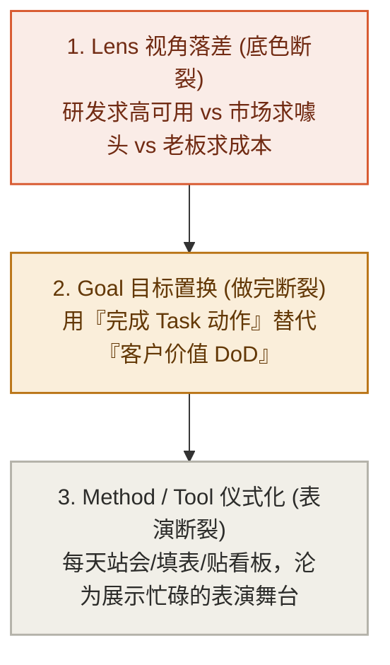

### 1. 认知底色断裂（Lens 落差）
团队里的成员看似在一个办公区工作，其实每个人戴着完全不同的 Lens（透镜）：
* 研发的 Lens 是“技术优雅”：他们关注代码结构漂不漂亮，系统会不会崩；
* 市场的 Lens 是“曝光声量”：他们关注文章阅读量高不高，海报够不够抓眼球；
* 老张的 Lens 是“企业存亡”：他关注的是现金流和客户续费率。

当这三种完全相反的先验视角没有在源头被统一时，大家在站会上的“沟通”，本质上只是三种语言在平行时空里的对聋发哑。

### 2. 做完标准断裂（Goal 置换）
在老张的团队里，最大的死穴在于**“做完的定义（Definition of Done, DoD）”被严重置换了**。
* 研发把“代码合并进主干”定义为做完；
* 市场把“海报排版完成发送”定义为做完。

但真正的 DoD 永远只有一个：**客户是否成功使用了这个功能？这个动作是否产生了真实的商业价值？**
当团队用“Task 完成度”替代“客户价值 DoD”时，大家就会心安理得地交付大量“无用的垃圾”。

### 3. 动作与工具表演化（Method / Tool 退化）
敏捷站会（Method）和看板工具（Tool），本意是为了暴露阻碍、快速迭代。但当上游的 Lens 和 Goal 断裂后，这些工具就退化为了员工向 Leader 证明“我很忙、我没有偷懒”的表演舞台。

---

## 三、 破局纪律：用 Goal 锁定 DoD，建立 4 步团队对齐流程

要终结团队的“敏捷表演”，老张们必须重构团队的 LGMT 对齐纪律。

### 纪律 1：强制统一“做完的定义（DoD）”

在任何项目开工前，团队负责人必须召开“DoD 锁定会”。在白板上只写两行字，并要求所有成员签字确认：

```
DoD (Definition of Done) 锁定公式：
┌─────────────────────────────────────────────────────────────┐
│ ❌ 伪 DoD (动作完成) : 代码写完了 / 海报发出了 / 报告填完了   │
├─────────────────────────────────────────────────────────────┤
│ ✅ 真 DoD (价值闭环) : 客户顺利完成了一次真实下单 /         │
│                        带来了 50 个有效试用留存 /            │
│                        问题在生产环境中被验证解决。         │
└─────────────────────────────────────────────────────────────┘
```

**未达到“真 DoD”之前，任何人在站会上都不能声称这个 Task“已完成”！**

这一条纪律，能瞬间击碎 90% 团队成员的自我感觉良好，把所有人拉回到真实的结果面前。

### 纪律 2：团队 LGMT 4 步对齐流程

下一次在召开项目启动会或周对齐会时，抛弃死板的表格，严格按照以下 4 步进行推演：

1. **第一步：统一 Lens（为什么要开这个战役？）**
   负责人首先发言：“各位，我们这次做小程序重构，底层的 Lens 不是为了炫技，而是因为现有流程太繁琐，导致 40% 的客户在支付环节流失了。”（统一先验底色）

2. **第二步：锁死 Goal（做完的具体指标）**
   “我们这次战役唯一的 Goal 是：**将支付环节的客户放弃率，从 40% 降低到 15% 以下。** 不管代码写得优雅还是粗暴，达到这个数字才算胜利！”

3. **第三步：拆解 Method（跨部门因果路径）**
   研发、产品和市场不再各自为政，而是共同推演路径：“为了降低放弃率，产品减少 2 个输入框，研发优化 1 秒加载延迟，市场提供一个一键领取优惠券的弹窗。”

4. **第四步：精简 Tool（拒绝看板表演）**
   废除那些花哨复杂的软件字段。白板上只留三列：`未开始`、`进行中`、`已达成真 DoD`。站会只讨论一件事：**“谁的动作卡住了总 Goal 的达成？怎么帮他搞定？”**

---

## 四、 本章防错纪律与检视卡

看清了老张团队的教训，请检查你的团队开会现场。

站会不是表演舞台，白板不是艺术展览。记住：**大家都在忙碌，不等于大家都在前进；只有朝向同一个 Goal 的做功，才叫真正的团队执行力。**

---

### 📷【30秒团队对齐与内耗避坑卡】

> **建议保存或拍照此卡，在团队开会、开例会或进行任务分工时自查：**

```
 ┌──────────────────────────────────────────────────────────────┐
 │             《清晰思考的纪律》· 团队对齐自查卡                 │
 ├──────────────────────────────────────────────────────────────┤
 │ 当你在管理团队或参加敏捷对齐会时，问自己：                   │
 │                                                              │
 │ [ ] 1. DoD 检测：团队成员口中的“我做完了”，指的是完成了    │
 │        某个动作（伪 DoD），还是产生了实际客户价值（真 DoD）？│
 │                                                              │
 │ [ ] 2. 视角检测：研发、产品和市场，对这次战役底层的 Lens    │
 │        （为什么做）是否达成了一致，还是各自为政？            │
 │                                                              │
 │ [ ] 3. 阻碍检测：站会是在进行向 Leader 的“忙碌表演”，        │
 │        还是在真实地暴露和解决阻碍 Goal 达成的 Blocker？      │
 └──────────────────────────────────────────────────────────────┘
```

---

> **本章金句**：  
> * “大家都在忙碌，不等于大家都在前进；没有目标对齐的忙碌，只是在集体无意识地踩原地踏步脚踏车。”  
> * “拷贝了敏捷站会的所有动作，唯独丢失了做完的定义（DoD），这就是现代企业里最昂贵的货物崇拜。”  
> * “未产生真实客户价值的‘已完成’，是对团队资源最残酷的浪费。”


---

# 第 6 章：系统与技术——避免千万级系统的“填表灾难”

> **本章提要**：为什么很多企业花费巨资引入 CRM、ERP 或敏捷管理软件后，员工不仅没有变得高效，反而每天要抽出一两个小时专门“补表格”？为什么花哨的技术选型往往演变为生产力的灾难？本章跟着全栈工程师小雯的亲身经历，用 LGMT 模型剖析技术实施中的“认知倒错”，揭示“工具强暴流程”与“管理者幻觉”的深层根源，并提供一套业务视角优先的技术选型与系统降维防错框架。

---

## 一、 小雯的“千万级系统填表地狱”

34 岁的全栈工程师小雯，去年跳槽到了一家正在进行“数字化转型”的中型企业担任技术负责人。

刚入职时，公司高层对小雯寄予厚望，并拨出了上千万元的预算，采购了市场上最昂贵、功能最齐全的顶级企业 CRM（客户关系管理）与 ERP 系统。

在启动大会上，董事长信心满满地宣布：“有了这套系统，我们的业务将实现全流程数字化，管理效率将提升 3 倍！”

随后，管理层发布了长达 20 页的《系统操作规范》，要求全公司员工：
* 销售人员每次打完客户电话，必须在系统中录入 12 项详细沟通字段；
* 每一个销售机会的推进，必须按 7 个阶段上传对应的证明文档；
* 工程师的每一个开发 Task，必须精确录入预估工时与实际工时，并每天打卡更新。

小雯作为技术负责人，亲自参与了系统的配置与上线。

然而，半年过去了，高层预想中的“效率飞跃”不仅没有出现，**公司反而陷入了一场前所未有的“填表地狱”。**

小雯在日常观察中看到了令人啼笑皆非的真实景象：

* **一线销售在“暗渠”交易**：销售员老王抱怨道：“我在手机微信里和客户聊两句就能敲定合同，但要我把沟通内容填进 CRM，需要在电脑上层层点击 12 个下拉框、耗时 5 分钟！我现在宁可用纸质笔记本记账，也不想打开那个卡顿的系统。”
* **周五下班前的“集体造假”**：每到周五下午 4 点，办公室里就会响起密集的键盘敲击声——大家开始凭回忆或干脆编造数据，把一周的业务“补填”进系统，仅仅是为了迎合 HR 和管理层下周一的例行抽查；
* **业务流程彻底瘫痪**：为了迎合系统预设的复杂审批流，原本半天就能签署的合同，现在要在系统里流转 6 个节点，拖延整整一周。

高层管理者在打开系统看板时看到的是一片繁荣：表格被填满了，折线图看起来极其漂亮。

但在看板背后，真正产生价值的业务线正在不堪重负地呻吟。

小雯看着这个自己花了大半年时间配置的系统，心里感到无比震惊：

**企业花了上千万元买来的系统（Tool），不仅没有成为推动业务前进的发动机，反而演变成了拖垮生产力的最大摩擦力源头。**

系统沦为一座高耸入云的“数字废墟”——大家都在为系统打工，唯独没有人为业务结果打工。

为什么聪明的管理者和优秀的工程师，会在技术选型和系统建设上掉入如此巨大的陷阱？

---

## 二、 LGMT 病理诊断：技术选型中的“认知倒错”

用 LGMT 模型的手电筒照向小雯公司那个瘫痪的系统，其背后的认知病理清晰得令人发指。这完全是一场关于 Lens、Goal、Method 与 Tool 位阶倒置的悲剧。

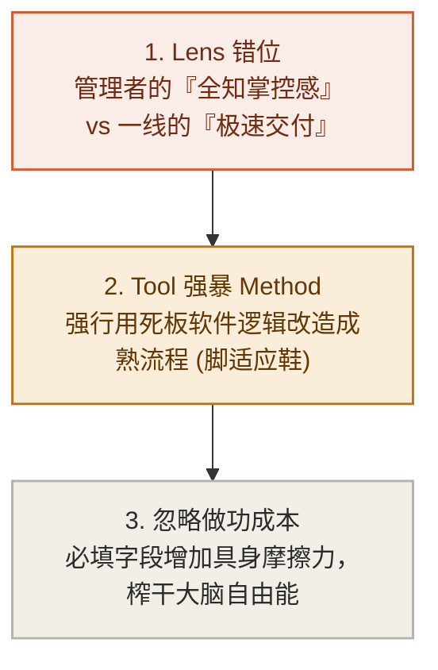

### 1. 认知倒错一：管理者的 Lens 与一线的 Lens 剧烈对撞
任何系统的设计和选型，都隐藏着设计者的 Lens（先验假设）。
* **管理者的 Lens** 是“掌控与全知”：他们希望系统能收集尽量多维度的数据，提供完美大屏，从而获得掌控感；
* **一线员工的 Lens** 是“生存与效率”：他们需要以最小的摩擦力、最快的速度把产品卖出去、把 Bug 修复掉。

当管理者凭借权力，把服务于自己“掌控 Lens”的庞大字段强制压给一线时，Tool 就彻底背离了一线的生产现场。对于一线而言，填写这些字段没有任何个人价值，反而增加了巨大的能量消耗。

员工集体敷衍填表、在暗渠沟通，正是系统摩擦力过大时，生物体为了防止自身能量被榨干而做出的理性自卫。

### 2. 认知倒错二：用 Tool（工具）强暴 Method（方法）
软件供应商在设计产品时，往往嵌入了他们所提炼的“通用最佳实践”。但**“通用最佳实践”往往等于“在任何具体场景下都不最佳的实践”。**

当企业自身的方法（Method）尚未成熟、流程尚未打磨顺畅时，管理者往往盲目寄希望于“买个系统就能把方法带过来”。于是，企业强行引入了一套庞大僵硬的系统（Tool），并用系统的规则去硬性改造一线的业务流程。

结果就是：**工具强暴了流程。**

原本灵活顺畅的线下沟通，被强行切割成无数个系统中的死板字段。这种“脚适应鞋”的倒错，直接摧毁了方法本身的生命力。

### 3. 认知倒错三：忽略 Tool 的“具身做功成本”
在很多数字产品的倡导者眼中，软件好像是没有重量的。

但现实中，**每一个输入框、每一个下拉菜单、每一个需要等待 2 秒的加载页面，都是需要消耗人类大脑自由能（Free Energy）的具身摩擦力。**

当一个工具带来的“效率增益”，小于使用这个工具所付出的“认知做功成本”时，这个工具在物理学意义上就是一个**效率净负值算子**。

---

## 三、 破局纪律：业务视角优先的技术选型与防错框架

要帮小雯们摆脱“填表灾难”，我们必须用 LGMT 的严格位阶，重新建立技术与系统实施的纪律。技术从来不是目的，工具永远只能服务于做功的节点。

### 纪律 1：无系统原则（No-Tool First）——绝不自动化未成熟的流程

在考虑购买或开发任何软件系统（Tool）之前，必须强制执行“无系统原则”：

> **在没有软件辅助的情况下，用纸笔、Excel 或纯手动沟通，你的业务流程（Method）能否顺畅跑通并产生价值？**

如果你的团队用一张简易的 Excel 表格或白板都管不好客户跟进，那么引入一套价值百万元的 CRM 系统，除了让你获得一张极其昂贵的数字废墟外，绝对不会产生任何奇迹。

**系统（Tool）的功能是“放大器”，而不是“救世主”。** 它会放大你顺畅的流程（使高效率放大 10 倍），但更会放大你混乱的方法（使混乱和摩擦力放大 10 倍）。

只有当你的 Method 已经在手动状态下被证明极其有效、但因业务量暴增而触及人力极限时，才是引入 Tool 进场自动化的最佳时机。

### 纪律 2：技术选型“黄金三问法”

任何团队在引入新工具、新架构或新系统前，负责人和小雯这样的技术主管，必须在白板上回答以下三个问题：

```
技术选型黄金三问：
┌─────────────────────────────────────────────────────────────┐
│ 1. 问 Goal：这套系统解决的是“交付摩擦”还是“管理者焦虑”？     │
│ 2. 问 Method：我们现有的线下流程是否已经标准化到可以被固化？│
│ 3. 问 Tool：一线员工使用新工具的操作步骤是增加了还是减少了？ │
└─────────────────────────────────────────────────────────────┘
```

1. **问 Goal**：这套系统上线后，最核心的受益者是谁？如果回答是“方便领导看报表”，那么请立刻斩断 80% 输入字段的设计，只保留最核心的交付数据。**凡是不直接促进业务交付的字段，都是对生产力的犯罪。**
2. **问 Method**：我们是否试图用软件的预设逻辑，去替代团队自主思考业务流程的责任？如果是，请先暂停系统引入，开会把业务路标彻底划清。
3. **问 Tool**：新工具是否降低了一线做功的摩擦力？如果一个新系统能让销售少敲 50 个字、让工程师少点 3 次鼠标，它就是绝佳的技术选型；如果它让一线的工作时间翻倍，那么无论它的后台看板多漂亮，都必须立刻砍掉。

---

## 四、 本章防错纪律与检视卡

技术是高精度的做功杠杆，但也最容易演变成庞大的认知负担。请记住：**最顶级的技术架构，往往拥有最克制的工具形态。**

为了防止你的团队或企业掉入系统化的“填表灾难”，请将以下防错纪律贴在 IT 部门与管理层的办公桌前。

---

### 📷【30秒技术与系统选型避坑检视卡】

> **建议保存或拍照此卡，在任何软件采购、系统立项或技术重构前进行自查：**

```
 ┌──────────────────────────────────────────────────────────────┐
 │             《清晰思考的纪律》· 系统与技术避坑卡               │
 ├──────────────────────────────────────────────────────────────┤
 │ [ ] 1. 验证成熟度：该流程在无软件介入（手动/Excel）时，    │
 │        是否已经能顺畅运转并闭环？                             │
 │        （若是 -> 允许系统化；若否 -> 先改流程，禁止上系统）    │
 │                                                              │
 │ [ ] 2. 摩擦力审查：新系统上线后，一线员工完成核心交付的     │
 │        物理操作步骤是变少了，还是变多了？                     │
 │        （若步骤暴增 -> 必须大幅砍掉非必要字段）              │
 │                                                              │
 │ [ ] 3. 目标纯粹性：系统收集的字段中，有多少是仅仅为了“迎合  │
 │        上级抽查”，而不产生任何实际业务价值的？                 │
 │        （占比 > 30% -> 正在发生“填表灾难”，需立刻治理）       │
 └──────────────────────────────────────────────────────────────┘
```

---

> **本章金句**：  
> * “没有经过手动验证的方法，绝不能用软件去固化；自动化一个混乱的流程，你只会得到一个自动化的混乱。”  
> * “凡是不直接促进业务交付的冗余字段，都是对一线生产力的残酷犯罪。”  
> * “最顶级的技术实施，是让工具隐形于流程之后，而不是让流程瘫痪在工具脚下。”


---

# 第 7 章：逆向追查——沿因果链拔除深层病根

> **本章提要**：当一个项目瘫痪、一项业务连续亏损、或者你个人的生活陷入无休止的陷入死循环时，绝大多数人的第一反应是“换个工具”或“再多努一把力”。这种在表象上的低水平死磕，不仅不能解决问题，反而会加速能量的耗散。本章用顾问带老张团队排查业务亏损的“诊断剧场”，教你如何沿着 Tool $\to$ Method $\to$ Goal $\to$ Lens 的因果链反向推演，精准拔除深层病根。

---

## 一、 老张会议室里的“诊断剧场”

周二下午 2 点，传统制造业创始人老张的会议室里，气氛压抑得令人窒息。

公司新开发的一款智能化硬件产品，连续三个月销量大败。面对危机，老张召集了研发、市场和销售的核心骨干，开了一整天的紧急救火会。

在过去的两周里，团队已经做出一连串“拯救举措”：
* **第一周（在 Tool 上折腾）**：认为营销软件不够先进，火速花了 10 万元更换了最新的 AI 智能外呼系统、重构了电商小程序 UI；
* **第二周（在 Method 上打转）**：销量依然没有任何起色。老张认为大家工作态度不对，于是要求销售团队每天多打 50 个外呼电话，要求市场部每天多发 3 篇公众号短文。

但到了今天，销量数据依然在大跌，员工们累得精疲力竭，眼神里充满了茫然与抵触。

受邀到场的资深咨询顾问“我”，静静地听完了大家的汇报，然后走到白板前，拿起一支黑色水笔，在白板上画出了一条自下而上的因果链：

$$\text{Tool (工具)} \to \text{Method (路径)} \to \text{Goal (目标)} \to \text{Lens (先验)}$$

“老张，你们现在正在做的事情，”顾问转过身，冷酷地看着满屋子的骨干，“叫做**用低水平的勤奋，掩盖战略上的失明**。”

接下来，会议室里上演了一场针针见血的**“四级逆向诊断剧场”**：

---

### 🎭 四级逆向诊断现场实录

#### 第一级排查：诊断 Tool（工具层）
**顾问问**：“老张，你们第一周换了 AI 外呼系统和小程序 UI，销量变了吗？”
**销售主管低头**：“完全没有。客户挂电话的速度甚至更快了。”
**顾问断言**：“**病因不在 Tool！** 软件和小程序很顺畅，器械没有卡顿。立刻停止在 Tool 层浪费任何预算！”

#### 第二级排查：诊断 Method（方法层）
**顾问问**：“第二周你们要求销售每天多打 50 个电话、市场多发 3 篇文章。这些动作的转化率是多少？”
**市场经理面露难色**：“发出去的文章阅读量只有几百，打出去的电话 99% 被当作骚扰电话挂断...”
**顾问断言**：“**病因不在 Method！** 你们的动作非常勤奋，但动作与结果之间的因果链早就断了！‘多打骚扰电话’在逻辑上根本无法导向‘客户购买’。停止用盲目加班来感动自己，排查升级！”

#### 第三级排查：诊断 Goal（目标层）
**顾问问**：“你们这个产品的 Goal 是什么？你们考核团队的 DoD 是什么？”
**研发主管抢着说**：“我们的 Goal 是打造全网功能最齐全、技术最先进的智能硬件！”
**顾问冷笑**：“**看！病根露出来了！** 你们把 Goal 定义成了‘塞入更多技术功能’（研发的自我满足），而不是‘帮客户解决具体的痛点’！你们的目标从源头就发生了置换！”

#### 第四级排查：诊断 Lens（先验场）
**顾问问老张**：“老张，你最底层凭什么认为，现在的传统买家愿意为这些复杂的花哨功能多付 30% 的溢价？”
**老张愣住了**，擦了擦额头上的汗：“我...我一直以为现在的用户都喜欢高科技...”
**顾问敲着白板**：“**这就是终极病根！你的先验假设（Lens）从一开始就彻底错了！** 用户买你们的产品是为了‘傻瓜式简单耐用’，而你却戴着‘高科技炫技’的红墨镜在看市场。在错误的 Lens 托底之下，你设定的 Goal 是偏的，推导出的 Method 是废的，买的 Tool 是浪费的！”

会议室里陷入了死一样的寂静。

老张和他的骨干们呆立在原地。过去两个月所有的焦虑、加班和内耗，在自下而上的因果链推演面前，被剥离得一干二净。

**这就是自下而上逆向追查的爆发力。**

当系统发生故障时，绝大多数人因为避难趋易的本能，只会蹲在最底层的 Tool 和 Method 上疯狂死磕；只有真正的思考者，敢于沿着因果链一路向上，拔除最深处那个坏掉的 Lens。

---

## 二、 诊断机制：自下而上的因果反向推演

在 LGMT 架构中，当系统输出结果（Error）不及预期时，我们必须将链条翻转过来，用**自下而上的逆向追查法（Tool $\to$ Method $\to$ Goal $\to$ Lens）**进行阶梯式排查。

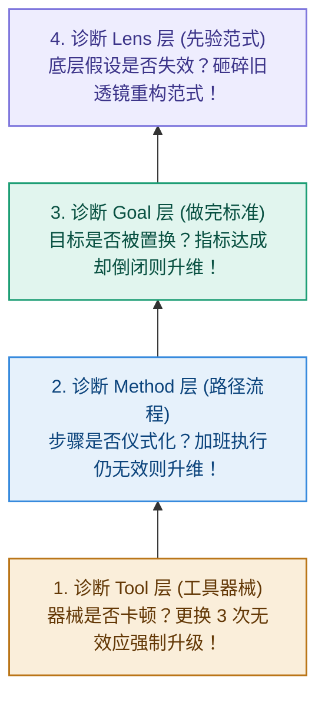

1. **第一关：诊断 Tool 层（工具排查）**
   * 问：目前使用的工具是否限制了效率？
   * 规则：如果连续更换了 3 个工具，问题依然没有任何改善，**立刻停止在 Tool 层浪费资源，触发排查升级！**

2. **第二关：诊断 Method 层（路径排查）**
   * 问：我们目前采取的行动步骤，在逻辑上是否真的能导向最终目标？
   * 规则：如果流程已经极其精细、每个人都严格加班执行了 Method，但结果依然惨淡，**说明问题不在“怎么做”，而在“做什么”！排查再次升级！**

3. **第三关：诊断 Goal 层（目标排查）**
   * 问：我们指标所衡量的 Goal，是否真正代表了客户或业务的最终价值？
   * 规则：如果我们完美达成了预设的 Goal，但公司却倒闭了、个人却没有感到任何成长，证明 Goal 发生严重病变！向上切入最深层的致命地带！

4. **第四关：诊断 Lens 层（先验排查）**
   * 问：我们对世界、市场、用户或自我的底层先验假设（Lens），是否已经被现实环境彻底否决？
   * 破局：砸碎旧有的 Lens，承认自己的底层逻辑错了。这是唯二能让瘫痪系统重新获得生机的终极救赎。

---

## 三、 破局纪律：拔除深层病根的诊断说明书

为了防止在遇到挫折时盲目乱投医，我们必须建立一套严格的诊断纪律。

### 纪律 1：三换不效，强制升维

> **纪律条文**：在任何项目中，如果连续更换了 3 次工具（Tool）或微调了 3 次步骤（Method），系统输出依然没有质的改观，**禁止再做任何 Tool 或 Method 层的修改**。必须强制召集团队或个人静默，启动 Goal 与 Lens 层的升维诊断。

在物理学中，这叫“切断低阶振荡”。不要在无效的维度上继续消耗能量。

---

## 四、 本章防错纪律与检视卡

陷入低水平死磕是人类大脑的本能，但学会自下而上地逆向追查，是成熟思考者的终极纪律。

请将这张诊断说明书保存在你的桌前。下一次当事情陷入停滞时，用它为你的项目进行一次彻底的因果手术。

---

### 📷【30秒自下而上逆向诊断说明书】

> **建议保存或拍照此卡，在项目停滞、业务亏损或个人陷入死循环时进行病因排查：**

```
 ┌──────────────────────────────────────────────────────────────┐
 │             《清晰思考的纪律》· 逆向诊断说明书                │
 ├──────────────────────────────────────────────────────────────┤
 │ [ ] 第一级（ Tool 排查）：                                    │
 │     是不是工具卡顿或不顺手？（换工具 3 次无改善 -> 升维）     │
 │                                                              │
 │ [ ] 第二级（ Method 排查）：                                  │
 │     动作流程与预期结果之间，是否存在明确的因果关系？         │
 │     （大家都很忙却无结果 -> 说明方法陷入仪式化，升维）       │
 │                                                              │
 │ [ ] 第三级（ Goal 排查）：                                    │
 │     我们考核的目标，是否真正代表了最终的核心价值？           │
 │     （目标完成但结果惨败 -> 说明目标发生了严重置换，升维）   │
 │                                                              │
 │ [ ] 第四级（ Lens 排查）：                                    │
 │     我们对环境、市场或自我的底层先验假设，是否已经失效？      │
 │     （若假设破缺 -> 必须砸碎旧观念，重构范式场）              │
 └──────────────────────────────────────────────────────────────┘
```

---

> **本章金句**：  
> * “低水平的勤奋，往往是掩盖战略失明和认知懒惰的最佳避难所。”  
> * “当方向错了，频繁地更换跑车（Tool）和猛踩油门（Method），只会让你更快地掉进悬崖。”  
> * “敢于沿着因果链向上追查，砸碎自己最骄傲的旧假设（Lens），是一个人真正的成熟。”


---

# 第 8 章：反思与闭环——小错修路，大错换车，死路换地貌

> **本章提要**：当系统出现偏差与报错（Error）时，为什么绝大多数人都会陷入“小错换车，大错修路”的致命错觉？当反馈传来，我们到底应该微调参数、升级载体，还是砸碎旧有的假设？本章跟着阿杰的“换键盘解压”与老张的“工厂死磕”，揭示 Error 驱动下的阶梯式反向传播原理，并给出划时代的纠偏法则：小错修路（Method），大错换车（Tool），死路换地貌（Lens）。

---

## 一、 现实中的“反向纠偏戏码”

让我们来看两个在现实中极具反差、却又天天重演的典型场景：

### 场景 A：阿杰的“小错大动干戈”
星期二晚上，互联网产品经理阿杰在写一份周报草稿。

他遇到了轻微的专注力波动——因为连续工作了两小时，大脑感到有点疲倦，写字的速度变慢了（这本是一个极其微小的 Method 动作摩擦）。

但阿杰做出的反应极其戏剧化：

他立刻关掉了 Word，打开小红书开始搜“最适合打字输入的键盘推荐”。接下来的两小时里，他花 800 块钱下单了一款号称“客制化静音机械键盘”；随后又下载了 3 款新的专注力倒计时软件，把桌面的壁纸换成了极简风。

**为了修补一点微小的流程疲倦，他把整个工具载体（Tool）砸掉换了一遍又一遍。**

### 场景 B：老张的“死路疯狂修路”
老张的传统制造工厂，连续两年业绩下滑 30%。这本是一场因为消费习惯改变引发的**致命生态死路（Lens 破缺）**。

但在高层会议上，老张开出的诊断药方却是：

“要求所有生产线工人每天多干一小时！要求所有销售每天的电话拜访量从 50 个增加到 80 个！每位主管的例会总结多写 500 字！”

**面对足以致命的生态死路，老张却在最微观的流程动作（Method）上咬牙“修路”，试图用更高强度的体力和汗水去对抗时代的大潮。**

把场景 A 和场景 B 放在一起，你会看到一个令人震惊的认知反转：

**绝大多数人在现实中，都在玩一场“小错换车，大错修路”的反向游戏！**

面对微不足道的小挫折（比如打字累了），人类大脑为了逃避真正的深度思考，最喜欢用“买新软件、换新设备（换车）”这种低智商的假装努力，来给自己提供多巴胺刺激；

而面对真正的深层危机和流程溃败（比如行业变天），人类大脑又因为恐惧承认自身的无知，反而选择在旧有的无效动作上死死硬撑（修路），企图用“多打几个电话、多加班两小时”来感动自己。

这种位阶错乱的纠偏方式，是导致无数团队耗尽预算崩溃、无数个人陷入低水平死磕的终极根源。

---

## 二、 控制论机制：Error 驱动的三阶反向传播

在控制论（Cybernetics）中，任何一个具备自适应能力的系统，其进化的唯一引擎就是**偏差信号（Error）**。

当系统输出的实际结果（Actual Output）与预期的目标（Goal）产生差值时，这个 Error 就会沿着 LGMT 架构反向流动，触发系统的阶梯式自愈。

像驾驶一辆汽车在公路上行驶一样，纠偏必须遵循严格的物理阶梯：

```
                    控制论的三阶反向纠偏梯队
┌─────────────────────────────────────────────────────────────┐
│ 3. 三阶纠偏 (范式级) : 死路换地貌 (Lens 场重构)              │
│    地图全错、前面是悬崖 ──► 彻底停工，砸碎旧先验，重新看世界   │
│      ▲                                                      │
│ 2. 二阶纠偏 (载体级) : 大错换车 (Tool 具身算子升级)          │
│    车速到 80 码剧烈晃动 ─► 现有的旧工具性能触及物理极限，换车 │
│      ▲                                                      │
│ 1. 一阶纠偏 (微观级) : 小错修路 (Method 路径微调)            │
│    方向盘偏了半度     ──► 轻轻微调手上的幅度，切忌大动干戈    │
└─────────────────────────────────────────────────────────────┘
```

### 1. 一阶纠偏：小错修路（Method）——切忌大动干戈
* **错误性质**：目标（Goal）正确，工具（Tool）顺手，唯独在具体执行的动作路径（Method）上产生了微小偏差或效率摩擦。
* **物理机制**：就像在高速公路上驾驶一辆性能良好的汽车，方向盘轻微偏了半度，你只需要轻轻修正手上的幅度（修路/微调 Method 路线）。
* **纠偏纪律**：**切忌小题大做！** 遇到一点执行不顺，咬牙微调流程动作即可，绝不要动不动就换软件、买新装备。

### 2. 二阶纠偏：大错换车（Tool）——生产力载体升级
* **错误性质**：目标（Goal）极其清晰，流程（Method）已被证明完全正确，但现有的工具（Tool）在物理极限上已经无法支撑当前的数据量或并发需求。
* **物理机制**：比如老王用 Excel 处理上百万行的订单数据，电脑频繁卡死崩溃。此时，Excel 的物理做功极限已经成为了阻碍生产力的最大瓶颈。
* **纠偏纪律**：**果断换车！** 当工具的算子能力触及物理天花板、导致巨大的做功摩擦时，不要在旧工具上死磕修补，果断升级更强悍的数据库或 Python 自动流水线（Tool）。

### 3. 三阶纠偏：死路换地貌（Lens）——砸碎旧先验
* **错误性质**：整个系统无论怎么微调 Method、怎么更换 Tool，输出结果依然持续恶化。这说明你赖以生存的**认知地貌与底层假设（Lens）**已经彻底与物理现实脱节。
* **物理机制**：就像你手里拿着一张 19 世纪的旧地图（Lens），在今天的现代城市里求生。此时无论你把跑车换得有多快（Tool），无论你把驾车技术修得多完美（Method），你走的都是一条死路。
* **纠偏纪律**：**砸碎旧先验！** 彻底停下一切做功，承认自己的认知地貌错了，重新走进真实世界去观察，重构最底层的 Lens 场。

---

## 三、 破局纪律：反常识的纠偏法则

要纠正人类本能中的“小错换车，大错修路”谬误，我们必须建立起严格的纠偏位阶纪律：

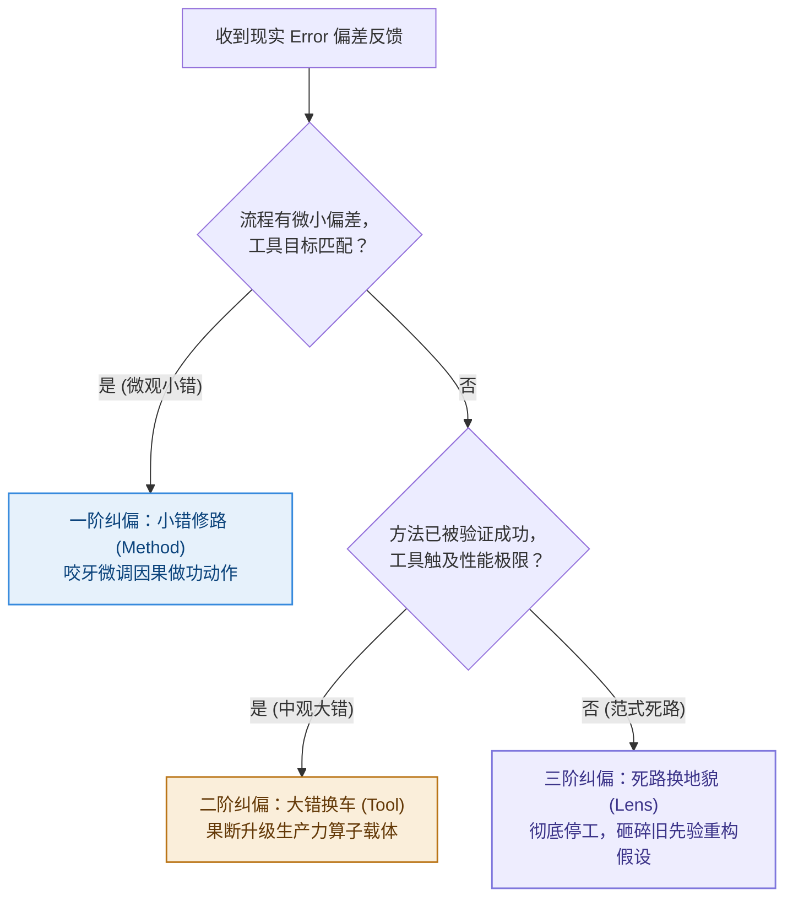

---

## 四、 本章防错纪律与检视卡

控制论不是冷冰冰的数学，而是指导我们在混乱世界中进行自我演化的纪律。

记住：**偏差（Error）不是敌人，而是系统给你的最高赏赐。** 关键在于，你是否用正确的位阶去回应它。

---

### 📷【30秒反馈诊断与纠偏决策树】

> **建议保存或拍照此卡，在收到报错（Error）或结果不及预期时引导纠偏决策：**

```
 ┌──────────────────────────────────────────────────────────────┐
 │             《清晰思考的纪律》· 阶梯纠偏决策树                 │
 ├──────────────────────────────────────────────────────────────┤
 │ 收到 Error 反馈后，依次问自己：                               │
 │                                                              │
 │ ❓ 提问 1：流程做功有微小摩擦，但工具和目标依然匹配吗？       │
 │    └─> 【是】：小错修路！在现有工具下微调 Method 动作。       │
 │                                                              │
 │ ❓ 提问 2：方法流程已被验证成功，但当前工具性能触及极限？     │
 │    └─> 【是】：大错换车！果断升级 Tool 载体，释放生产力。     │
 │                                                              │
 │ ❓ 提问 3：无论如何微调流程和换工具，结果依然持续恶化？       │
 │    └─> 【是】：死路换地貌！彻底停工，砸碎旧 Lens，重构先验！ │
 └──────────────────────────────────────────────────────────────┘
```

---

> **本章金句**：  
> * “面对微小的卡顿频繁更换工具，是智力上的惰性；面对深层的危机死磕旧流程，是认知上的傲慢。”  
> * “小错修路，大错换车，死路换地貌——这是自适应系统在物理世界中最优雅的进化节奏。”  
> * “永远不要试图用更高强度的体力和加班，去修复一个已经彻底破缺的先验地貌。”


---

# 第 9 章：防复发与自愈——打破“防御性归因”，建立自适应反馈回路

> **本章提要**：为什么很多团队和个人明明做过了复盘、也沿着因果链找到了病根，但在几个月后，依然会在一模一样的坑里跌倒第二次？因为人类大脑存在极其顽固的“防御性归因”——成功时归功于自己的英明，失败时怪罪于外部环境或工具不好。本章跟着老张团队复盘后的“旧病复发”，揭示自适应系统防复发的控制论机制，教你如何建立无惩罚的 Error-Tracker（偏差日志）与 Post-Mortem（验尸复盘）自愈回路。

---

## 一、 老张团队的“旧病复发”

在经历了第 7 章的白板诊断剧场和第 8 章的“小错修路、大错换车”纠偏后，老张的工厂曾有过一段长达三个月的“黄金复苏期”。

当时，老张痛定思痛，砸碎了自己过去对“高科技炫技”的傲慢先验（Lens），把产品的 Goal 重新锁定在“极致简单耐用”上。研发团队砍掉了 80% 花哨的功能，销售团队停止了盲目的电话骚扰。

一个月后，新版产品的销量出现了显著的回暖，客户的满意度大幅提升。

老张和他的骨干们激动不已，大家在庆功宴上推杯换盏，认为自己已经彻底掌握了 LGMT 的精髓，告别了过去的内耗。

**然而，现实的戏剧性在于：熵增与旧习惯的拉力，永远比你想象的更顽固。**

半年后的一个季度例会上，死气沉沉的气氛重新笼罩了会议室。

当老张打开最新的运营报告时，赫然发现：
* 研发部门在过去两个月里，又偷偷在产品里塞入了 5 个复杂的“AI 智能语音菜单”（理由是“竞品也出了这个功能，我们不能显得太土”）；
* 市场部门又开始每天强行要求员工转发 3 篇毫无阅读量的宣传统稿；
* 一线销售们又重新把客户数据记录在了私人的纸质笔记本上，CRM 系统里再次充斥着周五下班前编造的补填数据。

老张气得手发抖，拍着桌子质问：“三个月前我们不是才痛定思痛、把这些垃圾流程全部砍掉了吗？！为什么大家又走回了老路？！”

研发主管和市场经理低着头，小声嘀咕道：
* “上次销量回升是因为正好赶上了行业旺季，可最近市场大环境太差了呀...”
* “我们塞入 AI 菜单是为了提升产品档次，这本身没问题，主要是这次用户还没意识到这个功能的先进...”

老张看着下属们理直气壮的辩解，感到了一阵深深的无力。

**这种现象，在控制论和心理学中被称为“防御性归因（Defensive Attribution）与系统复发”。**

当系统取得成功时，人们倾向于把功劳归结为“自己的英明与勤奋”；而当系统出现 Error（偏差）或陷入困境时，大脑为了保护自尊心，会本能地把原因推给“大环境不好、用户不懂行、或者工具不给力”。

因为拒绝在主观 Lens 和内部 Method 上承认错误，系统内部的旧习惯就像野草一样，在风头过后疯狂复苏。

**诊断与纠偏固然重要，但如果不建立“防复发的自愈机制”，所有的纠偏都只是一场短暂的阵痛。**

---

## 二、 控制论机制：为什么系统天然具有“旧习惯拉力”？

在系统动力学中，任何一个组织或个人系统，都存在着强大的**基因拉力（Path Dependency，路径依赖）**。

你在过去几年中形成的工作习惯、思考惯性与组织流程，在脑神经和组织架构中已经挖出了一道深深的沟渠。

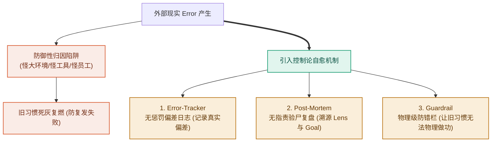

当你试图推行新的 LGMT 纪律时，你实际上是在和整个系统的“历史惯性”做对抗。

一旦外部压力稍有缓解，大脑就会本能地滑回最熟悉、最省能的旧路径上——继续用“装修工具”逃避思考，继续用“忙碌的动作”替代做完的定义。

要切断这种死循环，我们不能依赖道德说教或老板的咆哮，必须在系统内部建立**自适应的自愈反馈回路（Self-Healing Feedback Loop）**。

---

## 三、 破局纪律：建立防复发的“三大自愈防火墙”

为了帮老张们彻底切断旧病复发，我们必须在团队和个人系统中，强制植入三道物理级防火墙：

### 纪律 1：建立无惩罚的 Error-Tracker（偏差日志）

绝大多数团队之所以无法阻止复发，是因为大家**害怕承认错误**。一旦暴露问题就会面临 KPI 扣钱或责备，于是大家本能地掩盖 Error。

在自适应系统中，** Error 不是罪过，隐瞒 Error 才是唯一的罪过。**

建立团队的 **Error-Tracker（偏差日志）**：
* 允许任何员工无惩罚地记录系统出现的实际偏差（例如：“今天研发的模块未达到 DoD 标准”、“今天 CRM 系统增加了 2 个无用必填项”）；
* 不追踪个人责任，只追踪“系统流程在哪儿产生了摩擦”。把 Error 从隐蔽的角落拉到日光之下。

### 纪律 2：开展无指责的 Post-Mortem（验尸复盘会）

当一个项目延期、或者一项举措复发失败时，禁止开相互指责的批斗会，而是召开严格的 **Post-Mortem（验尸复盘会）**。

复盘会只讨论三个客观问题：
1. **真实结果与预设 Goal 的偏差有多大？**（用数据说话，不给“大环境不好”留辩解空间）；
2. **我们在哪一步偷偷滑回了旧的 Lens 和假 Goal？**（追查是谁又把“动作完成”当成了“做完”）；
3. **我们要在系统里增加哪一道物理屏障，防止下次再犯？**

### 纪律 3：设立物理级的 Guardrail（防错护栏）

不要相信人类的自律，要相信**物理级的阻碍**。

* **个人防复发**：如果你总是忍不住在工作时打开社交软件（旧病复发），不要靠意志力硬撑，直接用 App 锁定软件把社交网站封锁 8 小时（物理护栏）；
* **团队防复发**：如果研发部门总是忍不住偷偷塞入花哨功能，在需求流转关口设立物理护栏——**任何未经过 5 位真实用户访谈签名的需求，禁止提交代码库！**

用物理护栏，让做坏事的成本极高，让做正确事情的摩擦力极低。

---

## 四、 本章防错纪律与检视卡

复发不是失败，而是系统演化中的正常波动。

关键在于，当复发来临时，你是选择用“防御性归因”自我安慰，还是用自愈回路将系统再次升级。

---

### 📷【30秒系统防复发与自愈自查卡】

> **建议保存或拍照此卡，在项目复盘或发现旧习惯复发时自查：**

```
 ┌──────────────────────────────────────────────────────────────┐
 │             《清晰思考的纪律》· 系统防复发自查卡               │
 ├──────────────────────────────────────────────────────────────┤
 │ 当你发现团队或个人又走回了低效的旧老路时，问自己：           │
 │                                                              │
 │ [ ] 1. 归因检测：我们是在找外部环境/工具的借口（防御性归因），│
 │        还是敢于承认内部 Lens 和 Goal 的再次偏离？           │
 │                                                              │
 │ [ ] 2. 日志检测：我们是否有无惩罚的 Error-Tracker，让真实的  │
 │        偏差能够第一时间暴露，而不是被隐瞒？                  │
 │                                                              │
 │ [ ] 3. 护栏检测：我们是否建立了物理级的 Guardrail (防错栏)， │
 │        让旧习惯在物理上极难再次执行？                       │
 └──────────────────────────────────────────────────────────────┘
```

---

> **本章金句**：  
> * “成功时归功于英明，失败时怪罪于大环境，是人类系统最隐蔽的自欺欺人。”  
> * “不要相信意志力的自律，要相信物理护栏的阻碍；让做坏事的摩擦力极高，才是最高明的管理。”  
> * “ Error 不是罪过，隐瞒 Error 才是唯一的罪过。复发是系统自愈与进化的最佳契机。”


---

# 第 10 章：古今归真——老祖宗的“道法术器”与控制论

> **本章提要**：为什么一个诞生于现代数字时代的思考框架，在两千多年前的东方哲学“道、法、术、器”中能找到近乎完美的映射？为什么在西方控制论与物理学中，它又是自适应系统生存的唯一解？本章将剥离所有商业包装与技术流行语，深入 LGMT 的底层思想谱系，揭示其作为“物理世界通用自适应拓扑结构”的必然性与第一性原理。

---

## 一、 现象：跨越两千年的思想大碰撞

在现代企业管理、个人成长和技术架构的探讨中，经常会出现一个极具戏剧性的现象：

当一位高管用最新的现代管理理论（如 OKR、精益敏捷、OKR+KPI 组合）开完战略会后，一位研读经典哲学的智者可能会笑着总结：“你讲了半天，不就是老祖宗说的‘离道失法，以术代器’吗？”

而当一位控制论专家或物理学家审视这套管理架构时，他又会指出：“这无非是阿什比（W. Ross Ashby）在 1956 年提出的‘良好调节者定理’在组织管理中的一次应用。”

**东方古老的哲理、西方硬核的控制论物理学，与现代思维框架，在此处产生了令人震撼的跨时空大汇流。**

为什么不同文明、不同学科在探索“如何把事情做成”这一终极问题时，最终都指向了同一个拓扑结构？

因为世界运行的物理规律是统一的。无论你使用怎样的语言、符号或表述方式，只要你想在充满混乱与熵增的现实世界里建立秩序，你都必须遵循最基础的反馈与控制拓扑。

LGMT（Lens, Goal, Method, Tool）绝不是某个现代人拍脑袋杜撰出来的“新名词”，它是对人类文明数千年来关于“秩序与掌控”的底层规律的一次提炼与重构。

---

## 二、 东方辩证：解构“道法术器”与 LGMT 的控制论补齐

在中国古代思想体系中，“道、法、术、器”是探讨行为哲学与治理智慧的最高概括。很多人在初接触 LGMT 模型时，第一反应往往是把它简单等同于“道、法、术、器”。

但如果我们进行严格的哲学与结构比对，就会发现**简单的 1:1 硬套不仅是错误的，反而掩盖了 LGMT 作为现代控制论模型的真正突破。**

```
             “道法术器”与 LGMT 的真实结构映射与补齐
┌─────────────────────────────────────────────────────────────┐
│ 【道】 ───►  Lens 范式场      : 宇宙规律、底层先验与观照视角 │
│                Goal 设定值    : 【LGMT 显式补齐的控制论枢纽】│
│ 【法】 ───┐                                                 │
│           ├──► Method 方法路径 : 法=系统级制度 / 术=战术级技巧 │
│ 【术】 ───┘                                                 │
│ 【器】 ───►  Tool 具身算子    : 工具器械、载体平台与实体器具 │
└─────────────────────────────────────────────────────────────┘
```

### 1. 还原“道法术器”的本意结构
如果还原东方哲学的本意，“道法术器”实际上是一个 **1 认知 + 2 方法 + 1 工具** 的四层结构：

* **【道】（Lens 范式场）**：观照世界的先验立场与底层规律。“形而上者谓之道”。
* **【法】（Systemic Method）**：制度、法则、规约与方法论体系。古代“法”指的是治理制度与行为规范，“方法”一词即源自“法”。
* **【术】（Tactical Method）**：具体战术、操作技巧、技能与招式。“法”是宏观方法体系，“术”是微观操作路径。
* **【器】（Tool 具身算子）**：做功的物理载体、器具与装备。“形而下者谓之器”。

### 2. 传统“道法术器”的控制论解构：“道”是 Lens 与 Goal 的未解耦混合体
对比之后就会发现：**传统的“道”实际上是 Lens（先验范式）与 Goal（终局愿景）的未解耦混合体。**

在传统哲学语境中，“道”既代表着“看世界的底层透镜（Lens）”，又隐性裹挟着“终极要前往的理想吸引子（Goal）”。这种混合在哲学悟道上极具美感，但在现实控制与工程落地中，却留下了致命的控制论盲区：

* **目标（Goal）被裹挟在抽象的“道”中**，缺乏独立、显式的数值或 DoD（做完定义）进行结果校验；
* 到了执行层面，系统级的“法（制度）”极易退化为管束人、折腾人的繁文缛节（形式主义）；
* 战术级的“术（技巧）”则容易退化为炫技与表面动作；
* 大家看似有道、有法、有术、有器，但因为 Goal 没有被单独解耦出来，导致整个反馈控制链无法进行精确的 Error（偏差）计算！

### 3. 用 LGMT 重新解构老子的退化警示
老子在《道德经》中曾写下一段震古烁今的退化警示：

> **“失道而后德，失德而后仁，失仁而后义，失义而后礼。夫礼者，忠信之薄，而乱之首也。”**

如果用 LGMT 的控能力度去重新解构这段话，其病理清晰可见：

* 当人们丢失了最底层的范式认知（**失道 / 丢失 Lens**）；
* 又缺乏明确可校验的终局目标（**缺少 Goal 的约束**）；
* 治理和行为就会迅速降维退化为对表面制度与繁文缛节的机械崇拜（**求礼 / 沦为“法、术、器”的形式主义**）；
* **而这种失去了“道（Lens）与目标（Goal）”支撑的机械形式主义（礼），恰恰是混乱与内耗的开端（乱之首也）！**

### 4. LGMT 的超越：用独立 Goal 补齐控制闭环
LGMT 模型绝不是对“道法术器”的简单翻版，它的真正贡献在于**将 Goal（设定值/吸引子）从模糊的“道”中解耦出来，作为一个独立的控制枢纽显式置顶。**

它将“法”与“术”统一收拢为 **Method（路径）**，并将结构重新收敛为更符合现代控制论的四拓扑：**Lens（先验场）托底 $\to$ Goal（设定值）驱动 $\to$ Method（路径）做功 $\to$ Tool（算子）执行**。

这既保留了东方“道”的哲学高远，又赋予了现代科学严密的反馈与诊断闭环。

---

## 三、 西方科学：控制论与“良好调节者定理”

如果说“道法术器”是从哲学与行为学上验证了 LGMT，那么现代**控制论（Cybernetics）**则从数学与物理学上证明了它的必然性。

### 阿什比“良好调节者定理”（Good Regulator Theorem）
控制论先驱艾希比（W. Ross Ashby）与罗森布鲁斯在 1970 年提出了著名的控制论定理：

> **“任何一个完美的自适应调节器，其内部必须包含一个被控系统的模型（Every good regulator of a system must be a model of that system）。”**

这一定理在数学上证明了：**一个系统（无论是机器人、生物体还是企业）要想在充满不确定性的外部环境中维持生存，它的内部必须具备一套关于外部世界的先验模型。**

映射到 LGMT 架构中：
* **内部模型（Model of System）** 对应 **Lens**：如果没有这个先验模型，系统就无法理解外部输入；
* **设定值（Set Point）** 对应 **Goal**：系统维持稳态的目标吸引子；
* **控制律（Control Law）** 对应 **Method**：计算误差并生成修正策略的算法；
* **执行器（Actuator）** 对应 **Tool**：在物理世界中输出控制力、进行做功的硬件。

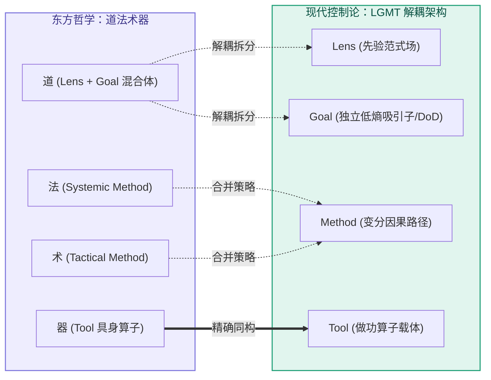

物理学与控制论告诉我们：**LGMT 并不是一种可选的管理爱好，而是任何自适应系统在物理世界中进行抗熵增求生的唯一通用拓扑结构。**

---

## 四、 本章防错纪律与检视卡

理解了古今同构的第一性原理，我们就能在面对纷繁复杂的新概念、新框架时，拥有洞穿表象的“火眼金睛”。

无论是面对两千年前的古训，还是面对明天最新发布的 AI 流行语，记住：**万变不离其宗，一切能成事的系统，底色必然是 LGMT。**

---

### 📷【30秒底层逻辑对齐自查卡】

> **建议保存或拍照此卡，在评估任何新方法论、新管理框架或新工具时进行同构自查：**

```
 ┌──────────────────────────────────────────────────────────────┐
 │             《清晰思考的纪律》· 底层同构自查卡                 │
 ├──────────────────────────────────────────────────────────────┤
 │ 当你引入一个新框架时，请问自己：                               │
 │                                                              │
 │ [ ] 1. 它的“道（Lens）”是什么？                              │
 │        它基于对现实世界的什么先验假设？                      │
 │                                                              │
 │ [ ] 2. 它的“法（Goal）”是什么？                              │
 │        它定义的衡量标准与做完定义是否明确？                  │
 │                                                              │
 │ [ ] 3. 它的“术（Method）”是什么？                            │
 │        它的行动路径是否具备可操作的因果链？                  │
 │                                                              │
 │ [ ] 4. 它的“器（Tool）”是什么？                              │
 │        它的载体算子是否增加了无谓的认知摩擦？                │
 └──────────────────────────────────────────────────────────────┘
```

---

> **本章金句**：  
> * “离道失法，以术代器——人类数千年来犯过的所有错误，本质上都是同一种认知颠倒。”  
> * “一切完美的调节者，内部都包含着世界的模型；最顶级的实践者，心中都秉持着清晰的先验。”  
> * “不需要发明新名词，真正的智慧早已在文明的源头相遇。”


---

# 第 11 章：AI 时代壁垒——把 Method 交给 AI，把 Lens 留给自己

> **本章提要**：当全栈工程师小雯用最新的 AI 智能体在 30 秒内完成了过去需要三天编写的代码，当生成式 AI 以恐怖的速度吞吞噬掉排版、文案、作图与数据分析等绝大多数方法（Method）与工具（Tool）时，人类真正的核心价值与不可替代的壁垒到底在哪里？当“怎么做”变得极其廉价，决定成败的唯一因素就变成了“看什么”与“要什么”。本章用 LGMT 模型重新定义 AI 时代的人机分工协议，教你如何在 AI 浪潮中构建真正不可撼动的认知护城河。

---

## 一、 小雯的“能力过剩与意义焦虑”

在经历了第 6 章的“填表地狱”后，全栈工程师小雯做出了一个大胆的尝试：她把团队最繁重、最死板的底层代码重构与接口测试任务，全部交给了最新的 AI 大模型智能体（Agents）。

效果令人震撼，却也极其悚然：

* 过去需要 3 名初级工程师折腾一整周的代码重构，AI 智能体在 45 秒内全部完成，并自动补充了完美的单元测试；
* 过去需要市场部花三天整理的 50 页竞品分析报告，AI 可以在 20 秒内抓取全网公开数据，生成图文并茂的分析草案；
* 过去需要小雯熬夜编写的数据库查询 SQL 语句，现在只需要在输入框里敲下一句自然语言，AI 就会瞬间输出最优化版本的代码。

在最初的兴奋过后，一种巨大的、空洞的焦虑感如潮水般淹没了小雯和她的团队。

研发组的两位年轻工程师私下里找小雯谈话，眼神里充满了茫然：“雯姐，我们过去花了 4 年大学、3 年加班苦练的编程技巧（Method）和工具调优（Tool），AI 几秒钟就做完了，而且比我们写得更好。我们未来的核心价值到底在哪？我们是不是马上就要被淘汰了？”

**这不仅仅是小雯团队的焦虑，而是整个时代正在重演的悲剧。**

面对 AI 极其恐怖的生产力浪潮，绝大多数人都陷入了极其盲目的应对模式：

* **一部分人试图在“方法和工具”上与 AI 展开死磕竞赛**：他们拼命记忆几百个死板的“提示词（Prompts）模板”，企图在生成速度和格式排版上战胜 AI——这就像是在工业革命早期企图和蒸汽机比拼拉货的力气，极其悲壮却注定惨败；
* **另一部分人则沦为了“机械搬运工”**：他们完全失去了主见，把 AI 生成的成百上千页毫无灵魂的代码和文案直接复制粘贴到生产环境中。结果不仅没有提升效率，反而给系统制造了庞大的垃圾信息与隐藏 Bug。

**这种现象被称为“ AI 时代的认知退化”。**

当人类把执行动作（Method）和做功算子（Tool）交给 AI 时，如果我们自己也丢失了目标（Goal）与视角（Lens），那么庞大的 AI 生产力不仅不会成为辅助我们的超级杠杆，反而会生成海量的“高质量垃圾”，让我们彻底溺亡在信息的汪洋大海之中。

---

## 二、 LGMT 位阶迁移：AI 时代的人机分工拓扑

用 LGMT 模型去审视人工智能的技术演进，你会发现 AI 对人类能力的替代，呈现出极其清晰的**自下而上吞噬轨迹**：

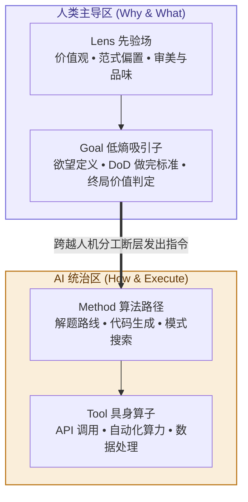

### 1. Tool 与 Method：AI 的绝对统治区
* **Tool 层（做功算子）**：算力、数据库、自动化 API、图像渲染、矢量计算——在这些实体做功与算子执行上，AI 拥有超越人类数百万倍的物理优势。
* **Method 层（路径与算法）**：如何把一段代码写得更优雅、如何把一篇文案翻译得更流畅、如何把一份财务报表进行同比环比分析——这些本质上都是“在已知的规则下寻找最优路径（Search in Solution Space）”。AI 大模型凭借其海量的预训练数据，在这一层展现出了降维打击般的解题能力。

### 2. Goal 与 Lens：人类真正的绝对壁垒
* **Goal 层（目标与价值定义）**：AI 可以回答“怎么做（How）”，但它永远无法替你决定“要什么（What）”。
  * 一个问题的“做完定义（DoD）”是什么？
  * 这个产品到底要解决用户的哪一个核心痛点？
  * 商业上的止损点应该设在何处？
  这些涉及欲望、选择、风险承担与价值判定的目标节点，永远只能由人类来锁定。
* **Lens 层（先验范式与世界观）**：AI 的底层逻辑是基于历史数据的概率统计（Next-Token Prediction），它本质上是对人类既有知识库的大型拟合。
  * 什么是真正的审美与品味？
  * 面对从未出现过的伦理冲突，我们秉持什么立场？
  * 敢于打破行业既有范式、提出反直觉先验假设的勇气从何而来？
  这些定义“你看待世界方式”的 Lens 场，是人类作为具备主体性生命体的终极壁垒。

**AI 时代的简明结论：把 How（Method / Tool）交给 AI，把 Why & What（Lens / Goal）留给自己。**

---

## 三、 破局纪律：打造 AI 时代的“超级个人”与人机分工协议

要在 AI 时代获得不可替代的竞争优势，小雯和我们每个人都必须建立全新的认知纪律，完成从“执行者”向“指挥官”的身份转变。

### 纪律 1：拒绝“提示词木偶”，恪守 Goal 的终局控制权

不要把注意力放在记忆成百上千个死板的“提示词模板”上。真正的 AI 高手，极其擅长向 AI 交付清晰的 **Goal（做完的标准）与背景 Lens**。

在使用任何 AI 智能体前，强制执行**“三约束提示法”**：
1. **给定 Lens（背景与视角）**：“假设你是具备 15 年经验的资深架构师，秉持极简与高可用原则...”
2. **锁定 Goal（做完定义）**：“我们需要一份针对电商高并发场景的重构方案，衡量成功的标准是响应延迟降低 50%...”
3. **开放 Method（方法交给 AI）**：“请给出 3 种可行的实现路径，并对比各自的优缺点...”

通过锁定上游的 Lens 与 Goal，让 AI 在广阔的方法空间中为你寻找最优解，而不是让 AI 牵着你的鼻子走。

### 纪律 2：从“生产员”转变为“超级审稿人（Chief Curator）”

当 AI 可以在几秒钟内生成 10 版方案时，限制你的不再是“生产速度”，而是你的“识别力与品味（Lens）”。

* 低效的人，忙着自己去写 10 版草稿；
* 高效的人，让 AI 生成 10 版草稿，然后凭自己敏锐的 Lens，瞬间识别出哪一版具备真正的洞察，并指出其最致命的漏洞。

**你的 Lens 越深刻、你的品味越高昂，你驾驭 AI 输出的杠杆力就越恐怖。**

---

## 四、 本章防错纪律与检视卡

AI 不是来替代人类的，它是来淘汰那些“像机器一样思考与执行的人”的。

请保存这张人机分工协议卡。在下一次使用 AI 工具前，确认你正站在因果链的最顶端。

---

### 📷【30秒 AI 时代 Human-AI 分工自查卡】

> **建议保存或拍照此卡，在使用 AI 辅助工作或规划个人职业壁垒时自查：**

```
 ┌──────────────────────────────────────────────────────────────┐
 │             《清晰思考的纪律》· AI 人机分工协议卡             │
 ├──────────────────────────────────────────────────────────────┤
 │ [ ] 1. 视角提供（Lens）：我是否为 AI 提供了清晰的先验假设、 │
 │        角色定位与审美标准，而不是让 AI 泛泛而谈？            │
 │                                                              │
 │ [ ] 2. 目标锁定（Goal）：该任务的“做完定义（DoD）”和成功标准 │
 │        是否由我牢牢掌控？                                    │
 │                                                              │
 │ [ ] 3. 方法放权（Method）：我是否把具体撰写、编码、计算等     │
 │        繁重路径，最大程度地交给了 AI 去探索和执行？          │
 │                                                              │
 │ [ ] 4. 品味把关（Curator）：对于 AI 输出的结果，我是进行有   │
 │        主见的筛选与批判，还是沦为了机械的复制粘贴者？        │
 └──────────────────────────────────────────────────────────────┘
```

---

> **本章金句**：  
> * “当‘怎么做’变得一文不值，‘要什么’和‘凭什么这么看’就成为了全宇宙最昂贵的资产。”  
> * “AI 不会淘汰人类，但掌握了 Lens 与 Goal 的人类，将以成百上千倍的杠杆淘汰只会做 Method 的执行者。”  
> * “把做功的苦力交给机器，把审美的灵魂留给自己。”


---

# 第 12 章：终局心法——顺序即纪律，放下即成熟

> **本章提要**：当阿杰、老张和小雯完整理解了 LGMT 模型的“1 场 + 3 节点”、学会了沿因果链逆向追查、掌握了 AI 时代的人机分工之后，最重要的一步反而来到了：“什么时候应该严格遵循这套纪律，什么时候又应该彻底放下它？”本章通过 Cynefin 复杂的决策边界，给出全书的终局心法——顺序即纪律，放下即成熟。

---

## 一、 现象：从“方法匮乏”到“模型教条主义”

让我们来看一个在很多熟练掌握了各种思维框架的人身上经常发生的反常现象：

产品经理阿杰在彻底学会了 LGMT 模型后，一度变得极其死板教条：

* 无论在食堂和同事讨论今天中午吃什么，还是在面对突如其来的灵感闪现时，他都强行要求大家：“等一下！我们先明确 Lens！再定义 Goal！然后推演 Method！最后选 Tool！”
* 面对需要快速试错、充满不确定性的艺术创作或混沌危机时，他因为迟迟无法定义出完美的 Goal，而僵立在原地不敢迈出第一步；
* 他把一套原本用来“理清思路、减少做功摩擦”的解耦工具，演变成了困住自己大脑的崭新牢笼。

**这种现象被称为“模型教条主义（Model Dogmatism）”。**

在本书的前 9 章中，我们反复强调“顺序即纪律”，教你如何用 Lens 托底、Goal 导向、Method 路径与 Tool 执行来击碎假装努力与认知紊乱。这是因为在**有序、复杂或线性做功的领域**，缺乏次序的混乱会导致剧烈的熵增和资源浪费。

然而，现实世界并不全是一条条理清晰的生产线。

如果你把用于应对“已知与复杂系统”的严密框架，生搬硬套到“完全无序、混沌或纯粹情绪表达”的领域，你就会从一个迷茫的执行者，变成一个死板的“框架教条者”。

**真正的成熟，不仅在于知道何时拿起武器，更在于知道何时放下武器。**

---

## 二、 Cynefin 决策边界：划定 LGMT 的有效领地

为了防止陷入模型教条主义，我们必须引入威尔士学者戴夫·斯诺登（Dave Snowden）提出的 **Cynefin 决策上下文域模型**。

现实世界中的所有情境，都可以被划分为四大不同的“领地（Domains）”。LGMT 模型在这四大领地中有着完全不同的适用规则：

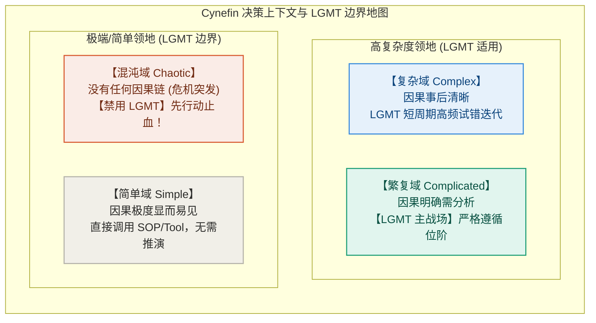

### 1. 繁复域与复杂域（Complicated & Complex）：LGMT 的主战场
* **繁复域（如企业系统建设、技术重构、复杂项目交付）**：因果链条明确但交织复杂。此时必须**严格遵循 LGMT 顺序**，用 Lens 统一底色，用 Goal 锁死 DoD，用 Method 规划路径，用 Tool 降维做功。
* **复杂域（如新产品探索、个人职业转型、市场突围）**：因果关系只有在事后才清晰。此时 LGMT 依然有效，但必须**大幅缩短 LGMT 的迭代周期**。不要试图规划一个为期两年的完美 Method，而是用“小 Goal + 快 Tool + 高频 Error 反馈”，在试错中让 Lens 自主演化。

### 2. 简单域与混沌域（Simple & Chaotic）：划定框架边界
* **简单域（如日常盖章、打卡、按规定报销）**：因果极度显而易见。此时**无需动用复杂的 LGMT 推演**，直接调用成熟的 Tool 或既有 SOP 即可。强行在简单事情上推演 LGMT，属于典型的过度工程（Over-Engineering）。
* **混沌域（如突发火灾、服务器全线崩溃、极端危机爆发）**：没有任何因果关系可言，系统正处于毁灭边缘。此时**必须暂停 LGMT 的理论推演！** 任何在火灾现场停下来讨论“先验 Lens 与长期 Goal”的行为都是致命的。此时的纪律是：**先行动（Act）止血，建立基本安全边界，等系统降温退回到复杂或繁复域后，再重启 LGMT 诊断！**

---

## 三、 终局心法：顺序即纪律，放下即成熟

读完本书，请将以下两条终局心法铭刻在心：

### 心法 1：手中有剑，顺序即纪律（秩序守护）

在绝大多数日常工作、团队协作与系统建设中，人类最大的敌人不是缺乏资源，而是**认知的无序与位阶的倒错**。

当你要开启一个新项目、学习一门新技能、或者带领一支团队突围时：
* 记住：**先定 Lens 场，再建 Goal 链，后推 Method 路，最后选 Tool 器。**
* 严守秩序，不被花哨的工具勾走灵魂，不被虚无的忙碌感动自己。这就是“手中有剑”的威力。

### 心法 2：心中无剑，放下即成熟（无我自由）

框架是用来服务人、解放大脑的，而不是用来囚禁心灵的。

当阿杰、老张和小雯在暴风雨中立定了骨架、当他们的 LGMT 四构件已经内化为肌肉记忆与直觉时，就不再需要时刻在嘴上挂着这些名词。

面对生活中的诗意、面对灵感的突发奇想、面对混沌中的果断出手——**勇敢地放下模型！**

直接去观察、直接去行动、直接去与真实的物理世界撞击。

**手中有模型，让你在混乱中建立秩序；心中无模型，让你在秩序中获得自由。**

---

## 四、 全书终局避坑卡与随书检视卡

感谢你陪同本书走过这段关于“清晰思考”的探索之旅。

在本书的结尾，我们为你准备了这张随书附赠的《终局避坑卡》。无论未来你走得多远、面对多么纷繁复杂的挑战，希望它能像一把沉静的手电筒，随时为你照亮脚下的路。

---

### 📷【随书附赠：30秒清晰思考终局避坑卡】

> **建议保存或打印此卡，贴在你的工作台前：**

```
 ┌──────────────────────────────────────────────────────────────┐
 │               《清晰思考的纪律》· 终局避坑卡                  │
 ├──────────────────────────────────────────────────────────────┤
 │ 永远铭记以下防错纪律：                                      │
 │                                                              │
 │ 1. 戒工具迷恋：绝不试图用购买新软件（Tool）来逃避真实的做功。│
 │ 2. 戒方法仪式：绝不把“忙碌的动作（Method）”当成“达成的结果”。│
 │ 3. 戒目标置换：永远用真实的用户与业务价值（Goal）校验进度。  │
 │ 4. 戒先验傲慢：当反馈持续报错，敢于砸碎旧假设（Lens）重构。  │
 │ 5. 戒模型教条：在简单域直接执行，在混沌域先出手止血！        │
 ├──────────────────────────────────────────────────────────────┤
 │ 核心口诀：                                                   │
 │ 顺序即纪律，小错修路，大错换车，死路换地貌，放下即成熟！    │
 └──────────────────────────────────────────────────────────────┘
```

---

> **全书终局金句**：  
> * “顺序即纪律：用清晰的次序击碎混乱，把人脑最宝贵的算子留给真正的创造。”  
> * “放下即成熟：框架是通往自由的桥梁，过河之后，便可昂首前行。”  
> * “愿你在充满熵增的世界里，怀揣清晰的骨架，勇敢而自由地生活。”
